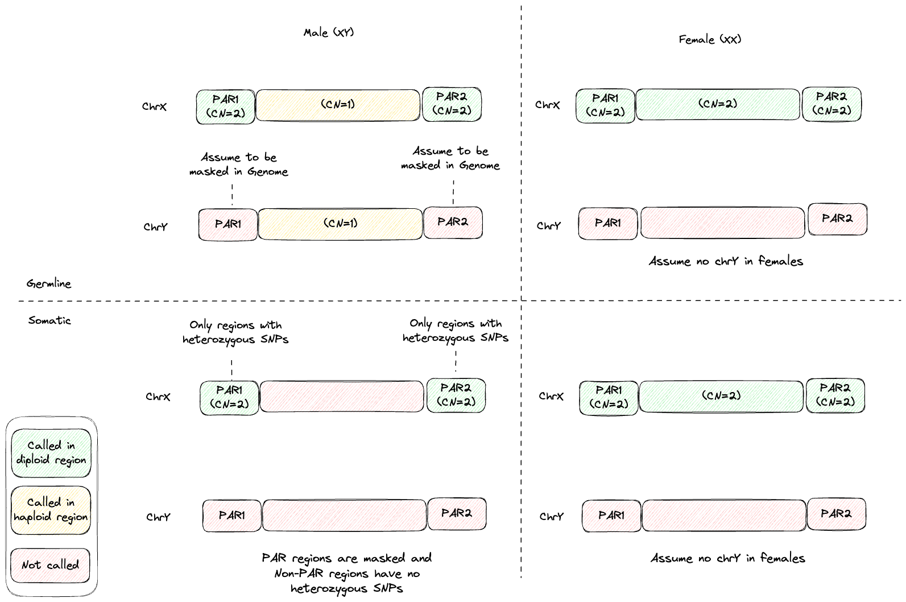

# Copy Number Caller

## Getting started

### Introduction

The Copy Number Caller identifies genomic copy number variation by analyzing coverage patterns in DNA sequencing alignments.
Designed as a post-alignment processing tool, it accepts position-sorted aligned reads — typically generated by aligners such as bwa-mem or Giraffe — to support two primary whole-genome sequencing (WGS) workflows: detecting copy number variants (CNVs) in germline normal samples and characterizing allele-specific somatic CNVs in matched tumor-normal sample pairs.

The module executes a streamlined pipeline that calculates interval coverage, normalizes for biases such as GC content, segments the genome based on signal patterns, and employs a likelihood model to assign copy number states.
This process yields detailed CNV calls, purity and ploidy estimates (in somatic mode), and visualization-ready outputs to aid in downstream interpretation.

#### High level diagram



### Recommended system requirements

|        | Requirements                                                                                   |
|--------|------------------------------------------------------------------------------------------------|
| CPU    | Modern processor with at least 16 cores. A processor supporting `AVX2` or `AVX-512` will result in much better performance. |
| Memory | At least 8 GiB.                                   |

## Usage

### Germline Normal usage


Germline CNVs called from a giraffe pangenome aligned BAM are known to miss common duplications.
This is caused by reads that align to the duplicated copy in the pangenome graph, but fail to project to the copy in the linear reference.
This results in missing reads associated with common duplications in the projected BAM.

A rescue/tag method has been developed that recovers these missing reads.
This method requires that giraffe is run with the `--max-multimaps` argument.
If using the XOOS pipeline and vg giraffe (i.e. CPU-based giraffe), it will be run with the `--max-multimaps` argument and the rescue/tag step is automatically run.
In this configuration, common duplications can be predicted.
If using XOOS pipeline with parabricks giraffe (i.e. GPU-based giraffe) or on-instrument alignment, the `--max-multimaps` is not yet supported.
This issue is expected to be resolved soon and the rescue/tag step will be incorporated into these workflows.

Note that BWA aligned BAM files will NOT have this missing common duplication issue.


The `germline-wgs` subcommand calls copy number variants from germline normal (i.e. non-tumor) WGS data.

This workflow involves calculating coverage of aligned reads across fixed-width intervals, correcting for GC-bias and noise, segmenting the genome into regions of similar coverage, and calling copy numbers using a likelihood model.

If the input BAM has a median coverage below 10x, the module exits with code 0 and writes structurally valid but data-empty output files (header-only SEG, VCF, BED; valid BigWig with chromosome headers). This avoids numerical errors during GC correction on very low or zero-coverage samples.

#### Germline Normal example command



- If working with hg38 aligned data, it is recommended to add `--blocklist-bed /resources/hg38_decoy_intervals.bed` to your command to reduce false positive duplications caused by reads from unplaced decoy regions mapping to the main chromosomes.



```bash
copy_number_caller germline-wgs \
                --bam /path/to/bam \
                --reference /path/to/reference \
                --mappability-bigwig /resources/hg38_mappability.bw \
                --seed-segments /resources/hg38_seed.seg \
                --threads 16 \
                --output-dir /path/to/output
```

This command analyzes read alignments from a germline normal WGS sample provided in `/path/to/bam` to predict copy number variations in genomic regions specified by `/resources/hg38_seed.seg`.
It utilizes 16 processing threads and generates output files, including segment and VCF files, which are saved to `/path/to/output`.

For more details on available CLI options, see [Germline Normal CLI options](#germline-normal-cli-options).

#### Germline Normal input

- Position sorted BAM (and its index)
- FASTA genome (and its index)
- [Genome mappability file](#genome-mappability)
- [Seed segment file](#seed-segments)
- (Optional) position sorted VCF of germline SNPs for B-allele fraction (BAF) visualization (see below for more details), with records sorted by position within each contig and kept in contiguous contig blocks (contig block order can be arbitrary).

An optional position sorted VCF of germline SNPs (records sorted by position within each contig, in contiguous contig blocks) can be provided for downstream visualization purposes only.
**Importantly, the germline SNPs are NOT used for copy number calling**.

For variants in this optional germline SNP VCF (used with the Germline Normal workflow), the `FILTER` must be `PASS` and the `AD` (Allele Depth) tag must be present in the `FORMAT` field.
The `AD` tag describes a vector of two values, corresponding to the read depths over the reference and alternative alleles, respectively.
The BAF is derived from this information by dividing the number of alternate reads (alt reads) with the total number of reads (ref + alt reads).
**The Copy Number Caller does not do any preprocessing of the VCF to ensure it contains confident calls, this must be handled upstream.**

#### Germline Normal output

Files are written to the current working directory by default.
The output folder can be specified with `--output-dir`.
If the output folder already exists, an error will be thrown.

Principal output:

| Default Name | Description |
|---------|-----------------------|
| *germline_copy_number_callset.seg*  | Copy number estimations for each segment along with their likelihoods in [SEG](#segments) format.          |
| *germline_copy_number_callset.vcf.gz*  | Copy number estimations for each segment in [VCF](#vcf) format.          |
| *igv_visualization.xml*  | Pre-configured IGV session file to visualize log ratios and optional BAF values.           |
| *metrics.tsv* | Summary metrics for copy number calls. |

Additional output:

| Default Name | Description |
|---------|-----------------------|
| *augmented_intervals.bed*  | Output file for the whole genome intervals that were automatically generated in [intervals](#intervals) BED format. |
| *corrected_coverage.bed*  | Output file for the GC-corrected coverage in [coverage](#coverage) BED format. |
| *coverage.bed*  | Output file for the raw coverage in [coverage](#coverage) BED format. |
| *log_ratios.bw*  | Output file for the log ratios in BigWig format. |
| *log_ratios.bed*  | Output file for the log ratios in BED format. |
| *mapping_quality.bed*  | Output file for the average mapping quality per interval in [observations](#observations) BED format. |
| *bafs.bed*  | Output file for the BAF values in BED format. Only output if `--vcf` is specified. |
| *bafs.bw*  |  Output file for the BAF values in BigWig format. Only output if `--vcf` is specified.   |

Log ratios are output in BED format (tab-delimited, with header, 0-based half-open coordinates):

| Column | Definition |
|---------|-----------------------|
| Contig   | The chromosome or contig name. |
| Start   | The 0-based start position of the interval (inclusive). |
| End   | The end position of the interval (exclusive). |
| LogR   | The Log2 of the read depth ratio between interval and median autosome interval read depth. |

File example:

```text
#Contig Start End LogR
chr1    0       10      0
chr1    10      20      -0.0166391
chr1    20      30      0.00814348
chr1    30      40      -0.0166391
...
```

BAFs are output in BED format (tab-delimited, with header, 0-based half-open coordinates):

| Column | Definition |
|---------|-----------------------|
| Contig   | The chromosome or contig name in which the current record is located. |
| Start   | The 0-based start position (inclusive). |
| End   | The end position (exclusive). For single-base variants, End = Start + 1. |
| BAF   | The B-allele fraction, calculated as `Alt_AD / (Ref_AD + Alt_AD)` in the inclusive range [0, 1]. |
| Ref_AD   | The read depth over the reference allele. |
| Alt_AD   | The read depth over the alternate allele. |

File example:

```text
#Contig Start End BAF Ref_AD Alt_AD
chr1    0       1       0.455556    49      41
chr1    13      14      0.488889    46      44
chr1    21      22      0.533333    42      48
chr1    39      40      0.455556    49      41
...
```

Notes:

- The predicted sex of the individual is printed to the header of the VCF file and to each line of the SEG file.
- The sample ID in the output is "sample" by default, unless provided otherwise with `--sample-name`.

#### Germline Normal metrics

##### `metrics.tsv`

*metrics.tsv* is the primary metric file containing statistics on predicted segments.

The first line of the TSV file is the following header:

```text
Metric  Value
```

| Metric name| Definition |
|---------|-----------------------|
| Number of targets   | Total number of targets used in the analysis. An integer >= 0.|
| Sex   | Predicted or specified sex of the sample. Possible values are M, F, or N. |
| Number of segments | Number of predicted segments. An integer >= 0. |
| Number of gain segments   | Number of predicted gain segments. An integer >= 0. |
| Number of loss segments   | Number of predicted loss segments. An integer >= 0. |
| Number of passing gain segments  | Number of predicted gain segments that passed filtering. An integer >= 0. |
| Number of passing loss segments  | Number of predicted loss segments that passed filtering. An integer >= 0. |

### Somatic Tumor/Normal usage

The `tumor-normal-wgs` subcommand characterizes somatic CNVs (aka. somatic copy number alterations) by comparing a tumor sample against a matched germline normal sample.
This workflow is specifically optimized for oncology research, where the goal is to distinguish acquired somatic mutations from inherited germline variations.

Analyzing tumor DNA presents unique challenges, such as tumor purity (the presence of infiltrating normal cells), aneuploidy (shifts in overall genomic ploidy), and tumor heterogeneity (where the somatic CNV is found only in a proportion of tumor cells).
To address these, the module simultaneously analyzes two independent signals: relative read depth (Log-Ratios) and allelic imbalance at heterozygous SNP sites (B-Allele Fractions).
By modeling these signals together, the caller can provide allele-specific calls (e.g., distinguishing between a simple deletion and copy-neutral loss of heterozygosity) and accurately estimate the tumor’s purity and ploidy.

If either the tumor or normal BAM has a median coverage below 10x, or if the input VCF has insufficient data quality (too few germline SNPs or zero variants after filtering), the module exits with code 0 and writes structurally valid but data-empty output files. This avoids numerical errors during GC correction on very low or zero-coverage samples and prevents unreliable calls from poor-quality VCF input.

#### Somatic Tumor/Normal example command



- If working with hg38 aligned data, it is strongly recommended to add `--blocklist-bed /resources/hg38_blocklist.bed` to your command to exclude problematic regions. See the "[Somatic Tumor/Normal tips for analysis](#somatic-tumor-normal-tips-for-analysis)" section below for more details.


```bash
copy_number_caller tumor-normal-wgs \
                --tumor-bam /path/to/tumor_bam \
                --normal-bam /path/to/normal_bam \
                --tumor-sample-name tumor_sample_name \
                --normal-sample-name normal_sample_name \
                --vcf /path/to/germline/variant/calls \
                --reference /path/to/reference \
                --mappability-bigwig /resources/hg38_mappability.bw \
                --seed-segments /resources/hg38_seed.seg \
                --threads 16 \
                --output-dir /path/to/output
```

#### Somatic Tumor/Normal input

- Position sorted BAM (and its index) for the TUMOR sample
- Position sorted BAM (and its index) for the NORMAL sample
- Position sorted TUMOR-NORMAL VCF of variants for allele-specific copy number calling in the tumor sample and BAF visualization, with records sorted by position within each contig and kept in contiguous contig blocks (contig block order can be arbitrary).
- FASTA genome (and its index)
- [Genome mappability file](#genome-mappability)
- [Seed segment file](#seed-segments)
- Tumor and Normal sample names (as indicated in the input VCF)

Germline heterozygous calls can be provided in the [VCF format](https://samtools.github.io/hts-specs/VCFv4.2.pdf).
The recommended way to generate this VCF is to use Mutect2 in tumor-normal mode (see [Generating variant calls](#somatic-tumor-normal-tips-for-analysis) for more details).
For variants to be considered by the Copy Number Caller, the `AD` (Allele Depth) tag must be present in the `FORMAT` field.
The `AD` tag describes a vector of two values, corresponding to the read depths over the reference and alternative alleles, respectively.
The B-allele fraction (BAF) is derived from this information by dividing the number of alternate reads (alt B reads) with the total number of reads (ref + alt reads).
The caller will choose only the records in the VCF that have a BAF within a specified range (default: `0.367 < BAF < 0.633`).
The Copy Number Caller does not do any preprocessing of the VCF to ensure it contains confident calls, this must be handled upstream.

Two types of VCF input files are supported:

- Non-somatic flagged VCF: Unfiltered matched Tumor/Normal VCF containing germline SNPs.
  - The `FILTER` column is `.` for all records.
- Somatic flagged VCF: Unfiltered matched Tumor/Normal VCF containing germline SNPs and flagged somatic SNVs (`FILTER = PASS` indicates somatic, `FILTER != PASS` indicates germline or technical artifact)
  - The caller will distinguish germline from technical artifacts through internal filtering.
  - An example of this type of VCF would be output from the XOOS tumor-normal SVC

The latter VCF type can be helpful in cases of low somatic CNV burden, where the Copy Number Caller is unable to accurately estimate the tumor purity.
In these cases, the tumor purity can be estimated using only the somatic SNVs.
If the caller detects the input VCF file has too few germline SNPs (i.e. the VCF type is likely invalid), or if no variants remain after depth and BAF filtering, the module exits gracefully with code 0 and writes data-empty output files.
The het-SNP fraction check can be bypassed with `--force-enable-somatic-variant-parsing` if you are confident that the VCF contains properly flagged variants and want to proceed with parsing.

#### Somatic Tumor/Normal output

Files are written to the current working directory by default.
The output folder can be specified with `--output-dir`. If the output folder already exists, an error will be thrown.

Principal output:

| Default Name | Description |
|---------|-----------------------|
| *somatic_copy_number_callset.seg*  | Copy number estimations for each segment along with their likelihoods in [SEG](#segments) format.          |
| *somatic_copy_number_callset.vcf.gz*  | Copy number estimations for each segment in [VCF](#vcf) format.          |
| *purity_ploidy_grid.tsv* | Ranked purity ploidy solutions generated by the caller and their likelihoods. Not generated if `--tumor-purity` and `--tumor-ploidy` provided. |
| *log_ratios.bw*  | Output file for the log-ratios between the tumor and normal coverage across the genome in BigWig format. |
| *bafs.bw*  |  Output file for the tumor BAF values at putative germline heterozygous SNPs across the genome in BigWig format.   |
| *igv_visualization.xml*  | Pre-configured IGV session file to visualize log ratios and BAF values.           |
| *metrics.tsv* | Summary metrics for copy number calls. |

Additional output:

| Default Name | Description |
|---------|-----------------------|
| *augmented_intervals.bed*  | Output file for the whole genome intervals that were automatically generated in [intervals](#intervals) BED format. |
| *normal_corrected_coverage.bed*  | Output file for the GC-corrected normal sample coverage in [coverage](#coverage) BED format. |
| *normal_coverage.bed*  | Output file for the raw normal sample coverage in [coverage](#coverage) BED format. |
| *tumor_corrected_coverage.bed*  | Output file for the GC-corrected tumor sample coverage in [coverage](#coverage) BED format. |
| *tumor_coverage.bed*  | Output file for the raw tumor sample coverage in [coverage](#coverage) BED format. |
| *log_ratio_segments.seg*  | Output file for the log ratios in [SEG](#segments) format. |
| *log_ratios.bed*  | Output file for the log ratios in BED format. |
| *mapping_quality.bed*  | Output file for the average mapping quality per interval in [observations](#observations) BED format. |
| *bafs.bed*  | Output file for the BAF values in BED format. |

Log ratios are output in BED format (tab-delimited, with header, 0-based half-open coordinates):

| Column | Definition |
|---------|-----------------------|
| Contig   | The chromosome or contig name. |
| Start   | The 0-based start position of the interval (inclusive). |
| End   | The end position of the interval (exclusive). |
| LogR   | The Log2 of the read depth ratios. |

File example:

```text
#Contig Start End LogR
chr1    0       10      0
chr1    10      20      -0.0166391
chr1    20      30      0.00814348
chr1    30      40      -0.0166391
...
```

BAFs are output in BED format (tab-delimited, with header, 0-based half-open coordinates):

| Column | Definition |
|---------|-----------------------|
| Contig   | The chromosome or contig name in which the current record is located. |
| Start   | The 0-based start position (inclusive). |
| End   | The end position (exclusive). For single-base variants, End = Start + 1. |
| BAF   | The B-allele fraction, calculated as `Alt_AD / (Ref_AD + Alt_AD)` in the inclusive range [0, 1]. |
| Ref_AD   | The read depth over the reference allele. |
| Alt_AD   | The read depth over the alternate allele. |

File example:

```text
#Contig Start End BAF Ref_AD Alt_AD
chr1    0       1       0.455556    49      41
chr1    13      14      0.488889    46      44
chr1    21      22      0.533333    42      48
chr1    39      40      0.455556    49      41
...
```

Notes:

- The purity/ploidy solution the caller uses to call allele-specific variants is printed to each line of the SEG file.
- The predicted sex of the individual is printed to the header of the VCF file and to each line of the SEG file.
- The sample ID in the output is the concatenation of `--normal-sample-name` and `--tumor-sample-name`, delimited by `_`. For example, `NORMAL_TUMOR`.

#### Somatic Tumor/Normal metrics

*metrics.tsv* is the primary metric file containing statistics on predicted segments.

The first line of the TSV file is the following header:

```text
Metric  Value
```

| Metric name| Definition |
|---------|-----------------------|
| Number of targets   | Total number of targets used in the analysis. An integer >= 0.|
| Number of SNPS | Total number of SNPs used in the analysis. An integer >= 0. |
| Sex   | Predicted or specified sex of the sample. Possible values are M, F, or N. |
| Tumor Purity | Predicted tumor purity, in the inclusive range [0, 1]. |
| Tumor Ploidy | Predicted tumor ploidy. An integer >= 0. |
| Number of segments | Number of predicted segments. An integer >= 0. |
| Number of somatic gain (non-LOH) segments   | Number of predicted somatic gain (non-LOH) segments. An integer >= 0. |
| Number of somatic loss segments   | Number of predicted somatic loss segments. An integer >= 0. |
| Number of somatic copy-neutral LOH segments   | Number of predicted somatic copy-neutral LOH segments. An integer >= 0. |
| Number of somatic gain LOH segments   | Number of predicted gain LOH segments. An integer >= 0. |
| Number of passing somatic gain (non-LOH) segments   | Number of predicted somatic gain (non-LOH) segments that passed filtering. An integer >= 0. |
| Number of passing somatic loss segments   | Number of predicted somatic loss segments that passed filtering. An integer >= 0. |
| Number of passing somatic copy-neutral LOH segments   | Number of predicted somatic copy-neutral LOH segments that passed filtering. An integer >= 0. |
| Number of passing somatic gain LOH segments   | Number of predicted gain LOH segments that passed filtering. An integer >= 0. |
| Number of heterozygous germline SNPs | Number of heterozygous germline SNPs found in the input VCF. An integer >= 0. Only present in tumor-normal mode. |
| Number of somatic variants | Number of somatic variants found in the input VCF. An integer >= 0. Only present in tumor-normal mode when a somatic-flagged VCF is provided. |
| Het SNP fraction | Fraction of heterozygous germline SNPs relative to total variants. A float in [0, 1], or "NA" when no variants are present. Only present in tumor-normal mode. |

#### Somatic Tumor/Normal tips for analysis {#somatic-tumor-normal-tips-for-analysis}

##### Generating variant calls

See the [Small Variant Caller — Tumor-normal whole-genome](../small_variant_caller#tumor-normal-whole-genome) section for the recommended Mutect2 command and parameters.

From the resulting set of variants, the caller will select heterozygous SNPs to use for calling.

##### Excluding problematic regions


There is currently no provided BED file for hg19 problematic regions.


The human reference genome is often incomplete, frequently lacking representation of paralogous regions.
As a result, reads originating from these missing paralogous regions can incorrectly map to the single corresponding region present in the reference.
When substantial fixed differences exist between these paralogous regions, this ambiguous alignment can lead to an inflated number of observed variants in the mapped region.
This can result in regions with a high density of germline heterozygous variants and unreliable BAF values, which can adversely affect the accuracy of somatic CNV calling.

It is recommended to pass in a BED file that excludes problematic regions for analysis by using the `--blocklist-bed`.
For hg38, a BED file of hg38 problematic regions has been provided in the docker image already at `/resources/hg38_blocklist.bed`.
This is based on the inverse of Heng Li's list of [easy genomic regions](https://academic.oup.com/gigascience/article/doi/10.1093/gigascience/giaf103/8247769) and was generated using the following command:

```bash
wget https://zenodo.org/records/15683328/files/hg38.pm151b-v2.easy.bed.gz

zcat hg38.pm151b-v2.easy.bed.gz \
    | bedtools complement -i - -g hg38.fa.fai \
    > hg38_blocklist.bed
```

##### Dealing with oversegmentation

Effective somatic CNV calling relies on accurate segmentation. In low-quality samples like FFPE, high noise levels often lead to oversegmentation (i.e. excessive, small segments).

Segment undoing is always enabled in `tumor-normal-wgs` mode. It iteratively merges adjacent segments when the difference in segment logR value is below the logR variance. Users can tune the behavior via:

- `--initial-segment-undoing-factor`: Defines the stringency of the merging process.
- `--max-segments-for-undoing`: Target segment count for the undoing procedure.
- `--segment-undoing-increment`: Value added to the factor at each iteration.

The tool iteratively increases the standard deviation factor (i.e. `--initial-segment-undoing-factor`) until the total segment count falls below the `--max-segments-for-undoing` limit. The increment is controlled by `--segment-undoing-increment`. The below diagram shows the logic flow:



To effectively skip segment undoing, set `--max-segments-for-undoing` to a value higher than the expected segment count (e.g. `999999`). The undoing loop exits immediately when the segment count is already below the target.

#### Somatic Tumor/Normal performance and cost notes

If the caller selects a purity/ploidy solution that contradicts your biological expectations (e.g., a "genome double" solution), you can use the [predict-somatic-cnv subcommand](#predict-somatic-cnv-usage) to force a specific solution and regenerate the VCF/SEG files without re-running the entire `tumor-normal-wgs` pipeline.

### Predict Somatic CNV usage

The `predict-somatic-cnv` subcommand predicts copy numbers from the results of `tumor-normal-wgs` mode (log-ratios, b-allele fractions, and segments) using a different purity/ploidy solution than the best-fit solution determined by the caller.

This workflow applies the same logic internal to `tumor-normal-wgs`, but was made available as a dedicated subcommand if the user already has segments, log-ratios and a list of germline heterozygous variants, or if the user wishes to test other purity and ploidy combinations.

#### Predict Somatic CNV example command

```bash
copy_number_caller predict-somatic-cnv \
                --segments <segments> \
                --log-ratios <log_ratios> \
                --bafs <bafs> \
                --reference /path/to/reference \
                --tumor-purity <FLOAT> \
                --tumor-ploidy <FLOAT> \
                --sex <F, M, or N> \
                --output-dir /path/to/output
```

This command calls somatic CNVs from the output files produced by `tumor-normal-wgs`.
It generates output files, including segment and VCF files, which are saved to `/path/to/output`.

For more details on available CLI options, see [Predict Somatic CNV overview and CLI options](#predict-somatic-cnv-overview-and-cli-options).

#### Predict Somatic CNV input

- Segments file in [SEG](#segments) format (Id, Contig, Start, End, NumLogRatio, NumSnp, IsInAllosome, IsInPseudoAutosomalRegion, MeanDh, MeanLogRatio), as output by the `tumor-normal-wgs` subcommand
- Log ratios file in BED format (Contig, Start, End, LogR), as output by the `tumor-normal-wgs` subcommand
- Tumor BAF values in BED format (Contig, Start, End, BAF, Ref_AD, Alt_AD), as output by the `tumor-normal-wgs` subcommand
- FASTA genome (and its index)
- Known (or experimental) tumor purity and tumor ploidy values
- Sex

#### Predict Somatic CNV output

Files are written to the current working directory by default.
The output folder can be specified with `--output-dir`.
If the output folder already exists, an error will be thrown.

| Default Name | Description |
|---------|-----------------------|
| *somatic_copy_number_callset.seg*  | Copy number estimations for each segment along with their likelihoods in [SEG](#segments) format.          |
| *somatic_copy_number_callset.vcf.gz*  | Copy number estimations for each segment in [VCF](#vcf) format.          |

Notes:

- The sample ID in the output is parsed from the input segments file (`Id` column). If a sample ID is not found, it will be "sample" by default.

### Output file formats

#### Coverage

Coverage data is provided in BED format (tab-delimited, with header, 0-based half-open coordinates):

| Column | Definition |
|---------|-----------------------|
| Contig   | The chromosome or contig name. |
| Start   | The 0-based start position of the interval (inclusive). |
| End   | The end position of the interval (exclusive). |
| Counts   | The raw read counts for the interval. Supports `nan`. |
| TotalCoverage   | The normalized or raw coverage value. Supports `nan`. |
| OnTarget   | Indicates if the region is within the intended bait/target set. `1` is true and `0` is false. |

File example:

```text
#Contig Start End Counts TotalCoverage OnTarget
chr1    0       500     540     5400    1
chr1    500     1000    469     4690    1
chrX    0       500     500     5000    1
chrX    500     1000    500     5000    1
chrY    0       500     500     5000    1
chrY    500     1000    500     5000    1
```

#### Intervals

Intervals (augmented baits) data is provided in BED format (tab-delimited, with header, 0-based half-open coordinates):

| Column | Definition |
|---------|-----------------------|
| Contig   | The chromosome or contig name. |
| Start   | The 0-based start position of the interval (inclusive). |
| End   | The end position of the interval (exclusive). |
| GCBias   | The fraction of G/C bases in the interval (range `0.000-1.000`). |
| Mappability   | The uniqueness score of the interval (range `0.000-1.000`). |
| OnTarget   | Indicates if the region is within the intended bait/target set. |

File example:

```text
#Contig Start End GCBias Mappability OnTarget
chr1    0       500     0.51    1       TRUE
chr1    500     1000    0.476   1       TRUE
chrX    0       500     0.508   1       TRUE
chrX    500     1000    0.498   1       TRUE
chrY    0       500     0.49    1       TRUE
```

#### Observations

Mapping quality data is provided in BED format (tab-delimited, with header, 0-based half-open coordinates):

| Column | Definition |
|---------|-----------------------|
| Contig   | The chromosome or contig name. |
| Start   | The 0-based start position of the interval (inclusive). |
| End   | The end position of the interval (exclusive). |
| MeanMapQ   | The mean of the average mapping quality (MAPQ) scores of all targets contained within the segment. |

File example:

```text
#Contig Start End MeanMapQ
chr1    0       500     60
chr1    500     1000    60
chrX    0       500     60
chrX    500     1000    60
chrY    0       500     60
chrY    500     1000    60
```

#### Segments

All `.seg` files follow the standard SEG format. Coordinates are 1-based, inclusive.

The first few lines of the TSV file contain a `##RocheCommandLine=<...>` metadata header followed by the column description header:

```text
Id      Contig  Start   End
```

| Column | Definition |
|---------|-----------------------|
| Id   | Sample ID.  |
| Contig  | The chromosome or contig name.  |
| Start  | 1-based start position (inclusive). |
| End  |  1-based end position (inclusive). |

Additional columns can also be provided:

| Column | Application | Definition |
|---------|-----------------------|-----------------------|
| AvgMeanMapq | Germline | Mean of the average mapping quality (MAPQ) scores of all targets contained within the segment. High values indicate unique genomic regions, while low values suggest repetitive regions where copy number calls can be less reliable. |
| ExpectedTotalCopyNumber | All | Estimated raw total copy number from the segment's mean log-ratio. |
| NumLogRatio | All | Number of log-ratio observations contained in the segment. |
| NumSnp | Somatic | Number of SNP BAF observations contained in the segment. |
| TotalCopyNumber | All | Estimated final total copy number for the segment. |
| MajorCopyNumber | Somatic | Estimated final copy number of the major allele. |
| MinorCopyNumber | Somatic | Estimated final copy number of the minor allele. |
| LogRatioLikelihood | All | Likelihood of observed log-ratios in the segment given purity and ploidy, if applicable, and total copy number. |
| BAlleleFrequencyLikelihood | Somatic | Likelihood of observed BAF values in the segment given purity, total copy number, and minor copy number. |
| JointLikelihood | Somatic | Combined statistical likelihood (sum of LogRatioLikelihood and BAlleleFrequencyLikelihood). |
| Purity | Somatic | Estimated tumor purity used for likelihood calculations. |
| Ploidy | Somatic | Estimated tumor ploidy used for likelihood calculations. |
| Sex | All | Predicted biological sex of the sample. |
| Filter | Germline | One of three possible filter flags, lowMmMapq, nonIntegerTcn, or cnvLength. See below for more details. |
| IsInAllosome | All | True if the segment is on a sex chromosome (e.g., X or Y); false otherwise. |
| IsInPseudoAutosomalRegion | All | True if the segment is within a pseudo-autosomal region (PAR); false otherwise. |
| MirroredBaf | Somatic | Mirrored B-Allele Fraction for the segment (between 0.0 and 0.5 inclusive, or nan). |
| MeanDh | Somatic | Mean Degree of Heterozygosity (DH) derived from BAF observations in the segment. |
| MeanLogRatio | All | Mean of all log-ratio observations in the segment. Note: If present, this will always appear as the last column. |

##### Segment filters

Segment filters are only included in germline application output (i.e. `germline-wgs`).

| Filter | Definition |
|---------|-----------------------|
| lowMmMapq | Low mapping quality. The segment's AvgMeanMapq falls below the required threshold, indicating low confidence. |
| nonIntegerTcn | Non-integer copy number. The segment has an expected copy number which does not conform to an integer. Only implemented for deletions. |
| cnvLength | Small variant length. The segment CNV length is below the minimum detection threshold (<2000bp). |

#### Purity Ploidy Grid

The purity ploidy grid file describes the purity-ploidy solutions considered for a tumor sample and their associated likelihoods.
The file is in a tab-delimited format.

The first line of the TSV file is the following header:

```text
Purity  Ploidy  TotalJointLikelihood    TotalLogRatioLikelihood TotalBAlleleFrequencyLikelihood
```

`TotalJointLikelihood` is the sum of `TotalLogRatioLikelihood` and `TotalBAlleleFrequencyLikelihood` (if they are not both `nan`).

| Column | Definition |
|---------|-----------------------|
| Purity   | The estimated fraction of the sample composed of tumor cells (range `0.15-1.00`, inclusive). |
| Ploidy   | The estimated average copy number across the tumor genome. |
| TotalJointLikelihood   | The combined statistical confidence score for a specific purity/ploidy pair, calculated as the sum of Log-Ratio and BAF likelihoods. |
| TotalLogRatioLikelihood   | The likelihood score based on how well the purity/ploidy model fits the observed total read depth (copy number intensity) data. |
| TotalBAlleleFrequencyLikelihood   | The likelihood score based on how well the purity/ploidy model fits the observed allelic imbalance (minor allele proportions). |

File example:

```text
Purity  Ploidy  TotalJointLikelihood    TotalLogRatioLikelihood TotalBAlleleFrequencyLikelihood
0.15    1.4     -38.9384        -42.8612        3.92282
0.15    1.5     -38.5677        -42.7518        4.18415
0.15    1.6     -34.0505        -38.7475        4.69695
...
```

The best solution is typically the one with the highest `TotalJointLikelihood`.

#### VCF

The VCF output follows the standard [VCF format](https://samtools.github.io/hts-specs/VCFv4.2.pdf), with a number of additional or modified fields.
Use the tables below to interpret the variant calls and metadata.

##### Header

The predicted sex of the sample is recorded in the header.

- Format: \#\#SEX=\<F|M|N\>
- Values: F (Female/XX), M (Male/XY), N (Unknown).

##### ALT

| ID | Description |
| :---- | :---- |
| CNV | Copy number variant region |
| DEL | Deletion (lower copy number relative to the reference or a deletion breakpoint) |
| DUP | Duplication (elevated copy number relative to the reference or a tandem duplication breakpoint) |

##### INFO

| ID | Description |
| :---- | :---- |
| REFLEN | Number of REF positions included in the record |
| SVLEN | Difference in length between REF and ALT alleles |
| SVTYPE | Type of structural variant |
| END | End position of the variant |

##### FILTER

| ID | Applications | Description |
| :---- | :---- | :---- |
| cnvLength | Germline | CNV with length below 2000 bp |
| lowMmMapq | Germline | Low mean of mean MAPQ for overlapping targets |
| nonIntegerTcn | Germline | Deletion where observed LR deviates too far from expected integer value |

##### FORMAT

| ID | Applications | Description |
| :---- | :---- | :---- |
| GT | All | Genotype |
| CN | All | Estimated total copy number |
| LR | All | Log2 of the Mean Read Depth Ratio (MRDR) |
| MRDR | All | Mean of the read depth ratios of overlapping targets |
| NUMTARGETS | All | Number of overlapping targets |
| MMMAPQ | All | Mean of mean MAPQ of overlapping targets |
| MCN | Somatic | Estimated minor copy number |
| MBAF | Somatic | Mean mirrored B-allele fraction of overlapping SNPs. SNPs with BAF > 0.5 are mirrored (values range 0.5 to 1.0). |
| NUMSNPS | Somatic | Number of overlapping SNPs |

## Overview and CLI Options

### General command syntax

```shell
copy_number_caller [COMMON_OPTIONS] subcommand [SUBCOMMAND_OPTIONS] <ARGUMENTS>
```

Notes:

- The command line output in the logs reflects all user-provided parameters and any applied defaults.  Parameters not described in this user guide can appear for transparency and reproducibility, and can be ignored.

### Genome mappability

The Copy Number Caller is designed to operate in regions of the genome that are uniquely mappable.
It identifies suitable regions using a genome mappability BigWig file, which provides a quantitative measure of regional uniqueness within a given reference genome.
These genome mappability BigWig files are included in the docker image as resources and are available for the following reference genomes:

- hg38: `/resources/hg38_mappability.bw`
- hg19: `/resources/hg19_mappability.bw`
  - This mappability file is based on the [analysis set version of hg19](https://hgdownload.soe.ucsc.edu/goldenPath/hg19/bigZips/analysisSet/)
  - This version of hg19 has the chrY PAR region masked, which is important for [allosome handling](#allosome-handling). As such, the mappability of the chrX PAR region will be high.
  - It also contains additional unlocalized and unplaced contigs, which helps with removing problematic regions.

### Seed segments

Seed segments specify the genomic regions that the Copy Number Caller analyzes during segmentation.

Seed segment files are included in the Docker image as resources and are available for the following reference genomes:

- hg38: `/resources/hg38_seed.seg`
- hg19: `/resources/hg19_seed.seg`

Seed segments require the following columns: `Id`, `Contig`, `Start`, `End`, `IsInAllosome`, `IsInPseudoAutosomalRegion`.

### Allosome handling

How Copy Number Caller performs copy number calling on allosomes depends on 3 major factors:

1. Whether the region is a [pseudoautosomal region (PAR)](https://en.wikipedia.org/wiki/Pseudoautosomal_region) or not:
    - PAR regions have 2 copies regardless of the sex of the sample
2. Sex of the sample:
    - Male: Modeled as XY (Haploid X and Y outside of PARs).
    - Female: Modeled as XX (Diploid X, Null Y).
3. Running in germline or somatic mode
    - In somatic mode, the caller relies on both the log ratios and BAF data and assumes access to heterozygous SNPs. This means in males there are no BAF values available in the non-PAR regions.

Taking all of this into account, the following table summarizes how copy number is predicted in the allosomes:


Copy Number Caller assumes that the chrY PAR region is masked in the reference genome that the data was aligned to.
If the chrY PAR region is NOT masked, Copy Number Caller will detect this and no copy number calling happens in PAR regions.



Masking of the chrY PAR region is important for Copy Number Caller since it assumes a baseline total copy number of 2 in the PAR region (irrespective of sex).
This means the coverage in PAR regions is expected to be double that of non-PAR regions in males.
When the chrY PAR region is masked, reads generated from the chrY PAR region will align to the chrX PAR region creating this double coverage.
Note that for females, the PAR and non-PAR regions have equivalent coverage.


|            |         | Somatic |        | Germline |        |
| ---------- | ------- | ------- | ------ | -------- | ------ |
| Chromosome | Region  | Male    | Female | Male     | Female |
| chrX       | PAR     | Yes     | Yes    | Yes      | Yes    |
| chrX       | Non-PAR | No      | Yes    | Yes      | Yes    |
| chrY       | PAR     | No      | No     | No       | No     |
| chrY       | Non-PAR | No      | No     | Yes      | No     |

The following diagram visualizes this:



### Germline Normal Overview and CLI Options

#### Design summary of Germline Normal

1. **Gather input files**, which include the aligned reads from the germline normal sample in BAM format, as well as genome resource files (ex. FASTA reference, mappability file, etc).
2. **Calculate coverage** of the aligned reads across fixed-width intervals over the whole genome.
3. **Correct and normalize coverage** to mitigate bias introduced by regions with high / low GC content, as well as to mitigate outliers and noise.
4. **Segment the genome** into stretches of adjacent intervals with similar coverage.
5. **Call copy number** of each segment using a likelihood model.
6. **Write** output summary files and metrics.



#### Germline Normal CLI options

Parameters in **bold** are required.

##### Input options (germline normal)

| Argument | Description | Value(s) |
| :---- | :---- | :---- |
| **--bam** | Path to the input BAM file. The BAM file must be coordinate-sorted and indexed. | File path |
| **--reference** | Path to the input reference FASTA file. The FASTA file must be indexed with a .fai file. | File path |
| **--mappability-bigwig** | Path to an input BigWig file describing mappability across the genome. | File path |
| **--seed-segments** | Path to pre-generated segments file from which to start segmentation. The seed segments file must be in SEG format. | File path |
| --blocklist-bed | Path to a BED file of 0-based regions to exclude from the analysis before generating intervals. | File path |
| --vcf | Path to an input VCF file for germline SNPs (for BAF visualization). Requires --sample-name. | File path |

##### Output options (germline normal)

| Argument | Description | Value(s) |
| :---- | :---- | :---- |
| --output-dir | Path to the output directory. | Directory path [default: .] |
| --min-mapq-for-calls | Minimum average mapping quality (MAPQ) required for a call in the SEG output. Segments with an average MAPQ less than this value are merged. If merging is not possible, the call will be flagged in the SEG output. Use a negative value to disable this filter. If the BAM has rescued secondary alignments, the default value is set to 0 (user-provided value takes precedence). | Int; [default: 30] |

##### Read Filtering options (germline normal)

| Argument | Description | Value(s) |
| :---- | :---- | :---- |
| --exclude-flags | Exclude alignments if any bits in their FLAG field match the specified integer. Refer to <https://broadinstitute.github.io/picard/explain-flags.html> for flag generation. | Text; [default: 1796] |

##### Segmentation options (germline normal)

| Argument | Description | Value(s) |
| :---- | :---- | :---- |
| --enable-segment-undoing | Undo segments based on log-ratio values (i.e. re-merge segments with similar median log-ratio values). This is done in an iterative fashion until `--max-segments-for-undoing` is reached or no more segments can be undone based on the criteria set by `--initial-segment-undoing-factor` | [default: 0] |
| --initial-segment-undoing-factor | The initial standard deviation multiplier for segment undoing. Adjacent segments with a difference less than or equal to the threshold determined by this multiplier are merged. | Float:positive; [default: 3] |
| --max-segments-for-undoing | Target segment count for the segment undoing procedure. The process stops once the total number of segments is less than or equal to this value. | Float:positive; [default: 500] |
| --hierarchical-pruning-height | Clustering parameter for hierarchical pruning. | Float; [default: 0.25] |

##### Region options (germline normal)

| Argument | Description | Value(s) |
| :---- | :---- | :---- |
| --interval-size | The size (in base pairs) for each target region of the genome for which log ratios are calculated. | Uint; [default: 500] |
| --min-interval-mappability | Minimum allowable mappability score for an interval. Intervals with a score less than this value are excluded to ensure high-quality read alignment. Mappability scores come from `--mappability-bigwig`. This often excludes low complexity regions (i.e. segdups). | Float; [default: 0.8] |

##### Sample metadata options (germline normal)

| Argument | Description | Value(s) |
| :---- | :---- | :---- |
| --sample-name | Name of sample in the input VCF header and used as a sample ID in the output. Does not require `--vcf`. | Text |
| --sex | Sex of sample. | Enum: {F->1, M->0, N->2} |

##### Performance options (germline normal)

| Argument | Description | Value(s) |
| :---- | :---- | :---- |
| --threads | Number of threads. | Int; [default: 1] |

##### Help options (germline normal)

| Argument | Description | Value(s) |
| :---- | :---- | :---- |
| -h, --help | Print help message and exit. | N/A |

### Somatic Tumor/Normal Overview and CLI Options

#### Design summary of Somatic Tumor/Normal

Call copy number alterations from a somatic tumor/normal WGS pair with the following steps:

1. **Gather input files**, which include the aligned reads from both the tumor and the normal samples in BAM format, a list of germline heterozygous variant calls in VCF format, as well as genome resource files (ex. FASTA reference, mappability file, etc).
2. **Calculate coverage** of the aligned reads for each sample across fixed-width intervals over the whole genome.
3. **Correct and normalize coverage** to mitigate bias introduced by regions with high / low GC content, as well as to mitigate outliers and noise. The caller normalizes data by taking the log2 ratio between the corrected coverages between the tumor and the normal samples.
4. **Segment the genome** into stretches of adjacent intervals with similar coverage. This workflow has two rounds of segmentation - the first round segments by the tumor-normal coverage log-ratios, and the second round further segments by the B-allele fractions of the germline heterozygous variant calls.
5. **Call copy number** of each segment using a likelihood model.
6. **Write** output summary files and metrics.



#### Somatic Tumor/Normal CLI options

Parameters in **bold** are required.

##### Input options (somatic tumor/normal)

| Argument | Description | Value(s) |
| :---- | :---- | :---- |
| **--tumor-bam** | Path to the input tumor BAM file. The BAM file must be coordinate-sorted and indexed. | File path |
| **--normal-bam** | Path to the input normal BAM file. The BAM file must be coordinate-sorted and indexed. | File path |
| **--vcf** | Path to an input VCF file with germline variant sites. Heterozygous germline calls allow for estimation of allele-specific copy number. Requires `--normal-sample-name` and `--tumor-sample-name`. | File path |
| **--seed-segments** | Path to pre-generated segments file from which to start segmentation. The seed segments file must be in SEG format. | File path |
| **--reference** | Path to the input reference FASTA file. The FASTA file must be indexed with a .fai file. | File path |
| **--mappability-bigwig** | Path to an input BigWig file describing mappability across the genome. | File path |
| --blocklist-bed | Path to a BED file of 0-based regions to exclude from the analysis before generating intervals. | File path |

##### Output options (somatic tumor/normal)

| Argument | Description | Value(s) |
| :---- | :---- | :---- |
| --output-dir | Path to output directory. | Directory path [default: .] |

##### Read Filtering Options (somatic tumor/normal)

| Argument | Description | Value(s) |
| :---- | :---- | :---- |
| --exclude-flags | Exclude alignments if any bits in their FLAG field match the specified integer. Refer to <https://broadinstitute.github.io/picard/explain-flags.html> for flag generation. | Text; [default: 1796] |
| --min-tumor-coverage | Minimum allowable coverage in the tumor sample for an interval to be kept. Intervals below this value are excluded. | Int; [default: 0] |
| --min-normal-coverage | Minimum allowable coverage in the normal sample for an interval to be kept. Intervals below this value are excluded. | Int; [default: 30] |

##### Segmentation options (somatic tumor/normal)

| Argument | Description | Value(s) |
| :---- | :---- | :---- |
| --initial-segment-undoing-factor | The initial standard deviation multiplier for segment undoing. Adjacent segments with a difference less than or equal to the threshold determined by this multiplier are merged. Segment undoing is always enabled in `tumor-normal-wgs` mode. | Float:positive; [default: 3] |
| --max-segments-for-undoing | Target segment count for the segment undoing procedure. The process stops once the total number of segments is less than or equal to this value. Set to a very high value (e.g. `999999`) to effectively skip segment undoing. | Float:positive; [default: 500] |
| --hierarchical-pruning-height | Clustering parameter for hierarchical pruning. | Float; [default: 0.25] |

##### VCF parsing options (somatic tumor/normal)

| Argument | Description | Value(s) |
| :---- | :---- | :---- |
| --force-enable-somatic-variant-parsing | Force enables parsing of somatic variants even if the fraction of germline variants is low. Only applicable for input VCF that contains flagged somatic variants. Requires: `--vcf`. | Flag |
| --min-vcf-normal-depth | Min normal depth for extracting variants from a matched tumor-normal or normal-only VCF. Variants with depth less than this value are excluded. | Int; [default: 15] |
| --min-normal-baf | Minimum BAF for a variant in the normal sample to be considered heterozygous. Variants below this value are excluded. | Float; [default: 0.367] |
| --max-normal-baf | Maximum BAF for a variant in the normal sample to be considered heterozygous. Variants above this value are excluded. | Float; [default: 0.633] |

##### Region options (somatic tumor/normal)

| Argument | Description | Value(s) |
| :---- | :---- | :---- |
| --interval-size | The size (in base pairs) for each target region of the genome for which log ratios are calculated. | Uint; [default: 1000] |
| --min-interval-mappability | Minimum allowable mappability score for an interval. Intervals with a score less than this value are excluded to ensure high-quality read alignment. Mappability scores come from `--mappability-bigwig`. This often excludes low complexity regions (i.e. segdups). | Float; [default: 0.6] |

##### Sample metadata options (somatic tumor/normal)

| Argument | Description | Value(s) |
| :---- | :---- | :---- |
| **--normal-sample-name** | Name of normal sample in the input VCF header and used as a sample ID prefix in the output. | Text |
| **--tumor-sample-name** | Name of tumor sample in the input VCF header and used as a sample ID suffix in the output. | Text |
| --sex | Sex of sample. | Enum: {F->1, M->0, N->2} |
| --tumor-purity | Tumor purity. Use if the tumor purity of the sample is known prior to the analysis. Requires: --tumor-ploidy. | Float; Range: [0.15 - 1] |
| --tumor-ploidy | Tumor ploidy. Use if the tumor ploidy of the sample is known prior to the analysis. Requires: --tumor-purity. | Float:positive |

##### Performance options (somatic tumor/normal)

| Argument | Description | Value(s) |
| :---- | :---- | :---- |
| --threads | Number of threads. | Int; [default: 1] |

### Predict Somatic CNV Overview and CLI Options

#### Design summary of Predict Somatic CNV

`PredictCopyNumber` uses a likelihood model that takes the log-ratios, BAFs, observed segments, tumor purity, and tumor ploidy as input in order to predict the total and allele-specific copy numbers for each segment.

The tumor purity and the tumor ploidy must be known in order to run the likelihood model.

1. For each segment boundary:
2. For each possible total copy number, calculate the joint-logr likelihood for the segment using the logr observations. This returns a single vector where each index corresponds to the total copy number. Each value is the joint likelihood of the tumor-normal coverage log ratios over the segment, given the total copy number.
3. For each total copy number and for each possible minor copy number, calculate the BAF likelihood for the segment using the germline heterozygous SNP B-allele fraction observations. This returns a matrix where the rows represent possible total copy numbers and the columns represent possible minor copy numbers. The values are the joint B-(minor)allele fraction likelihoods of the SNPs in the segment given each combination of total copy number and minor copy number.
4. Add the logr likelihoods to each row of the BAF likelihood matrix. The result is a matrix of the joint logr-BAF likelihoods for each combination of total copy number and minor copy number.
5. Return the maximum joint logr-BAF likelihood and the associated total copy number and minor copy number.

#### Predict Somatic CNV CLI options

Parameters in **bold** are required.

##### Input options (predict somatic CNV)

| Argument | Description | Value(s) |
| :---- | :---- | :---- |
| **--segments** | Initial copy number calls in SEG format, as output by the copy_number_caller `tumor-normal-wgs` subcommand. | File path |
| **--log-ratios** | Log ratios file in BED format (Contig, Start, End, LogR), as output by the copy_number_caller `tumor-normal-wgs` subcommand. | File path |
| **--bafs** | Tumor BAF values in BED format (Contig, Start, End, BAF, Ref_AD, Alt_AD), as output by the copy_number_caller `tumor-normal-wgs` subcommand. Used for estimation of allele-specific copy number. | File path |
| **--reference** | Path to the input reference FASTA file. The FASTA file must be indexed with a .fai file. | File path |

##### Output options (predict somatic CNV)

| Argument | Description | Value(s) |
| :---- | :---- | :---- |
| --output-dir | Path to output directory. | Directory path [default: .] |

##### Sample metadata options (predict somatic CNV)

| Argument | Description | Value(s) |
| :---- | :---- | :---- |
| **--tumor-purity** | Tumor purity. Use if the tumor purity of the sample is known prior to the analysis. Requires: --tumor-ploidy. | Float; Range: [0.15 - 1] |
| **--tumor-ploidy** | Tumor ploidy. Use if the tumor ploidy of the sample is known prior to the analysis. Requires: --tumor-purity. | Float:positive |
| **--sex** | Sex of sample. | Enum: {F->1, M->0, N->2} |

##### Help options (predict somatic CNV)

| Argument | Description | Value(s) |
| :---- | :---- | :---- |
| -h, --help | Print help message and exit. | N/A |

## Troubleshooting

Table of known bugs or other information to share

| Issue   | Description of Issue |
|---------|----------------------|
| Blank output files on M-chip machines | Blank output files are produced when run on any machine with an M chip. This issue is related to the use of third party scientific computing libraries during GC correction. Can recreate when running the binary directly and when using docker. |

## Appendix

### Concepts and Terminology

| Term | Definition |
|---------|-----------------------|
| Normal Sample  | The "baseline" or constitutional DNA sample (typically from blood or saliva). In somatic workflows, it is used to filter out inherited variants; in germline-only workflows, it is the primary sample analyzed for inherited copy number changes. |
| Tumor Sample  | The sample containing the cell population of interest (typically from a biopsy or surgical resection). It is compared against a Normal Sample to identify acquired (somatic) copy number alterations. |
| GC Bias  | The systematic variation in sequencing coverage caused by the G/C content of a genomic region. PCR and sequencing efficiency vary across different GC percentages, necessitating mathematical correction to ensure uniform coverage analysis. |
| Normalization  | The process of adjusting raw read counts to remove technical artifacts (such as GC bias, mappability issues, and total library depth) so that the remaining signal represents true biological copy number. |
| Segmentation  | The statistical process of grouping adjacent genomic intervals that share a similar copy number state into larger "segments." This simplifies the genome into a series of discrete blocks of constant copy number. |
| Undo Segments | A procedure where adjacent segments are merged if their mean log-ratios are within a distance defined as a factor of the standard-deviation of log-ratio values across the whole genome. |
| Log Ratios  | The log2-transformed ratio of observed coverage versus expected coverage. A Log Ratio of 0.0 represents the expected diploid state; positive values indicate gains (duplications), while negative values indicate losses (deletions). |
| Purity  | The estimated proportion of the sample that consists of the cells of interest (e.g., tumor cells). Lower purity "dilutes" the copy number signal with DNA from normal cells, requiring the caller to adjust its estimations. |
| Ploidy  | The average number of chromosome copies across the entire genome of the sample. While humans are naturally diploid (ploidy = 2), tumor genomes can be aneuploid, shifting the baseline for copy number calls. |
| BAF | B-Allele Fraction. The proportion of reads supporting the alternate allele relative to the total reads at a specific site. Used to detect allelic imbalances and distinguish between events like deletions and loss-of-heterozygosity (LOH). |
| Seed segments | An input file containing pre-defined genomic intervals. These segments provide the caller with "prior knowledge" to guide the segmentation process. They are primarily used to focus analysis on specific regions of interest or to improve the accuracy and speed of the segmentation algorithm by providing an initial genomic framework. Seed segments require the following columns: `Id`, `Contig`, `Start`, `End`, `IsInAllosome`, `IsInPseudoAutosomalRegion`. |
| Interval | A specific, fixed-length region of the genome (also known as a "bin" or "target") where read counts are measured. Intervals are the smallest units of analysis before being grouped into segments. |
| BigWig | A compressed, indexed binary format for the storage of dense, continuous data. In this pipeline, it is used to store Log Ratio and BAF values for high-performance visualization in genome browsers like IGV. More information on the BigWig format can be found [here](https://genome.ucsc.edu/goldenPath/help/bigWig.html). |
