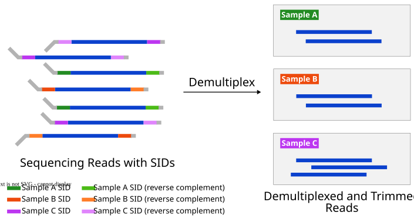
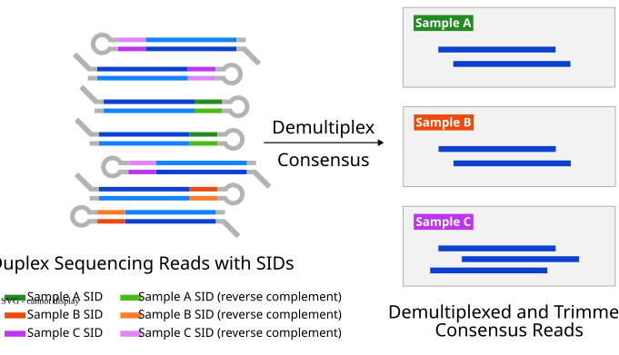

# Demux

## Getting started

### Introduction

Demux demultiplexes and processes raw reads from AXELIOS, the Roche SBX sequencing platform.
It supports demultiplexing, adapter trimming, duplex pairwise intramolecular consensus with YC tag generation, and
filtering.

Two command-line tools are provided:

1. `demux` — demultiplexes, trims, and filters raw sequencing reads.
   Handles both simplex and duplex data; on duplex data performs pairwise intramolecular consensus and YC tag generation.
2. `demux_strand_index` — builds a strand index (modified Bloom filter) for optional genome strand detection of duplex reads.
   See [Genome Strand Detection](#genome-strand-detection) for details.

---

### Background Concepts

<details open>
<summary>Background Concepts (click to expand)</summary>

Key concepts used throughout this documentation.

#### What is Primary Analysis?

A sequencer converts raw signals into nucleotide sequences (A, T, G, C) — a process called **basecalling**. The
resulting files contain millions of raw **reads**: short sequences representing fragments of the original DNA. Primary
analysis transforms these raw reads into clean, sample-labelled sequence files ready for downstream analysis.

#### What is Demultiplexing?

Sequencing workflows commonly pool DNA from **multiple samples** into a single run. To distinguish samples, each is
labelled with a **sample index (SID)** — a sample-specific, short nucleotide sequence that is attached to each DNA
fragment before pooling to identify the sample from which the DNA fragments derive.

Demultiplexing reads the SID on each raw read and sorts reads back into per-sample bins.



Without demultiplexing, reads from different samples would be mixed together.

#### What is a Sample Index (SID)?

A **SID** is a short, known nucleotide sequence — typically 12 bp — ligated to a single or both ends of every DNA fragment for a
given sample. The SIDs in use for a run are listed in the **sample sheet** (a CSV file). `demux` reads the sample
sheet, matches each SID in the raw reads, and assigns each read to a sample.

#### What is Adapter Trimming?

**Adapters** are short synthetic sequences added to DNA fragment ends during library preparation. They are required for
sequencing but are not part of the biological DNA. Adapter trimming removes them so downstream tools see only the
insert sequence.



#### What is a Unique Molecular Index (UMI)?

Some adapter designs include a **UMI** — a short random sequence attached to each DNA molecule. Unlike SIDs (which
identify the sample), UMIs identify the **individual molecule**, distinguishing true biological duplicates from PCR
amplification artifacts.

#### Simplex vs. Duplex Reads

| Term    | Meaning                                                                                                                                                                                                    |
|---------|------------------------------------------------------------------------------------------------------------------------------------------------------------------------------------------------------------|
| Simplex | A single read from one strand of a DNA molecule.                                                                                                                                                           |
| Duplex  | A read that contains both strands of the same DNA molecule (R1 and R2) connected by a **hairpin** adapter. After sequencing, a consensus is computed from R1 and R2 to produce a higher-accuracy sequence. |



##### Example duplex raw read structure (SBX-D)


Aligning R1 and R2 (reverse complement of R1) reveals concordant bases (matching, higher confidence) and discordant bases
(mismatching, lower confidence). The `start` and `end` adapters are reverse complements of each other and flank the
inserts. The hairpin is `SID + loop + SID RC`, where `SID RC` is the reverse complement of `SID`. This structure
identifies duplex reads and assigns them to samples.

##### Example raw simplex read structure (YS/YSU)


In YSU adapters, a UMI sits between the SID and the insert; YS adapters omit the UMI. Each UMI includes a short
1–4 bp linker that spaces functional regions apart. The paired UMI regions share a reverse complement relationship
for the first 3 bases.

</details>

---

### Processing Pipeline Overview

#### Duplex Pipeline

Duplex processing adds a consensus step because each raw read contains **two** passes of the same molecule.


| Step                 | What happens                                                                                                                                                                                | Key inputs                                                             |
|----------------------|---------------------------------------------------------------------------------------------------------------------------------------------------------------------------------------------|------------------------------------------------------------------------|
| ① Gather input files | All FASTQ / FASTQ.gz / RDB files from `--input` are collected.                                                                                                                              | `--input`                                                              |
| ② Demultiplex        | The hairpin is located within each raw read, splitting it into R1 and R2. The SID in the hairpin is matched against the sample sheet.                                                       | `--sample-sheet`, `--adapter-design-name`                              |
| ③ Pairwise consensus | R1 and R2 are aligned to each other. Concordant bases are kept; discordant bases are resolved. A **YC tag** is generated encoding the original R1/R2 sequences for lossless reconstruction. | —                                                                      |
| ④ Trim adapters      | Endadapter sequences flanking the insert are removed.                                                                                                                                       | `--adapter-design-bundle`                                              |
| ⑤ Filter reads       | Reads are discarded if too short, too many errors in the duplex region, or the consensus is too long for the output buffer.                                                                 | `--min-read-len`, `--min-trimmed-read-len`, `--max-error-rate-percent` |
| ⑥ Write output       | Passing consensus reads are written to per-sample subdirectories.                                                                                                                           | `--out-dir`, `--compression-type`                                      |
| ⑦ Calculate metrics  | Summary statistics (duplex bases, concordance, hairpin detection methods, etc.) are written as TSV files.                                                                                   | —                                                                      |

> **Note:** Components such as filtering can be performed slightly out of order for algorithmic or performance reasons.

#### Simplex Pipeline


| Step                 | What happens                                                                                                                                                               | Key inputs                                 |
|----------------------|----------------------------------------------------------------------------------------------------------------------------------------------------------------------------|--------------------------------------------|
| ① Gather input files | All FASTQ / FASTQ.gz / RDB files from `--input` are collected.                                                                                                             | `--input`                                  |
| ② Demultiplex        | The SID is located at the 5′ and/or 3′ ends of each read and matched against the sample sheet. Each read is assigned to a sample — or marked unassigned if no match is found. | `--sample-sheet`, `--adapter-design-name`  |
| ③ Trim adapters      | Runway, SID, UMI, and other adapter sequences are removed, leaving only the DNA insert.                                                                                    | `--adapter-design-bundle`                  |
| ④ Filter reads       | Reads shorter than a given trimmed or untrimmed length are discarded.                                                                                                      | `--min-read-len`, `--min-trimmed-read-len` |
| ⑤ Write output       | Passing reads are written to per-sample subdirectories under `--out-dir`.                                                                                                  | `--out-dir`, `--compression-type`          |
| ⑥ Calculate metrics  | Summary statistics (total reads, assigned reads, SID detection rates, etc.) are written as TSV files.                                                                      | —                                          |

---

#### Adapter Designs

The [adapter design bundle](#adapter-bundle-structure) (`--adapter-design-bundle`) ships several designs for simplex
and duplex libraries, with or without UMIs. Each design has a `type` that determines which pipeline is used:

| Adapter Design Name | Type          | Pipeline | UMI | Description                                                                                                                                |
|---------------------|---------------|----------|-----|--------------------------------------------------------------------------------------------------------------------------------------------|
| SBX-D               | `duplex`      | Duplex   | No  | Default duplex adapter design for paired intramolecular reads that use SBX-D chemistry.                                                    |
| SBX-DM              | `duplex`      | Duplex   | No  | SBX-D adapter design for TAPS+ methylation libraries.                                                                                      |
| SBX-FAST            | `duplex`      | Duplex   | No  | Default duplex adapter design for paired intramolecular reads that use SBX-FAST chemistry.                                                 |
| YSU                 | `YSU`         | Simplex  | Yes | Simplex adapter for libraries that include UMIs.                                                                                           |
| YS                  | `YS`          | Simplex  | No  | Simplex adapter for simplex libraries without UMIs.                                                                                        |
| YS-NEW              | `simplex`     | Simplex  | No  | Improved simplex adapter with better SID assignment accuracy. Intended to replace YS.                                                      |
| SIMPLEX-10X         | `simplex-10x` | Simplex  | No  | Simplex adapter for 10x-linked libraries. Only the runway and SID are trimmed (`<runway> + <sid>`); No trimming on the 3'-end is applied.* |

> **Note:** The adapter design bundle can contain additional designs not listed here (e.g., `I2X_*` variants). These are
> internal or experimental and not intended for general use.
>
> \* **Note:** Because SIMPLEX-10X only trims on the 5', all assigned reads are classified as partial reads.
> Additional untrimmed adapter sequence before and after the insert remains in the output for downstream tools.

#### Recommended System Requirements

- Processor — at least 16 cores. `AVX2` or `AVX-512` support improves performance.
- Memory — `demux`: 8 GiB. `demux_strand_index`: 64 GiB.

#### Minimum Memory Requirements

- `demux` — scales with thread count and `--batch-size`. With defaults, allocate ~1 GB per 10 threads. Strand
  detection adds the strand index file size.
- `demux_strand_index` — scales with reference size (~10 GiB per 1 Gbp). The human genome (~3 Gbp) needs ~32 GiB and
  produces a 2 GiB index with defaults.

---

## Usage

### Demultiplexing raw _simplex_ sequencing reads

Pipeline steps:

1. **Gather input files** in FASTQ or RDB format.
2. **Demultiplex input reads** into different samples using the provided sample sheet and adapter design.
3. **Trim adapters** from reads according to the specified adapter design.
4. **Filter reads** based on length, error rate, and other specified criteria.
5. **Write processed reads** to the output directory.
6. **Calculate metrics** and write summary output files.

Filtering can be performed slightly out of order for performance reasons.

#### Example command

```bash
demux \
  --adapter-design-bundle /resources/adapter-design-bundle.zip \
  --adapter-design-name YSU \
  --threads 16 \
  --sample-sheet /path/to/sample_sheet.csv \
  --input /path/to/input_directory \
  --out-dir /path/to/output_directory
```

Demultiplexes reads from the input directory using the `YSU` adapter design. Output is written per-sample into
subdirectories under `--out-dir`. See [Overview and CLI Options](#overview-and-cli-options) for all options.

#### Input files (simplex `demux`)

1. Adapter design bundle
2. Raw reads: FASTQ, FASTQ.gz, or RDB files (or directories containing them)
3. Optional [sample sheet](#sample-sheet-format). Falls back to the bundle's default sheet if omitted. The default sheet can include samples not associated with the run.

#### Output files (simplex `demux`)

1. Per-sample demultiplexed FASTQ files
2. Metrics (TSV): run metrics, sample metrics, sample assignment metrics, read length distributions

#### Simplex Metrics

##### Simplex run metrics (`run_stats.tsv`)

Columns: `metrics_name`, `count`, `percentage`.

| Metric Name                    | Description                                                          | Percentage Denominator  | Relationship                                               |
|--------------------------------|----------------------------------------------------------------------|-------------------------|------------------------------------------------------------|
| total_reads                    | Number of reads parsed                                               | total_reads             | `preassignment_passing_reads + failed_reads`               |
| preassignment_passing_reads    | Number of reads passing filter before assignment                     | total_reads             | `assigned_reads + unassigned_reads`                        |
| failed_reads                   | Number of reads filtered before adapter processing                   | total_reads             | `too_short_reads`                                          |
| too_short_reads                | Number of reads filtered by min read length                          | total_reads             |                                                            |
| assigned_reads                 | Number of reads assigned to a SID                                    | total_reads             |                                                            |
| failed_assigned_reads          | Number of reads that have valid adapters/SID but subsequently failed | total_reads             | `too_short_trimmed_reads + sid_discordant_discarded_reads` |
| too_short_trimmed_reads        | Number of reads filtered by min length after trim                    | total_reads             |                                                            |
| sid_discordant_discarded_reads | Number of discordant SID reads discarded by `--discordant-sid-mode`  | total_reads             |                                                            |
| unassigned_reads               | Number of reads not assigned to a SID                                | total_reads             |                                                            |
| full_reads                     | Number of full reads                                                 | total_reads             |                                                            |
| partial_reads                  | Number of partial reads                                              | total_reads             |                                                            |
| both_sid_detected_reads        | Number of reads with SID detected on both ends                       | total_reads             |                                                            |
| sid_discordant_reads           | Number of reads with discordant SID                                  | both_sid_detected_reads |                                                            |
| index_hopping_reads            | Number of index-hopping reads                                        | both_sid_detected_reads |                                                            |
| perfect_index_reads            | Number of perfect index reads                                        | both_sid_detected_reads |                                                            |
| num_expected_sids              | Number of expected SIDs in sample sheet                              | sample sheet            |                                                            |
| num_sids                       | Number of unique SIDs detected in run                                | sample sheet            |                                                            |

Adapter metrics use an eight-letter code combining `s5`/`s3`/`u5`/`u3` (found) and `xX` (not found) for
5’ SID, 3’ SID, 5’ UMI, and 3’ UMI respectively — 16 combinations total:

| Name     | 5’ SID | 3’ SID | 5’ UMI | 3’ UMI |
|----------|--------|--------|--------|--------|
| s5s3u5u3 | yes    | yes    | yes    | yes    |
| s5s3u5xX | yes    | yes    | yes    | no     |
| s5s3xXu3 | yes    | yes    | no     | yes    |
| s5s3xXxX | yes    | yes    | no     | no     |
| s5xXu5u3 | yes    | no     | yes    | yes    |
| s5xXu5xX | yes    | no     | yes    | no     |
| s5xXxXu3 | yes    | no     | no     | yes    |
| s5xXxXxX | yes    | no     | no     | no     |
| xXs3u5u3 | no     | yes    | yes    | yes    |
| xXs3u5xX | no     | yes    | yes    | no     |
| xXs3xXu3 | no     | yes    | no     | yes    |
| xXs3xXxX | no     | yes    | no     | no     |
| xXxXu5u3 | no     | no     | yes    | yes    |
| xXxXu5xX | no     | no     | yes    | no     |
| xXxXxXu3 | no     | no     | no     | yes    |
| xXxXxXxX | no     | no     | no     | no     |

##### Simplex sample metrics (`sample_stats.tsv`)

| Name                    | Description                                        |
|-------------------------|----------------------------------------------------|
| index_sequence          | Sample index sequence (SID)                        |
| assigned_reads          | Number of reads assigned to this SID               |
| full_reads              | Number of full reads assigned to this SID          |
| partial_reads           | Number of partial reads assigned to this SID       |
| both_sid_detected_reads | Number of reads with SID detected on both ends     |
| sid_discordant_reads    | Number of reads with discordant SID                |
| index_hopping_reads     | Number of index-hopping reads                      |
| perfect_index_reads     | Number of perfect index reads assigned to this SID |

In addition, the eight-letter string adapter metrics (as defined for `run_stats.tsv`) are also reported for each
sample. Therefore, the metrics file has a total of 24 (8 + 16) rows.

The TSV contains a leading `metric` column, followed by one column per SID and an `Unassigned` column; each row
contains the values for that metric across the samples/unassigned column.

##### Sample assignment metrics (`sample_assignment_metrics.tsv`)

Columns (7):

| Name                    | Description                                                                        |
|-------------------------|------------------------------------------------------------------------------------|
| expected_sid            | Expected SID name                                                                  |
| collision_sid           | Collided SID name                                                                  |
| 5'collision             | Number of 5' SID collisions                                                        |
| 3'collision             | Number of 3' SID collisions                                                        |
| total_collisions        | Number of SID collisions; sum of `5'collision` and `3'collision`                   |
| both_sid_detected_reads | Number of reads with both 5' and 3' SIDs detected                                  |
| percent_sid_collision   | Percent of SID collisions; `total_collisions` divided by `both_sid_detected_reads` |

##### Read length distribution metrics

Read length distribution metrics are split into 4 files, one for each read type:

1. `trimmed_full_read_len_dist.tsv`
2. `trimmed_partial_read_len_dist.tsv`
3. `untrimmed_full_read_len_dist.tsv`
4. `untrimmed_partial_read_len_dist.tsv`

Each file has a column for read lengths and one column per SID with frequencies. Lengths exceeding
`--length-distribution-report-max` are grouped into a single bucket (e.g., "1000+").

> **Note:** When `--adapter-design-name SIMPLEX-10X` is used for 10x scRNA libraries, only the 5′ SID
> is detected and trimmed. Therefore, all assigned reads are reported as `partial_reads` with adapter
> code `s5xXxXxX`, and metrics that depend on 3′ SID detection (`full_reads`, `both_sid_detected_reads`,
> `sid_discordant_reads`, `perfect_index_reads`, `index_hopping_reads`) report a value of zero.

### Demultiplexing raw _duplex_ sequencing reads

Pipeline steps:

1. **Gather input files** in FASTQ or RDB format.
2. **Demultiplex** via the hairpin specified by the adapter design and sample sheet.
3. **Pairwise intramolecular consensus** for duplex reads, generating YC tags.
4. **Trim adapters** per the adapter design.
5. **Filter reads** by length, error rate, and other criteria.
6. **Write** processed reads to the output directory.
7. **Calculate metrics** and write summary files.

Filtering can be performed slightly out of order for performance reasons.

Example command:

```bash
demux \
  --adapter-design-bundle /resources/adapter-design-bundle.zip \
  --adapter-design-name SBX-D \
  --threads 16 \
  --sample-sheet /path/to/sample_sheet.csv \
  --input /path/to/input_directory \
  --out-dir /path/to/output_directory
```

Demultiplexes reads from the input directory using the `SBX-D` adapter design. Output is written per-sample into
subdirectories under `--out-dir`. See [Overview and CLI Options](#overview-and-cli-options) for all options.

#### Input files (duplex `demux`)

1. Adapter design bundle
2. Raw reads: FASTQ, FASTQ.gz, or RDB files (or directories containing them)
3. Optional [sample sheet](#sample-sheet-format). Falls back to the bundle's default sheet if omitted. The default sheet can include samples not associated with the run.

#### Output files (duplex `demux`)

1. Per-sample demultiplexed FASTQ files
2. Metrics (TSV): run metrics, sample metrics, read and region size distributions

#### Duplex metrics

##### Duplex run metrics (`run_stats.tsv`)

Columns: `metrics_name`, `count`, `percentage`.

| Metric Name                    | Description                                                                                | Percentage Denominator | Relationship                                                                                                            |
|--------------------------------|--------------------------------------------------------------------------------------------|------------------------|-------------------------------------------------------------------------------------------------------------------------|
| total_reads                    | Raw reads processed.                                                                       | total_reads            | `assigned_reads + unassigned_reads`                                                                                     |
| assigned_reads                 | Reads with a hairpin that contains valid SIDs and are not filtered by raw read length.     | total_reads            | `passing_reads + failed_assigned_reads`, `found_by_string_compare + found_by_global_symmetry + found_by_local_symmetry` |
| passing_reads                  | Assigned reads that pass all filters such as trimmed length, error rate and buffer size.   | total_reads            | `full_duplex_reads + partial_duplex_reads`                                                                              |
| full_duplex_reads              | Passing reads without a simplex region.                                                    | total_reads            |                                                                                                                         |
| partial_duplex_reads           | Passing reads with a simplex region.                                                       | total_reads            |                                                                                                                         |
| unassigned_reads               | Reads filtered before or during SID assignment.                                            | total_reads            | `no_hairpin_reads + too_long_reads + too_short_reads`                                                                   |
| no_hairpin_reads               | Unassigned reads without a hairpin.                                                        | total_reads            |                                                                                                                         |
| too_long_reads                 | Unassigned reads too long to fit in buffer (currently 2688 bp).                            | total_reads            |                                                                                                                         |
| too_short_reads                | Unassigned reads too short according to length filter (default 50 bp).                     | total_reads            |                                                                                                                         |
| failed_assigned_reads          | Assigned reads that failed subsequent filters.                                             | total_reads            | `too_many_errors_reads + too_short_trimmed_reads + too_long_consensus_reads + failed_hairpin_stem_trim_reads`           |
| too_many_errors_reads          | Failed assigned reads with too many errors in duplex region (default 10%).                 | total_reads            |                                                                                                                         |
| too_short_trimmed_reads        | Failed assigned reads filtered after trimming (default 50 bp).                             | total_reads            |                                                                                                                         |
| too_long_consensus_reads       | Failed assigned reads with consensus sequence too long for output buffer (currently 1344). | total_reads            |                                                                                                                         |
| failed_hairpin_stem_trim_reads | Assigned read that failed to trim on the hairpin side.                                     | total_reads            |                                                                                                                         |
| found_by_string_compare        | Hairpins found via string comparison algorithm.                                            | assigned_reads         |                                                                                                                         |
| found_by_global_symmetry       | Hairpins found via global symmetry algorithm.                                              | assigned_reads         |                                                                                                                         |
| found_by_local_symmetry        | Hairpins found via local symmetry algorithm.                                               | assigned_reads         |                                                                                                                         |
| longer_r2_reads                | Reads where raw R1 is shorter than raw R2.                                                 | passing_reads          |                                                                                                                         |
| longer_r2_full_duplex_reads    | Full duplex reads where raw R1 is shorter than raw R2.                                     | passing_reads          |                                                                                                                         |
| both_umi_reads                 | Reads where both UMIs (relative to R1) were found.                                         | passing_reads          |                                                                                                                         |
| 5p_umi_reads                   | Reads where only the 5p UMI (relative to R1) was found.                                    | passing_reads          |                                                                                                                         |
| 3p_umi_reads                   | Reads where only the 3p UMI (relative to R1) was found.                                    | passing_reads          |                                                                                                                         |
| no_endadapter_reads            | Passing reads without a detectable endadapter after consensus (left untrimmed).            | passing_reads          |                                                                                                                         |
| strand_fw_reads                | Forward strand classified reads. (`--strand-detect` mode only).                            | passing_reads          |                                                                                                                         |
| strand_rv_reads                | Reverse strand classified reads. (`--strand-detect` mode only).                            | passing_reads          |                                                                                                                         |
| strand_fw_sig_reads            | Forward strand significantly classified reads. (`--strand-detect` mode only).              | passing_reads          |                                                                                                                         |
| strand_rv_sig_reads            | Reverse strand significantly classified reads. (`--strand-detect` mode only).              | passing_reads          |                                                                                                                         |
| total_bases                    | Total bases in all passing reads.                                                          | total_bases            | `concordant_duplex_bases + discordant_duplex_bases + non_duplex_bases`                                                  |
| concordant_duplex_bases        | Bases matching duplex pair in passing reads.                                               | total_bases            |                                                                                                                         |
| discordant_duplex_bases        | Bases not matching in passing reads.                                                       | total_bases            |                                                                                                                         |
| duplex_bases                   | Duplex bases that are either concordant or discordant.                                     | total_bases            | `concordant_duplex_bases + discordant_duplex_bases`                                                                     |
| non_duplex_bases               | Bases in non-duplex regions in passing reads.                                              | total_bases            |                                                                                                                         |
| raw_bases                      | Raw bases in all input reads.                                                              | raw_bases              | `unassigned_bases + failed_assigned_bases + trimmed_bases + total_bases`                                                |
| unassigned_bases               | Raw bases in reads that were determined unassigned.                                        | raw_bases              |                                                                                                                         |
| failed_assigned_bases          | Raw bases in reads that were assigned but failed subsequent filters.                       | raw_bases              |                                                                                                                         |
| trimmed_bases                  | Bases removed from passing reads during adapter trimming.                                  | raw_bases              |                                                                                                                         |
| num_expected_sids              | Number of expected SIDs in sample sheet.                                                   | num_sids               |                                                                                                                         |
| num_sids                       | Number of unique SIDs detected in run.                                                     | num_sids               |                                                                                                                         |
| mean_passing_read_length       | Mean read length of passing reads.                                                         | total_reads            |                                                                                                                         |

##### Duplex sample metrics (`sample_stats.tsv`)

Same TSV shape as the simplex `sample_stats.tsv`: a leading `metric` column, one column per SID, and an `Unassigned`
column. Most metric names are shared with `run_stats.tsv`, with these additions:

| Name           | Description                          |
|----------------|--------------------------------------|
| index_sequence | Sample index sequence (SID). |

The following run-level metrics are not reported per sample:

- `total_reads`
- `unassigned_reads`
- `no_hairpin_reads`
- `too_long_reads`
- `too_short_reads`
- `raw_bases`
- `unassigned_bases`
- `num_expected_sids`
- `num_sids`

##### Length distribution metrics

`demux` outputs read/region size distributions in TSV format. Each filename corresponds to a metric above.

Pre SID assignment distribution files:

1. `total_read_length_distr.tsv`
2. `unassigned_read_length_distr.tsv`
3. `no_hairpin_read_length_distr.tsv`

Post SID assignment distribution files:

1. `full_duplex_read_length_distr.tsv`
2. `partial_duplex_read_length_distr.tsv`
3. `passing_read_length_distr.tsv`
4. `endadapter_position_distr.tsv`

#### Tips for `demux` analysis

Increase `--batch-size` for better throughput at the cost of higher memory usage.

### Build an index for reference genome strand detection

`demux_strand_index` builds an interleaved Bloom filter of reference genome k-mers for alignment-free strand detection
in `demux`.

Forward and reverse strand filters are interleaved to optimize memory access during querying.

Example command:

```bash
demux_strand_index \
  --input /path/to/reference_genome.fa \
  --threads 16
```

Creates `strand.bloom` in the current directory. Pass it to `demux` via `--strand-detect`:

```bash
demux \
  --adapter-design-bundle /resources/adapter-design-bundle.zip \
  --adapter-design-name SBX-D \
  --threads 16 \
  --input /path/to/input_directory \
  --out-dir /path/to/output_directory \
  --strand-detect strand.bloom
```

See [Overview and CLI Options](#overview-and-cli-options) for all options.

#### Input file for `demux_strand_index`

Reference genome FASTA with its index (`*.fa.fai`).

#### Output file for `demux_strand_index`

`strand.bloom` in the current directory (override with `--output`).

#### Tips for `demux_strand_index`

1. Build once per reference genome; reuse across runs.
2. Larger `--kmer-size` improves precision but reduces tolerance to sequencing errors.
3. Lower `--max-false-positive-rate` reduces false positives but increases filter size.
4. Entropy-optimal FPRs are 1/2^n. The default `0.015625` (n=6) works well — only change it if memory is constrained.
5. Filter sizes are powers of 2. For the human genome the default FPR produces a 2 GiB filter near optimal entropy.

#### Performance and cost notes for `demux_strand_index`

Memory is at least 64 bits per unique k-mer (e.g., 1 Gbp ≈ 8 GiB). The 10 GiB/Gbp heuristic accounts for hash table
overhead; power-of-2 sizing can increase actual usage by up to 2× in the worst case.

## Overview and CLI Options

### `demux` CLI Options

Options in the [Simplex Options](#simplex-options) group only take effect when the selected adapter design uses the simplex pipeline, and options in the [Duplex Options](#duplex-options) group only take effect for duplex designs.

See [Adapter Designs](#adapter-designs) for how simplex/duplex adapter type is determined.

#### Common options

Parameters in **bold** are required.

| Parameter                        | Description                                                                                                                                                                                                                                          | Value(s)                                                            |
|----------------------------------|------------------------------------------------------------------------------------------------------------------------------------------------------------------------------------------------------------------------------------------------------|---------------------------------------------------------------------|
| **--input**                      | Input FASTQ, FASTQ.gz, or RDB files or directories. May be specified multiple times or as a space-separated list.                                                                                                                                    | A string file path                                                  |
| --input-files-list               | File listing input paths (alternative to `--input`).                                                                                                                                                                                                 | A string file path                                                  |
| --out-dir                        | Output directory for demultiplexed reads and metrics.                                                                                                                                                                                                | A string directory path [default `.`]                               |
| --overwrite                      | Allow overwriting an existing output directory.                                                                                                                                                                                                      |                                                                     |
| --batch-size                     | Number of reads to process in each batch.                                                                                                                                                                                                            | An integer > 0 [default `500`]                                      |
| --threads                        | Number of threads used (0=available hardware threads).                                                                                                                                                                                               | An integer >= 0 [default `1`]                                       |
| --adapter-design-bundle          | Path to ZIP or directory containing adapter architecture and search strategy.                                                                                                                                                                        | A string file path [default `/resources/adapter-design-bundle.zip`] |
| --adapter-design-name            | Adapter design name to load from the bundle. Determines whether the simplex or duplex pipeline is used.                                                                                                                                              | A string [default `SBX-D`]                                          |
| --sample-sheet                   | Restrict SID lookup to this sheet; otherwise the bundle's default is used. See [Sample Sheet Format](#sample-sheet-format).                                                                                                                          | A string file path                                                  |
| --compression-level              | Compression level for output FASTQs (`zstd`: 1–19, `gzip`: 1–9). Higher values increase compression at the cost of speed.                                                                                                                            | An integer >= 1 and <= 19 [default `1`]                             |
| --writing-threads-per-sample     | Writer threads per sample (1–8). Output is deterministic at 1 (default); with >1, read order can vary between runs.                                                                                                                                  | An integer > 0 and <= 8 [default `1`]                               |
| --worker-threads-per-input       | Controls how many input files are processed concurrently: `concurrent inputs = threads / worker-threads-per-input` (minimum 1). Higher values reduce concurrency, which can lower memory pressure for large files. Clamped to `--threads` if larger. | An integer >= 1 [default `4`]                                       |
| --compression-type               | Compression type for output FASTQs. `none` disables compression.                                                                                                                                                                                     | Either `zstd`, `gzip`, `none` [default `gzip`]                      |
| --length-distribution-report-max | Maximum read length bucket in the length distribution report.                                                                                                                                                                                        | An integer > 0 [default `1000`]                                     |
| --min-read-len                   | Filter raw reads shorter than this length.                                                                                                                                                                                                           | An integer >= 0 [default `50`]                                      |
| --min-trimmed-read-len           | Filter trimmed reads shorter than this length.                                                                                                                                                                                                       | An integer >= 0 [default `50`]                                      |
| --output-failed-reads            | Write unaltered failed reads to files prefixed `raw_failed`.                                                                                                                                                                                         |                                                                     |

#### Simplex options

These options only take effect when the adapter design selects the simplex pipeline (YS, YSU, YS-NEW, SIMPLEX-10X).

| Parameter                        | Description                                                                                                                                                                                                                                        | Value(s)                                                          |
|----------------------------------|----------------------------------------------------------------------------------------------------------------------------------------------------------------------------------------------------------------------------------------------------|-------------------------------------------------------------------|
| --read-length-mode               | Simplex read output mode. `full-only`: emit only full-length reads. `all`: emit full and partial reads together. `all-split`: emit full and partial reads into separate subdirectories (`<sample>/full/`, `<sample>/partial/`).                    | `full-only`, `all`, or `all-split` [default `all`]                |
| --discordant-sid-mode            | Determines how to handle reads where 5′ and 3′ SIDs disagree. `discard-tied`: discard only when both sides are equally likely. `discard-all`: discard all discordant reads. `keep`: keep all discordant reads, assign to winning side.             | `discard-tied`, `discard-all`, or `keep` [default `discard-tied`] |
| --suppress-simplex-qual-override | Suppress overriding base-call quality scores for simplex adapter reads (YS, YSU, YS-NEW, SIMPLEX-10X). By default, the scores are replaced with a fixed simplex value. When this flag is set, the original base-call quality scores are preserved. |                                                                   |
| --min-score                      | Minimum log-odds score for a valid adapter match (experimental, subset of adapters only).                                                                                                                                                          | An integer >= 0 [default `30`]                                    |

#### Duplex options

These options only take effect when the adapter design selects the duplex pipeline (SBX-D, SBX-DM, SBX-FAST).

| Parameter                                | Description                                                                                                                                                  | Value(s)                               |
|------------------------------------------|--------------------------------------------------------------------------------------------------------------------------------------------------------------|----------------------------------------|
| --max-error-rate-percent                 | Filter duplex reads with a consensus region with error rate larger than this percentage.                                                                     | A float >= 0 and <= 100 [default `10`] |
| --stop-after-min-concordant-duplex-bases | Minimum concordant duplex bases per sample for early stopping.                                                                                               |                                        |
| --strand-critical-phred                  | In duplex strand detection mode, this is the Phred scaled FPR critical value -10*log10(critical_value). Low values will classify faster at cost of accuracy. | A double > 0 [default `70`]            |
| --strand-detect                          | Enable strand detection using a Bloom filter built by `demux_strand_index`.                                                                                  | A string file path                     |

### `demux_strand_index` Common CLI Options

Parameters in **bold** are required.

| Parameter                 | Description                                                                        | Value(s)                                     |
|---------------------------|------------------------------------------------------------------------------------|----------------------------------------------|
| **--input**               | Input FASTA file of reference genome. Must include a fai index.                    | A string file path                           |
| --output                  | Output filename for the strand index.                                              | A string file path [default `strand.bloom`]  |
| --threads                 | Number of threads used (0=available hardware threads).                             | An integer >= 0 [default `1`]                |
| --kmer-size               | k-mer size for the output strand index.                                            | An integer > 0 and < 32 [default `19`]       |
| --max-false-positive-rate | Maximum false positive rate for the output interleaved bloom filter used as index. | A float in range (0, 1) [default `0.015625`] |

---

## Appendix

### Sample Sheet Format

The sample sheet file is a CSV with two columns, `sample_name` and `sample_sid`.

Example sheet with only 2 samples:

```text
sample_name,sample_sid
HG001,CTATTGAAGGCT
HG002,GGAGTAACATCC
```

#### Adapter Bundle Structure

The adapter design bundle is a folder (or ZIP) containing FASTA files and a `manifest.json` that describes the
available designs. Typical structure:

```adapter_design_bundle/
├── adapter_name/
│   ├── adapter_feature.fasta
└── manifest.json
```

##### Adapter Bundle Manifest File Structure

**Top-level fields:**

- `default_adapter_design_name`: Design used when `--adapter-design-name` is not specified
- `adapter_designs`: Array of adapter design objects

**Adapter design fields:**

- `name`: Unique identifier (e.g., "SBX-D", "YSU")
- `type`: Adapter type (e.g., "duplex", "duplex_umi")
- `adapter_5p` / `adapter_3p`: Arrays of adapter features for each read end

**Adapter feature fields** (within `adapter_5p` / `adapter_3p`):

- `type`: Feature type ("runway", "sid", "anchor", "umi", "stem", "loop")
- `lut`: Lookup table configuration
  - `sequences`: Path to FASTA file (relative to bundle root)
  - `transform`: "none" or "reverse_complement"
  - `max_edit_distance`: Maximum Hamming distance for matching
  - `prefix` / `suffix` (optional): Bases prepended/appended before transform and LUT generation
- `search`: Search strategy
  - `max_wiggle_left` / `max_wiggle_right`: Search range around expected position

**Example snippet:**

```json
{
  "default_adapter_design_name": "SBX-D",
  "adapter_designs": [
    {
      "name": "SBX-D",
      "type": "duplex",
      "adapter_5p": [
        {
          "type": "runway",
          "lut": {
            "sequences": "duplex/runway-5p.fa",
            "transform": "none",
            "max_edit_distance": 2
          },
          "search": {
            "max_wiggle_left": 0,
            "max_wiggle_right": 2
          }
        }
      ]
    }
  ]
}
```

The manifest allows flexible organization of adapter sequences across different directories while maintaining a
consistent interface for demux to locate and use them.

### Read Name Format for FASTQ Output with RDB input

When the input files are in RDB format (a binary format), output FASTQ read names are regenerated.
Four RDB input flavors are supported — Gamma2, Gamma1, DataPath2, and HTP1 — which are automatically detected by the reader.
The read name outputs are generated with the following format:

```shell
{date}:{sequence}:Q{queue_name}:R{run_num}:{cycle_id}:{b64-UID}:{sidUmiBitflag}|{sidId}{optionalUMI}
```

| Field           | Description                                                                                                                                                                                                                                                                    |
|-----------------|--------------------------------------------------------------------------------------------------------------------------------------------------------------------------------------------------------------------------------------------------------------------------------|
| `date`          | Date of processing in YYYYMMDD format.                                                                                                                                                                                                                                         |
| `sequence`      | Sequence number of the read in the input file.                                                                                                                                                                                                                                 |
| `queue_name`    | Name of the queue the read was processed in. This is a `*` if not specified or identified.                                                                                                                                                                                     |
| `run_num`       | Run number of the read. This is a `*` if not specified or identified.                                                                                                                                                                                                          |
| `cycle_id`      | Cycle ID of the read.                                                                                                                                                                                                                                                          |
| `b64-UID`       | Base64 encoded unique identifier of the read. Encoded using `0123456789ABCDEFGHIJKLMNOPQRSTUVWXYZabcdefghijklmnopqrstuvwxyz+_`, 0-padded for uniform length. Constant size is 6 tokens (6 tokens × 6 bits = 36 bits, sufficient to exceed u32 range; upper bits are always 0). |
| `sidUmiBitflag` | 4-bit bitfield printed as a base-10 integer (0-15) indicating the presence of SIDs and UMIs in the read. Bits: 5' SID found: `0b1000` (8), 3' SID found: `0b0100` (4), 5' UMI found: `0b0010` (2), 3' UMI found: `0b0001` (1).                                                 |
| `sidId`         | Assigned SID for the read.                                                                                                                                                                                                                                                     |
| `optionalUMI`   | UMI sequences if present, formatted as `:{umi5p}:{umi3p}`.                                                                                                                                                                                                                     |

### Read Name Format for FASTQ Output with FASTQ input

When the input files are in FASTQ format, demux preserves the original read names in the output FASTQ files and applies the same SID/UMI annotations described above for RDB input by appending `sidUmiBitflag`, `sidId`, and `optionalUMI` to the end of the read name.

### Output Directory and Filename Structure

The output directory will contain a subdirectory for each sample, named for the sample.
Each sample subdirectory will contain the FASTQ files for that sample.
The files are named as `<sample_name>-<part_index>.fastq[.gz|.zst]`, where `part_index` is a 1-based, zero-padded integer (6 digits by default) that uniquely identifies each output file within a sample. Part indices are contiguous and assigned in input file order. Files from the same input file use contiguous part indices.
The output directory will also contain a metrics directory with files described in the [simplex metrics](#simplex-metrics) and [duplex metrics](#duplex-metrics) sections.
In addition to the per-sample subdirectories, if `--output-failed-reads` is set, there will be a `raw_failed` sample for unassigned reads that failed before or during SID assignment with files named `raw_failed-<part_index>.fastq[.gz|.zst]`.

Each sample subdirectory also contains a `file_provenance.tsv` that maps each output FASTQ file to the input file it was derived from. This is useful for troubleshooting. The TSV has two columns: `output_filename` and `input_filepath`.

**Determinism:** When `--writing-threads-per-sample` is set to 1 (the default), the output is fully deterministic: the same inputs produce the same output filenames, read order, and file contents. With more than one writing thread, read order within a sample can vary between runs due to concurrent writes.

A truncated example output directory structure can look like this with a single writing thread, when `--output-failed-reads` is set, and with two samples `HG0001` and `HG0002`:

```text
output_directory/
├── metrics/
│   ├── run_stats.tsv
│   ├── sample_stats.tsv
│   ├── sample_assignment_metrics.tsv
│   ├── trimmed_full_read_len_dist.tsv
│   ├── trimmed_partial_read_len_dist.tsv
│   ├── untrimmed_full_read_len_dist.tsv
│   └── untrimmed_partial_read_len_dist.tsv
├── HG0001/
│   ├── HG0001-000001.fastq.gz
│   ├── HG0001-000002.fastq.gz
│   ├── HG0001-000003.fastq.gz
│   └── file_provenance.tsv
├── HG0002/
│   ├── HG0002-000001.fastq.gz
│   ├── HG0002-000002.fastq.gz
│   └── file_provenance.tsv
└── raw_failed/
    ├── raw_failed-000001.fastq.gz
    ├── raw_failed-000002.fastq.gz
    └── file_provenance.tsv
```

With `--read-length-mode all-split`, full and partial reads are written to separate subdirectories:

```text
out-dir/
├── <sample>/
│   ├── full/
│   │   ├── <sample>-000001.fastq.gz
│   │   └── file_provenance.tsv
│   └── partial/
│       ├── <sample>-000001.fastq.gz
│       └── file_provenance.tsv
```

### Genome Strand Detection

Strand detection is optional. It enables strand-aware indel left-alignment for duplex reads without changing the
consensus sequence — only indel positions (and thus quality score and YC tag locations) are affected. This is useful
when duplex data is processed by downstream tools that expect indels to follow a different alignment convention.

Detection uses k-mer membership queries against an interleaved Bloom filter (forward + reverse strand). Lookups stop
early once a binomial test, controlled by `--strand-critical-phred`, classifies the read with high confidence. Lower
values classify faster at the cost of accuracy. Reads not significantly classified use the strand with the higher
k-mer count (`strand_fw_reads` / `strand_rv_reads` metrics).

After classification, indels in the pairwise alignment are shifted as far left or right as possible without altering
the consensus, left-aligning them relative to the reference genome. Unclassified reads (equal counts) are shifted
arbitrarily for consistency.

### Concepts and Terminology

| Term                | Description                                                                                                                                                              |
|---------------------|--------------------------------------------------------------------------------------------------------------------------------------------------------------------------|
| Bloom filter        | Memory-efficient probabilistic data structure for set-membership tests.                                                                                                  |
| consensus           | Sequence generated by pairwise intramolecular consensus of R1 and R2.                                                                                                    |
| duplex              | A read with two constituent reads (R1, R2) paired intramolecularly.                                                                                                      |
| assigned read       | A read that has been successfully assigned to a sample using the SID of the read.                                                                                        |
| full read           | Assigned simplex read with enough of both adapter regions before and after the insert to trim them off. Adapter design must have an adapter before and after the insert. |
| partial read        | Assigned simplex read that remains untrimmed on exactly one side. Adapter design must have at least one adapter before or after the insert.                              |
| full duplex read    | Duplex read with identifiable insert on both R1 and R2.                                                                                                                  |
| partial duplex read | Duplex read with a simplex region (one or more features missing on R1 or R2).                                                                                            |
| RC                  | Reverse complement.                                                                                                                                                      |
| runway              | Fixed adapter sequence at the 5' start: `[runway][start adapter]`.                                                                                                       |
| start adapter       | Fixed sequence after the runway: `[runway][start adapter][R1 insert]`.                                                                                                   |
| end adapter         | Fixed sequence at the 3' end: `[R2 insert][end adapter]`.                                                                                                                |
| endadapter          | Collective term for start/end adapters (reverse complements of each other). After consensus: `[endadapter][insert][hairpin]`.                                            |
| loop                | ~7 bp sequence between the two SIDs in the hairpin.                                                                                                                      |
| hairpin             | `[SID][loop][SID RC]` adapter sequence (also called midadapter).                                                                                                         |
| linker              | Short (1–4 bp) spacer between functional regions (e.g., barcode and UMI).                                                                                                |
| linker base         | A base in the linker, usually A.                                                                                                                                         |
| stem                | General term for a fixed adapter sequence between endadapter regions. Superseded by more specific names when applicable.                                                 |
| hairpin stem        | Stem between insert and hairpin: `[insert][stem][hairpin]`. In SBX-D this is just the linker base A.                                                                     |
| R1                  | First constituent read in a duplex read. Raw R1 = untrimmed sequence before the loop.                                                                                    |
| R2                  | Second constituent read in a duplex read. Raw R2 = untrimmed sequence after the loop.                                                                                    |
| SID                 | Sample index, a sample-specific, short nucleotide sequence that is attached to each DNA fragment before pooling to identify the sample from which the DNA fragments derive. |
| Valid SID           | SID matching (within error tolerance) an entry in the sample sheet or bundle defaults.                                                                                   |
| UMI                 | Unique molecular index — short sequence tagging individual molecules.                                                                                                    |
| YC tag              | Lossless encoding of R1 and R2 in a duplex consensus read.                                                                                                               |
| strand detection    | Determining the DNA strand (forward/reverse) relative to a reference genome.                                                                                             |
| sample sheet        | CSV file mapping SID sequences to sample names. See [Sample Sheet Format](#sample-sheet-format).                                                                         |
