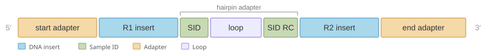
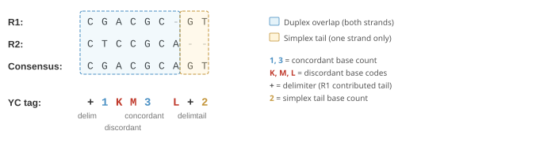

# Interpreting SBX Duplex (SBX-D) Reads

This guide explains how to interpret SBX Duplex (SBX-D) reads: their structure, read-name
examples, the YC tag, and quality scores. For the shared read-name format (fields, base prefix,
and `read_bitflag`), see the parent [Interpreting SBX Reads](interpreting-sbx-reads.md) page.

---

## Duplex Read Structure

In SBX-D sequencing, a raw read has the following structure:



The raw read contains R1 (the forward strand insert), a hairpin adapter (which includes the sample identifier), and R2 (the reverse complement of R1). During demultiplexing, R1 and R2 are aligned to each other to produce a consensus sequence.

Bases in the consensus fall into two categories:

- **Concordant bases** — positions where R1 and R2 agree. These have higher confidence because both strands independently produced the same call.
- **Discordant bases** — positions where R1 and R2 disagree (mismatches, insertions, or deletions between the two strands).

Additionally, the ends of the consensus may contain **simplex tails** — regions where only one strand contributed sequence (because R1 and R2 were different lengths or did not fully overlap).

Duplex reads fall into two categories based on strand overlap:

- **Full-length duplex read** — R1 and R2 are the same length, so every base in the consensus has duplex support (both strands contributed).
- **Partial-length duplex read** — R1 and R2 are different lengths. The shorter strand does not cover the full insert, producing simplex tails at one or both ends. Note that a partial-length duplex read still has a complete insert; "partial" refers to the duplex coverage, not to missing adapter detection (which is the simplex "partial-insert" concept described in the [SBX-S guide](interpreting-sbx-s-reads.md#simplex-read-structure)).

---

## Read Name Examples

Duplex read names follow the shared format described on the
[parent page](interpreting-sbx-reads.md#read-names).

### Duplex read

```text
20250115:SBX-HTP01:Q1:R3:42:0A3xKf:12|1
```

| Component | Value | Meaning |
|-----------|-------|---------|
| Date | `20250115` | January 15, 2025 |
| Sequencer | `SBX-HTP01` | Instrument name |
| Queue | `Q1` | Run queue 1 |
| Run | `R3` | Run 3 |
| Cycle ID | `42` | Bright cycle 42 |
| UID | `0A3xKf` | Unique molecule identifier |
| Bitflag | `12` = `0b1100` | Both SIDs classified |
| SID | `1` | Assigned to sample 1 |

---

## The YC Tag

The YC tag is a string attached to every duplex consensus read (in the FASTQ comment field or as a BAM auxiliary tag). It encodes the differences between R1 and R2 so that both original sequences can be reconstructed from the consensus without storing them separately. Simplex reads do not have a YC tag.



### Structure

Every YC tag has exactly three segments separated by two delimiter characters:

```text
{left_tail}{delimiter}{duplex}{delimiter}{right_tail}
```

- **Left tail** — simplex bases at the 5′ end (from only one strand)
- **Duplex** — the overlapping region where both R1 and R2 contributed
- **Right tail** — simplex bases at the 3′ end (near the hairpin)

### Delimiters

The two delimiters (`+` or `-`) indicate which raw read contributed the tail bases on each end:

| Delimiter | Meaning |
|-----------|---------|
| `+` | R1 has bases at this end (or no tail bases — default) |
| `-` | R2 has bases at this end |

### Duplex Segment Encoding

Within the duplex segment:

- **Numbers** represent runs of consecutive concordant bases (where R1 and R2 agree)
- **Letters** represent individual discordant bases, encoding the specific R1/R2 mismatch

### Discordant Base Lookup Table

Each letter in the duplex segment encodes a specific R1→R2 mismatch:

| R1(↓) R2(→) | A | C | G | T | - |
|:-------:|:-:|:-:|:-:|:-:|:-:|
| **A**   |   | M | R | W | I |
| **C**   | B |   | S | Y | P |
| **G**   | D | V |   | K | J |
| **T**   | H | E | F |   | X |
| **-**   | L | Q | O | Z |   |

- Rows are R1, columns are R2.
- Each cell is the letter encoding the mismatch.
- `-` represents an indel between R1 and R2.
- Codes `I`, `P`, `J`, `X` represent insertions in R1 (bases present in R1 but not R2).
- Codes `L`, `Q`, `O`, `Z` represent deletions from R1 (bases present in R2 but not R1).

### Tail Segment Encoding

In the tail segments, a number represents the count of simplex bases on that end. No letter codes appear in tail segments — only the count matters.

### Worked Examples

#### Example 1: Both tails present

```text
R1:     CATGACGTACGGTCATG---
R2:     ----ACGTACGGTCATGGCG
YC tag: 4+13-3
```

- **Left tail**: `4` — R1 has 4 bases (`CATG`) with no R2 coverage
- **Delimiter**: `+` — R1 contributed the left tail
- **Duplex**: `13` — 13 concordant bases (`ACGTACGGTCATG`)
- **Delimiter**: `-` — R2 contributed the right tail
- **Right tail**: `3` — R2 has 3 bases (`GCG`) with no R1 coverage

#### Example 2: Discordant bases in the duplex region

```text
R1:     CAGAAG-
R2:     CTTA-GA
YC tag: +1WK1I1L+
```

- **Left tail**: empty (no tail)
- **Duplex**: `1WK1I1L` — 1 concordant base (`C`), then `W` (A→T mismatch), `K` (G→T mismatch), 1 concordant base (`A`), `I` (G inserted in R1), 1 concordant base, `L` (A deleted from R1)
- **Right tail**: empty (no tail)

Reconstructing the bases from the duplex segment:

| Position | YC code | Consensus | R1 | R2 | Type |
|----------|---------|-----------|----|----|------|
| 1 | `1` (concordant) | C | C | C | Concordant |
| 2 | `W` | A or T | A | T | Discordant (mismatch) |
| 3 | `K` | G or T | G | T | Discordant (mismatch) |
| 4 | `1` (concordant) | A | A | A | Concordant |
| 5 | `I` | G | G | - | Discordant (R1 insertion) |
| 6 | `1` (concordant) | G | G | G | Concordant |
| 7 | `L` | A | - | A | Discordant (R1 deletion) |

#### Example 3: Only one tail present

```text
R1:     CGACGC-GT
R2:     CTCCGCA--
YC tag: +1KM3L+2
```

- **Left tail**: empty → delimiter `+` (default when no tail)
- **Duplex**: `1KM3L` — 1 concordant (`C`), K (G→T mismatch), M (A→C mismatch), 3 concordant (`CGC`), L (A deleted from R1)
- **Delimiter**: `+` — R1 contributed the right tail
- **Right tail**: `2` — R1 has 2 extra bases (`GT`) with no R2 coverage

#### Example 4: Only one strand has bases

```text
R1:     CGACGCACG
R2:     ---------
YC tag: 9++
```

When only one strand has bases, all bases are treated as a left tail:

- **Left tail**: `9` — all 9 bases from R1
- **Duplex**: empty
- **Right tail**: empty

### Rules Summary

1. Every YC tag has exactly two delimiters.
2. Numbers in the duplex segment count consecutive concordant bases. A value of `0` is never used.
3. No number appears between two adjacent discordant codes (no concordant bases means no number).
4. Leading zeros are not allowed in numbers.
5. Tail segments contain only a number (or are empty) — never letter codes.
6. The default delimiter is `+` when no tail bases are present on that end.

---

## Quality Scores

Quality scores are assigned at two stages of the SBX analysis pipeline:

- **Intra-molecular** — quality derived from evidence within a single read. For duplex reads, this means comparing the two strands (R1 and R2) of the same molecule. The demux tool assigns these scores during demultiplexing.
- **Inter-molecular** — quality derived from combining evidence across multiple reads originating from the same molecule. The Read Collapser assigns these scores when it clusters and collapses reads into a consensus.

### Duplex Intra-Molecular Quality Scores

Duplex consensus reads produced by the demux tool use three fixed quality scores that indicate the type of evidence supporting each base:

| Base type | Quality character | Phred score | Meaning |
|-----------|:-----------------:|:-----------:|---------|
| Concordant | `H` | Q39 | R1 and R2 agree at this position |
| Discordant | `&` | Q5 | R1 and R2 disagree (mismatch, insertion, or deletion) |
| Simplex tail | `7` | Q22 | Only one strand covers this position |

These scores directly reflect the duplex consensus structure:

- **Concordant bases** (Q39) have the highest quality because both strands independently produced the same call.
- **Simplex tail bases** (Q22) have intermediate quality — they come from a single strand at the ends of the read where R1 and R2 did not overlap.
- **Discordant bases** (Q5) have the lowest quality because the two strands disagreed, so the consensus base is uncertain.

### Inter-Molecular Consensus Quality Scores

When reads (simplex or duplex) are processed through the Read Collapser's consensus calling pipeline, multiple reads originating from the same molecule are clustered and collapsed into a single consensus sequence. This step produces new quality scores that reflect the combined evidence from all reads in the cluster.

#### Duplex consensus modes

For duplex data, the `--duplex-library-type` option controls how the Read Collapser uses the intra-molecular structure of each read during inter-molecular consensus:

| Mode | Flag | Behavior |
|------|------|----------|
| None (default) | `--duplex-library-type=none` | Duplex reads are treated as opaque sequences. No R1/R2 deconvolution is performed. |
| Parent-parent | `--duplex-library-type=parent-parent` | Each duplex read is decoded into its R1 and R2 components using the YC tag. R1 and R2 are treated as separate forward/reverse strand evidence during majority voting. Strand-aware clustering (`--cluster-by-strand`) is typically used with this mode. |
| Parent-daughter | `--duplex-library-type=parent-daughter` | Similar to parent-parent, but designed for protocols where amplification produces Xpandomers in both orientations. Strand-aware clustering is not used. |

When deconvolution is enabled (parent-parent or parent-daughter), the quality scoring logic uses the R1/R2 structure to make more informed decisions:

- **Singleton duplex clusters** (a single duplex read with no other supporting reads): the consensus is essentially the same as the intra-molecular consensus from demux. R1 is preferred as the consensus base when R1 and R2 disagree.
- **Simplex bases within duplex reads** (positions where only one strand contributed): these receive a fallback quality score of Q22 (or Q18 with the legacy model), reflecting that only single-strand evidence is available at that position.
- **Discordant duplex bases**: when all supporting duplex reads at a position have discordant R1/R2 calls, the base receives the simplex fallback score rather than a high-confidence score.

#### Impact of partial reads

Partial reads (reads where only one adapter was detected) affect consensus quality in several ways:

- During clustering, partial reads are assigned to existing full-read clusters based on nearest position and matching UMI information (when clustering by UMI). They are not used to seed new clusters unless `--make-clusters-of-partial-reads-only` is enabled.
- Partial reads contribute fewer bases to the consensus matrix because they are truncated on one end. This reduces the effective cluster size — the average read support per consensus position — which in turn lowers quality scores at positions where only partial reads contribute.
- The consensus read name encodes the composition of each cluster as `[cluster_id]-[num_partial_fwd]-[num_partial_rev]-[num_full_fwd]-[num_full_rev]-[effective_cluster_size]`, allowing downstream tools to assess the contribution of partial reads.
- Partial reads can be excluded entirely from consensus with `--exclude-partial-reads`.

#### Quality score models

The **default calibrated model** produces quality scores trained on empirical error rates. It considers cluster size, strand bias, and whether both forward and reverse strands support the consensus base. It produces scores from the following set:

| Phred Score | Meaning |
|:-----------:|---------|
| Q5          | Low confidence |
| Q10         | Low-moderate confidence |
| Q20         | Moderate confidence |
| Q22         | Moderate-high confidence |
| Q30         | High confidence |
| Q40         | Very high confidence |
| Q50         | Highest confidence |

A **naive binomial model** is also available (enabled with `--enable-legacy-qscore-model`). It models the probability of a base being incorrect based on the sequencing error rate and produces categorical scores:

| Phred Score | Meaning |
|:-----------:|---------|
| Q0          | Low confidence |
| Q18         | Simplex base (only one strand supports the call) |
| Q35         | Intermediate confidence |
| Q40         | High confidence |

### Interpreting Quality Scores in Practice

- **High quality scores** (Q30+) indicate strong multi-read agreement from both strands. These bases are suitable for sensitive variant calling.
- **Moderate quality scores** (Q10–Q22) may indicate smaller cluster sizes or strand bias.
- **Low quality scores** (Q5–Q10) suggest the base call has limited support and should be treated with caution.
- For duplex data, bases in **simplex tail** regions have quality scores that reflect single-strand evidence only, so they are inherently less reliable than duplex bases regardless of the reported score.


Do not compare quality scores from demux directly with consensus quality scores from the Read Collapser. A Q22 from demux (fixed simplex override or duplex simplex tail) and a Q22 from the consensus model represent different levels of evidence. The consensus Q22 incorporates information from multiple reads and is calibrated against empirical error rates.

