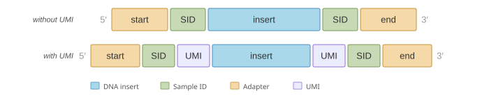

# Interpreting SBX Simplex (SBX-S) Reads

This guide explains how to interpret SBX Simplex (SBX-S) reads: their structure, read-name
examples, and quality scores. For the shared read-name format (fields, base prefix, and
`read_bitflag`), see the parent [Interpreting SBX Reads](interpreting-sbx-reads.md) page.

---

## Simplex Read Structure

SBX-S adapters come in two flavors:



- **Without UMI** — the read contains a start adapter, a sample identifier (SID), the DNA insert, a second SID, and an end adapter.
- **With UMI** — the read additionally contains a unique molecular identifier (UMI) between each SID and the insert. The paired UMIs at the 5′ and 3′ ends allow the Read Collapser to cluster reads originating from the same molecule.

During demultiplexing, the adapter, SID, and UMI sequences are trimmed, leaving only the insert in the output FASTQ.

Simplex reads fall into two categories based on adapter detection:

- **Complete-insert read** (also called full-length) — both the start and end adapters were identified, so the boundaries of the insert are reliable.
- **Partial-insert read** (also called partial) — only one adapter was found, so one boundary of the insert cannot be determined reliably. Note that this is a different concept from the duplex "partial-length" definition, which refers to incomplete duplex coverage rather than missing adapter detection (see the [SBX-D guide](interpreting-sbx-d-reads.md#duplex-read-structure)).

---

## Read Name Examples

Simplex read names follow the shared format described on the
[parent page](interpreting-sbx-reads.md#read-names).

### Simplex read without UMI — full-length

```text
20250220:SBX-HTP02:Q1:R1:18:7Bk2pQ:12|3
```

| Component | Value | Meaning |
|-----------|-------|---------|
| Bitflag | `12` = `0b1100` | Both SIDs classified, no UMIs |
| SID | `3` | Assigned to sample 3 |

This is a **full-length read** because both the 5′ SID (bit 3) and 3′ SID (bit 2) were classified.

### Simplex read with UMI — full-length

```text
20250220:SBX-HTP02:Q1:R1:18:7Bk2pQ:15|3:42:42
```

| Component | Value | Meaning |
|-----------|-------|---------|
| Bitflag | `15` = `0b1111` | Both SIDs classified, both UMIs classified |
| SID | `3` | Assigned to sample 3 |
| UMI 5′ | `42` | 5′ UMI value |
| UMI 3′ | `42` | 3′ UMI value |

### Simplex partial read (only 5′ SID classified)

```text
20250220:SBX-HTP02:Q1:R1:18:9xLm0A:8|3
```

| Component | Value | Meaning |
|-----------|-------|---------|
| Bitflag | `8` = `0b1000` | Only 5′ SID classified |
| SID | `3` | Assigned to sample 3 based on 5′ SID |

This is a **partial read** — only the 5′ end was classified.

---

## Quality Scores

Quality scores are assigned at two stages of the SBX analysis pipeline:

- **Intra-molecular** — quality derived from evidence within a single read. The demux tool assigns these scores during demultiplexing.
- **Inter-molecular** — quality derived from combining evidence across multiple reads originating from the same molecule. The Read Collapser assigns these scores when it clusters and collapses reads into a consensus.

### Simplex Quality Scores

By default, the demux tool assigns a single fixed quality score to every base in a simplex read:

| Quality character | Phred score | Meaning |
|:-----------------:|:-----------:|---------|
| `7` | Q22 | Fixed simplex quality — single-strand evidence only |

This fixed score reflects that simplex reads represent a single pass of a single strand, with no intramolecular consensus to boost confidence.


To preserve the original per-base quality scores from the base caller instead of the fixed override, use the `--suppress-simplex-qual-override` flag.


### Inter-Molecular Consensus Quality Scores

When simplex reads are processed through the Read Collapser's consensus calling pipeline, multiple reads originating from the same molecule are clustered and collapsed into a single consensus sequence. This step produces new quality scores that reflect the combined evidence from all reads in the cluster.

#### Quality score models

The **default calibrated model** produces quality scores trained on empirical error rates. It considers cluster size, strand bias, and whether both forward and reverse strands support the consensus base. It produces scores from the following set:

| Phred Score | Meaning |
|:-----------:|---------|
| Q5          | Low confidence |
| Q10         | Low-moderate confidence |
| Q20         | Moderate confidence |
| Q22         | Moderate-high confidence |
| Q30         | High confidence |
| Q40         | Very high confidence |
| Q50         | Highest confidence |

A **naive binomial model** is also available (enabled with `--enable-legacy-qscore-model`). It models the probability of a base being incorrect based on the sequencing error rate and produces categorical scores:

| Phred Score | Meaning |
|:-----------:|---------|
| Q0          | Low confidence |
| Q18         | Single-strand base |
| Q35         | Intermediate confidence |
| Q40         | High confidence |

### Interpreting Quality Scores in Practice

- **High quality scores** (Q30+) indicate strong multi-read agreement. These bases are suitable for sensitive variant calling.
- **Moderate quality scores** (Q10–Q22) may indicate smaller cluster sizes or strand bias.
- **Low quality scores** (Q5–Q10) suggest the base call has limited support and should be treated with caution.


Do not compare quality scores from demux directly with consensus quality scores from the Read Collapser. A Q22 from demux (fixed simplex override) and a Q22 from the consensus model represent different levels of evidence. The consensus Q22 incorporates information from multiple reads and is calibrated against empirical error rates.

