<!-- markdownlint-disable MD024 -->
# XOOS Analysis Pipeline

## Getting started

### Introduction

The XOOS pipeline system consists of two components that work together to process sequencing data generated on Roche's AXELIOS platform:

- **xoosnf** is a Nextflow DSL2 pipeline built on the nf-core framework.
It accepts a run sheet describing one or more sequencing runs and performs demultiplexing, alignment, deduplication, optional variant calling, and consolidated QC reporting.
- **pipeline_launcher** is a Python CLI tool (`xoos`) that abstracts away the differences between execution environments.
It provides a single `xoos run` command that dispatches to local, Slurm HPC, AWS Batch, or GCP Batch backends.

You can run xoosnf directly with `nextflow run` if you manage your own environment configuration.
The pipeline_launcher adds environment abstraction, artifact organization, run sheet generation, work directory cleanup, result upload, and problem report collection.

### Recommended system requirements

| Software          | Version  | Notes                                                                                                         |
|:------------------|:---------|:--------------------------------------------------------------------------------------------------------------|
| Python            | ≥ 3.10   | Required for the pipeline_launcher.                                                                           |
| Nextflow          | ≥ 25.10  | Follow the [Nextflow installation guide](https://www.nextflow.io/docs/stable/install.html).                   |
| Java JRE          | 17 to 23 | Required by Nextflow.                                                                                         |
| Container runtime | Latest   | Docker, Apptainer, Singularity, or Podman. At least one is required to run pipeline processes in containers.  |

### Installation

The pipeline launcher is distributed as a Python wheel. Download the wheel from the release
assets and install it into a virtual environment (replace `<version>` with the version you
downloaded):

```bash
python -m venv .venv
source .venv/bin/activate
pip install xoos-<version>-py3-none-any.whl
```

Get the wheel from the [XOOS releases page](https://github.com/Roche-AXELIOS/XOOS/releases)
(under each release's **Assets**). After installation the `xoos` command is available on PATH
while the virtual environment is active.


The pipeline is nf-core compliant and runs in any environment that can run Nextflow nf-core
pipelines. You also need Nextflow and a container runtime installed (see
[Recommended system requirements](#recommended-system-requirements)).


### Downloading the resource bundle

The pipeline consumes reference and index files (genome FASTA, indexes, BED files, trained
models, and so on). These are distributed as a **resource bundle** that you point the pipeline
at via `--resources-base`.

Download the resource bundle from the XOOS data portal on the Kamino website:

- [https://web.sbxdata.kamino.platform.navify.com/dashboard/](https://web.sbxdata.kamino.platform.navify.com/dashboard/)

Extract the bundle to a local directory (or upload it to a cloud bucket). The extracted
directory must contain a `resources.config` file — this is the path you pass to
`--resources-base`. See [Resource files](#resource-files) for the individual parameters
`resources.config` provides.

### Creating an environment

The launcher selects an execution backend through an **environment config** (a YAML file). You
can use a bundled environment by name, or author your own.

To create a custom environment, copy one of the bundled templates and fill in the placeholders:

```bash
# Environment config YAML templates (one per backend):
pipeline_launcher/src/pipeline_launcher/env/aws_batch.yaml.template
pipeline_launcher/src/pipeline_launcher/env/gcp_batch.yaml.template
pipeline_launcher/src/pipeline_launcher/env/slurm.yaml.template
pipeline_launcher/src/pipeline_launcher/env/standalone_server.yaml.template

# Matching Nextflow config templates:
pipeline_launcher/src/pipeline_launcher/nextflow_config/env/*.config.template
```

Copy the appropriate `*.yaml.template` to `env/<name>.yaml`, replace every `<PLACEHOLDER>`
value, and select it with `--env <name>`. For the full environment config schema and
per-backend instructions, see [Supported environments](supported-environments.md).

## Usage

Install the pipeline launcher into a virtual environment as described in
[Installation](#installation) (replace `<version>` with the version you downloaded):

```bash
python -m venv .venv
source .venv/bin/activate
pip install xoos-<version>-py3-none-any.whl
```

After installation the `xoos` command is available on PATH.

### Running with the pipeline launcher

The recommended way to run xoosnf is via the `xoos` pipeline launcher, which provides a unified interface across different execution environments and adds features like run sheet generation, artifact organization, and result upload.

The basic usage pattern is:

```bash
xoos run \
    --env ENV_NAME \
    --pipeline-script PATH_OR_URI_TO_PIPELINE_SCRIPT \
    --resources-base PATH_OR_URI_TO_RESOURCES_BASE \
    --analysis-dir PATH_OR_URI_TO_ANALYSIS_DIR \
    -- \
    --input PATH_OR_URI_TO_RUN_SHEET \
    --outdir PATH_OR_URI_TO_OUTPUT_DIR \
    -profile PROFILE_NAME
```

The `--env` flag selects an environment config YAML that determines the execution backend and related settings.
The `--pipeline-script` and `--resources-base` flags point to the Nextflow pipeline script and resources directory, which can be local paths or cloud URIs.
The `--analysis-dir` flag specifies the root directory for all pipeline artifacts, and the `--` separator indicates that subsequent arguments are passed directly to the Nextflow pipeline.

Some environments can require additional setup. For more details on supported environments, see [Supported environments](supported-environments.md).

### Running xoosnf directly (without the launcher)

Since the pipeline is implemented using Nextflow DSL2, it can be run directly with `nextflow run` if you prefer to manage environment configuration yourself.

```bash
nextflow run /path/to/xoosnf/main.nf \
    --input run_sheet.csv \
    --outdir /path/to/output \
    -profile docker,germline_wgs_duplex
```

### What the launcher adds

The `pipeline_launcher` is not required, but it provides:

| Feature                      | Description                                                                                     |
|:-----------------------------|:------------------------------------------------------------------------------------------------|
| Environment abstraction      | A single `--env` flag selects the executor, profiles, config files, and platform-specific paths. |
| Artifact organization        | Structures output, logs, Nextflow state, and work directories under `--analysis-dir`.           |
| Run sheet generation         | Generates the input CSV from CLI flags instead of writing it by hand.                           |
| Work directory cleanup       | Deletes the Nextflow work directory on success (configurable).                                  |
| Result upload                | Uploads results to a remote destination via rclone after completion.                            |
| Problem reports              | Collects logs into a zip archive on failure for easier debugging.                               |
| Signal forwarding            | Converts SIGINT/SIGTERM into graceful Nextflow shutdown.                                        |
| Slurm driver mode            | Submits a driver job via sbatch so the pipeline runs on a compute node, not the login node.     |

## Input and Output

### Input run sheet format

Both the launcher and the pipeline accept a CSV run sheet via `--input`. It describes one or more sequencing runs that will be processed in parallel.
The run sheet must contain the following columns:

| Field             | Description                                                                                                         | Valid values                                                                                                            |
|-------------------|---------------------------------------------------------------------------------------------------------------------|-------------------------------------------------------------------------------------------------------------------------|
| **`run_name`**    | Unique identifier for the run. Used as directory names in outputs and in MultiQC report headers. No spaces allowed. | Any non-whitespace string                                                                                               |
| **`run_type`**    | Chemistry / instrument type of the run.                                                                             | `SBX-D`, `SBX-FAST`, `SBX-DM`, `I2X_HPSID_v0.01`, `I2X_HPSID_v0.00`, `I2X_HPU_v0.11`, `I2X_HPU_v0.10`, `YS`, `YSU`, `YS-NEW` |
| **`file_type`**   | Describes the format and state of input data for this run. Determines which pipeline steps are applied.             | `basecall_rdb`, `basecall_fastq`, `demultiplexed_fastq`, `bam`                                                          |
| **`run_dir`**     | Absolute path to the directory containing the run data. Interpretation depends on `file_type`.                      | A valid directory path                                                                                                  |
| **`samplesheet`** | Absolute path to the per-run samplesheet CSV.                                                                       | A valid file path                                                                                                       |
| `bam_type`        | Optional. Only used when `file_type = bam`. Declares the deduplication / secondary-rescue state of the pre-aligned input BAMs so the pipeline can skip steps that would be redundant or non-idempotent (notably secondary rescue). Defaults to `sas_markdup` when omitted; ignored for non-BAM input. A `bam_type` set in the samplesheet takes precedence over this run-level value. | `no_dedup`, `sas_markdup`, `pb_markdup`, `xoos_markdup`, `xoos_secondary_rescue_and_markdup`, `xoos_consensus` |

**`file_type` semantics:**

| Value                 | Meaning                                                                                                                                                                                       |
| --------------------- | --------------------------------------------------------------------------------------------------------------------------------------------------------------------------------------------- |
| `basecall_rdb`        | Basecall output in RDB (Roche data block) format. The pipeline will run demultiplexing (`xoos_demux`) followed by alignment.                                                                  |
| `basecall_fastq`      | Basecall output in FASTQ format. The pipeline will run demultiplexing (`xoos_demux`) followed by alignment.                                                                                   |
| `demultiplexed_fastq` | A directory of per-sample FASTQ files that have already been demultiplexed. The pipeline matches FASTQ files to samplesheet entries by `sample_name` or `sample_sid`. Alignment is performed. |
| `bam`                 | A directory of per-sample BAM and BAI files. Demultiplexing and alignment are skipped. BAM files are matched to samplesheet entries by `sample_name` or `sample_sid`.                         |


**With `bam` input, `--aligner` must match the aligner that produced the BAM.**
Even though alignment is skipped for pre-aligned BAMs, the `--aligner` value
still selects the reference used by downstream steps (variant calling and
Picard metrics). The Giraffe aligners (`pb_giraffe`, `vg_giraffe`) use the
linearized pangenome reference, which has a different contig set and ordering
than the standard reference used by the other aligners. Supplying a BAM aligned
against one reference while `--aligner` points at the other causes a contig
mismatch between the BAM `@SQ` header and the reference, which produces
incorrect or empty results rather than a clean error. See
[BAM input: aligner must match the BAM](#bam-input-aligner-must-match-the-bam)
in Troubleshooting.


**Example run sheet:**

```csv
run_name,run_type,file_type,run_dir,samplesheet
run_001,SBX-D,basecall_rdb,/data/axelios/run_001,/data/axelios/run_001_samplesheet.csv
run_002,SBX-FAST,demultiplexed_fastq,/data/axelios/run_002,/data/axelios/run_002_samplesheet.csv
```

### Sample sheet format

Each run references a per-run samplesheet CSV that describes the individual samples within that run. The samplesheet is validated against the pipeline's JSON schema.

| Field             | Description                                                                                                                                                               | Valid values                |
| ----------------- | ------------------------------------------------------------------------------------------------------------------------------------------------------------------------- | --------------------------- |
| **`sample_name`** | Unique name for the sample within the run. Used as the output file prefix, and for matching FASTQ/BAM files in the run directory. No spaces allowed.                      | Any non-whitespace string   |
| **`sample_sid`**  | The SID (barcode / primer sequence) used during demultiplexing. Must be a DNA sequence. Also used to match files in the run directory when `sample_name` is not found.    | String matching `[ACGT]+`   |
| `target_bed`      | Path to a BED file defining the target regions for this sample. Overrides the global `--target_bed` parameter for sample-level target metrics.                            | A valid file path           |
| `capture_bed`     | Path to a BED file defining the capture/bait regions for this sample. Overrides the global `--capture_bed` parameter for hybrid-selection metrics.                        | A valid file path           |
| `target_coverage` | Target read depth (coverage) for this sample. Used as a reference value in subsampling decisions. Overrides the global `--subsample_bam_coverage_target` parameter. | A number ≥ 1                |
| `group`           | Group identifier used to link samples into tumor-normal pairs. Required when `TN` is set. Must match exactly between the tumor and normal sample in the pair.             | Any string                  |
| `TN`              | Designates the role of the sample in a somatic tumor-normal pair. Required when `group` is set.                                                                           | `T` (tumor) or `N` (normal) |
| `sample_type`     | Tissue preparation type used to select the somatic TN model and thresholds. Defaults to `ffpe` when omitted. If the tumor and normal disagree, the pipeline warns and falls back to `ffpe`. Ignored for non-TN samples. | `ffpe` or `cell-line` |
| `reporter_vcf`    | Path to a per-sample VCF used by the reporter step. Must exist when provided.                                                                                            | A valid file path           |
| `bam_type`        | Only used when the run's `file_type = bam`. Declares the deduplication / secondary-rescue state of this sample's pre-aligned BAM so the pipeline can skip redundant or non-idempotent steps (notably secondary rescue). Defaults to `sas_markdup` when omitted. A value here overrides the run-level `bam_type` set on the run sheet. | `no_dedup`, `sas_markdup`, `pb_markdup`, `xoos_markdup`, `xoos_secondary_rescue_and_markdup`, `xoos_consensus` |


`TN` and `group` must be provided together. Providing one without the other is a validation error. The `group` field needs to be unique for each tumor-normal pair across all runs provided in the run sheet.


The samplesheet is validated against `assets/schema_samplesheet.json` in the
pipeline repository, which does not allow columns beyond those listed above.

#### Example samplesheet (germline)

```csv
sample_name,sample_sid,target_coverage
SAMPLE_A,ACGTACGT,30
SAMPLE_B,TTGGCCAA,30
```

#### Example samplesheet (somatic TN, one run)

```csv
sample_name,sample_sid,group,TN,target_coverage
SAMPLE01_TUMOR,ACGTACGT,SAMPLE01,T,60
SAMPLE01_NORMAL,TTGGCCAA,SAMPLE01,N,30
SAMPLE02_TUMOR,GGTTAACC,SAMPLE02,T,60
SAMPLE02_NORMAL,CCAATTGG,SAMPLE02,N,30
```

#### Example samplesheet (somatic TN, multiple runs)

`run_sheet.csv`

```csv
run_name,run_type,file_type,run_dir,samplesheet
run_001,SBX-D,basecall_fastq,/data/axelios/run_001,/data/config/run_001_samplesheet.csv
run_002,SBX-D,basecall_fastq,/data/axelios/run_002,/data/config/run_002_samplesheet.csv
```

`run_001_samplesheet.csv`

```csv
sample_name,sample_sid,group,TN,target_coverage
SAMPLE01_TUMOR,ACGTACGT,SAMPLE01,T,60
SAMPLE02_TUMOR,GGTTAACC,SAMPLE02,T,60
```

`run_002_samplesheet.csv`

```csv
sample_name,sample_sid,group,TN,target_coverage
SAMPLE01_NORMAL,TTGGCCAA,SAMPLE01,N,30
SAMPLE02_NORMAL,CCAATTGG,SAMPLE02,N,30
```

The pipeline will pair `SAMPLE01_TUMOR` (from `run_001`) with `SAMPLE01_NORMAL` (from `run_002`) and `SAMPLE02_TUMOR` (from `run_001`) with `SAMPLE02_NORMAL` (from `run_002`) for somatic variant calling, even though they are in different runs.

#### Incorrect samplesheet example

Tumor-normal requires both `group` and `TN` fields to be set. The following samplesheet is invalid because the normal sample is missing the `group` value:

```csv
sample_name,sample_sid,group,TN,target_coverage
SAMPLE01_TUMOR,ACGTACGT,SAMPLE01,T,60
SAMPLE01_NORMAL,TTGGCCAA,,N,30
```

Tumor-normal requires exactly one tumor (`T`) and one normal (`N`) sample per group. The following samplesheet is invalid because `SAMPLE01` has two tumor samples and no normal sample:

```csv
sample_name,sample_sid,group,TN,target_coverage
SAMPLE01_TUMOR_1,ACGTACGT,SAMPLE01,T,60
SAMPLE01_TUMOR_2,TTGGCCAA,SAMPLE01,T,60
```

#### Sectioned samplesheet format

In addition to the flat CSV above, the pipeline accepts an INI-style **sectioned**
samplesheet (the format emitted by some sequencer/LIMS exports). The pipeline
automatically detects this format and converts it to the flat CSV internally
before validation.

Rules:

- A `[Samples]` section is required. Other sections (`[Header]`, `[Settings]`, …)
  are ignored.
- The `[Samples]` section must contain a `Sample ID` column (mapped to
  `sample_name`) and a `Sample Index` column (mapped to `sample_sid`). Additional
  columns map to their canonical names (`Group` → `group`, `TN` → `TN`, etc.).
- Comment lines (starting with `#`) and blank lines are stripped.

```text
# Example samplesheet
# Date: 2026-06-06

[Header]
Experiment Name, Test Experiment
Date, 2026-06-06

[Settings]
Adapter, AGATCGGAAGAGC

[Samples]
Sample ID, Sample Index, Group, TN
SAMPLE01_TUMOR, ACGTACGT, SAMPLE01, T
SAMPLE01_NORMAL, TTGGCCAA, SAMPLE01, N
```

### Output directory structure

The pipeline organizes results under `--outdir` by run and then by sample. Each
run sheet `run_name` becomes a top-level directory; within it, each `sample_name`
gets its own subdirectory holding that sample's BAM, VCFs, and per-caller output.
Run-level reports (combined metrics report and MultiQC) are published directly
under the `{run_name}/` directory, and Nextflow execution reports go to
`pipeline_info/`.

The directory layout is defined authoritatively by the `output {}` block in
`xoosnf/main.nf`. The blocks marked _(if enabled)_ are only present when the
corresponding analysis step is turned on (via parameters or a profile).

```text
{outdir}/
├── {run_name}/
│   ├── {sample_name}/
│   │   ├── *.bam, *.bam.bai                       Final (deduplicated, optionally subsampled) BAM and index
│   │   ├── *.vcf.gz, *.vcf.gz.tbi                 Final/merged VCF (when variant calling is enabled)
│   │   ├── pre_subsample/                         BAM before subsampling (if --enable_publish_pre_subsample_bam)
│   │   ├── fastqs/                                Demultiplexed FASTQs (if --enable_publish_demuxed_fastqs)
│   │   ├── {raw_variant_caller}/                  Raw caller VCFs, e.g. mutect2/ or haplotype_caller/
│   │   ├── small_variant_caller/
│   │   │   ├── pretrained/                        SVC VCF from the pretrained model
│   │   │   └── retrained/                         SVC VCF from a retrained model (if --enable_small_variant_caller_retrain)
│   │   ├── copy_number_caller/                    CNV caller results (if --enable_copy_number_caller)
│   │   ├── str_caller/                            STR caller results (if --enable_str_caller)
│   │   ├── tumor_fraction_estimation/             Tumor fraction estimator results (if --enable_tfe)
│   │   ├── contamination_detection/              Contamination estimator results (if --enable_contamination_estimation)
│   │   ├── hs_metrics/                            Hybrid-selection metrics (if --enable_hs_metrics)
│   │   ├── CollectGcBiasMetrics/                  GC bias metrics (if --enable_gc_bias_metrics)
│   │   └── alignment_metrics/
│   │       └── {stage}_{region}/                  One dir per metrics stage and region,
│   │                                              e.g. original_autosomes/, dedup_autosomes/,
│   │                                              dedup_high_confidence/, dedup_subsample_targets/
│   ├── metrics-report.tsv                         Combined run-level metrics report
│   ├── metrics-report-summary.tsv                 Metrics report summary (if --metrics_report_summary_patterns set)
│   └── multiqc_report.html                        MultiQC report for the run
├── index/                                         JSON provenance index files for each published output type
└── pipeline_info/
    ├── execution_report_*.html
    ├── execution_timeline_*.html
    ├── execution_trace_*.txt
    ├── pipeline_dag_*.html
    ├── pipeline_report.html, pipeline_report.txt  Pipeline completion report
    └── params_*.json                              Resolved parameters for the run
```


The metrics stage prefixes are `original` (pre-deduplication), `dedup`
(post-deduplication), `subsample`, and `dedup_subsample`; the region suffixes are
`autosomes`, `targets`, and `high_confidence`. Which combinations appear depends
on the active aligner, dedup strategy, subsampling settings, and the
`enable_alignment_metrics_*` parameters.


## Overview and CLI options

### Pipeline stages

The xoosnf pipeline processes data through the following stages:

1. **Parse run sheet** — route runs by input type.
2. **Demultiplex** — demultiplex basecall inputs when required (`xoos_demux`).
3. **Align** — align reads using the configured aligner (`pb_giraffe`, `pb_fq2bam`, `pb_minimap2`, `minimap2`, `bwa`, or `vg_giraffe`).
4. **Deduplicate** — perform optional deduplication via `markdup` or `consensus` (read_collapser), or skip it with `none`.
5. **Subsample** — optionally subsample BAM files to a target coverage.
6. **Metrics** — compute alignment, GC bias, homopolymer, hybrid selection, and related QC metrics.
7. **Variant calling** — run optional downstream analyses (small variants, CNV, STR, evaluation).
8. **MultiQC** — aggregate metrics and render per-run reports.

The following diagram illustrates the pipeline flow and how the stages are conditionally applied based on the input `file_type`:
















### CLI options

### `xoos run` options

Parameters in **bold** are required.

| Parameter                    | Description                                                                                                                      | Value(s)                                                                                |
|:-----------------------------|:---------------------------------------------------------------------------------------------------------------------------------|:----------------------------------------------------------------------------------------|
| **--env**                    | Environment name or path to an env config YAML. Looked up as `env/{name}.yaml` in the package; falls back to a direct file path. | String or file path                                                                     |
| **--pipeline-script**        | Path or cloud URI to the Nextflow pipeline script (`.nf`). Cloud executors upload the parent directory at runtime.               | File path or cloud URI (s3://, gs://)                                                   |
| **--resources-base**         | Path or cloud URI to the resources directory. Must contain a `resources.config` file.                                            | File path or cloud URI (s3://, gs://)                                                   |
| **--analysis-dir**           | Root directory or cloud URI for all pipeline artifacts (stage scripts, Nextflow state, work directory, and logs). `--outdir` defaults to `{analysis-dir}/output` when not provided. | File path or cloud URI                              |
| --username                   | Override the username for cloud work directory paths and resource labels. Defaults to the current OS user.                       | String                                                                                  |
| --upload-dst                 | Destination for uploading results via rclone.                                                                                    | String (rclone remote path)                                                             |
| --file-lock                  | Path to a lock file for preventing concurrent executions.                                                                        | File path                                                                               |
| --rclone-options             | Options to pass to rclone (quoted string).                                                                                       | String [default: `""`]                                                                  |
| --name                       | Base name for analysis (used for job name and Nextflow `-name`).                                                                 | String                                                                                  |
| --singularity-cache          | Singularity cache strategy.                                                                                                      | `shared` or `user` [default: `shared`]                                                  |
| --callback                   | Command to invoke with START/COMPLETE/FAIL around the Nextflow run.                                                              | String (executable path)                                                                |
| --work-dir-delete            | Work directory cleanup policy.                                                                                                   | `delete-if-succeeded`, `delete-always`, `delete-never` [default: `delete-if-succeeded`] |
| --project                    | Project name for Slurm job comment. Required for HPC submission.                                                                 | String                                                                                  |
| --disable                    | Features to disable. Repeatable.                                                                                                 | See [disable options](#disable-options) below                                           |
| --enable                     | Features to enable. Repeatable.                                                                                                  | See [enable options](#enable-options) below                                             |
| --workflow-config            | Path to a workflow configuration YAML. Derives `--run-name`, `--run-type`, `--file-type`, `--run-dir`, and `--samplesheet` from the YAML; explicit CLI flags override derived values. (Launcher flag — distinct from the pipeline `--workflow_config` parameter.) | File path |
| --env-override               | Override fields in the env config. Repeatable. Format `key=value`, with dot-notation for nested fields (e.g. `--env-override driver.singularity_cache=/my/path`). | `key=value` |

### Run sheet generation options

Instead of writing a run sheet CSV by hand and passing it via `--input`, the launcher can generate one from CLI flags.
When any of the five flags are provided, all five are required and `--input` must not appear in passthrough args.

| Parameter       | Description                                                              | Value(s)                                                       |
|:----------------|:-------------------------------------------------------------------------|:---------------------------------------------------------------|
| --run-name      | Unique run identifier. No spaces.                                        | String                                                         |
| --run-type      | Chemistry or instrument type.                                            | `SBX-D`, `SBX-FAST`, `SBX-DM`, `I2X_HPSID_v0.01`, `I2X_HPSID_v0.00`, `I2X_HPU_v0.11`, `I2X_HPU_v0.10`, `YS`, `YSU`, `YS-NEW` |
| --file-type     | Format and state of input data.                                          | `basecall_rdb`, `basecall_fastq`, `demultiplexed_fastq`, `bam` |
| --run-dir       | Directory containing the run data.                                       | Directory path or cloud URI                                    |
| --samplesheet   | Per-run samplesheet CSV (`sample_name`, `sample_sid`, optional columns). | File path or cloud URI                                         |

### Disable options

The `--disable` flag accepts the following values (repeatable):

| Value                       | Effect                                                                                    |
|:----------------------------|:------------------------------------------------------------------------------------------|
| `provenance-report`         | Disables the nf-prov provenance report plugin.                                            |
| `sample-report`             | Disables the nf-report sample report plugin.                                              |
| `per-sample-error-ignore`   | Switches the default error strategy from `ignore` to `finish` and suppresses `workflow.failOnIgnore`. |

### Enable options

Parabricks dynamic resource scaling is **off by default**. Enable it with `--enable` (repeatable):

| Value                | Effect                                                                                     |
|:---------------------|:-------------------------------------------------------------------------------------------|
| `pb-dynamic-scaling` | Injects input-size-aware memory scaling for Parabricks processes (`pb_dynamic_scaling.config`). |

### Passthrough arguments

Any arguments after `--` are passed directly to Nextflow.
This allows you to specify pipeline-specific parameters without the launcher needing to be aware of them.

| Parameter | Description                                                                              | Value(s)                                |
|:----------|:-----------------------------------------------------------------------------------------|:----------------------------------------|
| --outdir  | Output directory for the pipeline. Defaults to `{analysis-dir}/output` when not provided.| Directory path or cloud URI             |
| --input   | Input run sheet CSV.                                                                     | File path or cloud URI                  |
| -profile  | Nextflow profiles to activate. Merged with environment profiles.                         | Comma-separated profile names           |
| -c        | Additional Nextflow config file.                                                         | File path                               |
| -resume   | Resume a previous pipeline run from cached results. Automatically included by the launcher — no need to pass explicitly. | (flag, no value)                        |

### `xoos rclone` options

Parameters in **bold** are required.

| Parameter          | Description                                                    | Value(s)                          |
|:-------------------|:---------------------------------------------------------------|:----------------------------------|
| **action**         | rclone action.                                                 | `copy`                            |
| **src**            | Source path or remote.                                         | String                            |
| **dst**            | Destination path or remote.                                    | String                            |
| --num-partitions   | Number of parallel rclone workers.                             | Integer > 0 [default: `10`]       |
| --work-dir         | Directory for partition files and logs.                        | Directory path                    |
| --log-level        | Logging level.                                                 | String [default: `INFO`]          |
| --include          | File patterns to include.                                      | String (glob pattern, repeatable) |

### xoosnf pipeline parameters

These parameters are passed after the `--` separator as Nextflow pipeline parameters when using the `pipeline_launcher`.
When running xoosnf directly with `nextflow run`, these parameters can be passed directly on the command line or via a config file.



**How to distinguish pipeline parameters, Nextflow config parameters, and launcher CLI parameters.**

Pipeline parameters start with `--` (e.g. `--input`), while Nextflow config parameters use `-` (e.g., `-profile`, `-c`).
Also note that pipeline parameters use snake_case (e.g., `--enable_subsample_run`) while launcher CLI parameters use kebab-case (e.g., `--log-level`).



#### Input/output options

| Parameter | Description | Type | Default |
|:----------|:------------|:-----|:--------|
| `--input` | Path to CSV run sheet describing the samples to analyse. | string | — |
| `--outdir` | Output directory for results. Use absolute paths for cloud storage. | string | — |
| `--email` | Email address for completion summary. | string | — |
| `--multiqc_title` | MultiQC report title. Printed as page header. | string | — |
| `--multiqc_methods_description` | Custom methods-description text (or file) appended to the MultiQC report. | string | — |
| `--workflow_config` | Path to a workflow configuration YAML. Stored for provenance only; not parsed by the pipeline. | string | — |

#### XOOS container options

| Parameter | Description | Type | Default |
|:----------|:------------|:-----|:--------|
| `--xoos_registry` | Container registry for XOOS module images. | string | — |
| `--xoos_version` | Container image tag/version for XOOS module images. | string | — |

#### Subsampling options

| Parameter | Description | Type | Default |
|:----------|:------------|:-----|:--------|
| `--enable_subsample_run` | Enable subsampling of the run directory. | boolean | `false` |
| `--subsample_run_ratio` | Ratio of data to retain when subsampling. | number | `1.0` |
| `--subsample_run_absolute_size` | Absolute number of reads to retain. When 0, ratio-based strategy is used. | integer | `0` |
| `--subsample_run_copy_mode` | Method for creating the subsampled run directory. | string | `copy` |
| `--subsample_run_strategy` | Subsampling strategy for selecting reads. | string | `random-ratio` |
| `--enable_subsample_demuxed_fastq` | Enable subsampling of demultiplexed FASTQ files. | boolean | `false` |
| `--subsample_demuxed_fastq_read_count` | Number of reads to retain when subsampling demuxed FASTQs. | integer | `200000000` |
| `--enable_subsample_bam` | Enable subsampling of BAM files. | boolean | `false` |
| `--subsample_bam_coverage_target` | Target coverage for BAM subsampling. When null, provided per sample via samplesheet. | integer | `null` |
| `--subsample_bam_metric_name` | Metric name used for BAM subsampling. | string | `post_filter_coverage` |
| `--enable_publish_pre_subsample_bam` | Publish the BAM produced before subsampling. Requires `--enable_subsample_bam`. | boolean | `false` |
| `--enable_publish_demuxed_fastqs` | Publish the demultiplexed FASTQ files. | boolean | `false` |

#### Demultiplexing options

| Parameter | Description | Type | Default |
|:----------|:------------|:-----|:--------|
| `--exclude_partial_reads` | Exclude partial reads during demultiplexing. | boolean | `true` |
| `--enable_demux_strand_detect` | Enable strand detection during demultiplexing. | boolean | `false` |
| `--enable_demux_early_stop` | Enable early stopping based on coverage target. | boolean | `false` |
| `--demux_early_stop_coverage_target` | Coverage target for early stopping. | integer | `30` |

#### Alignment options

| Parameter | Description | Type | Default |
|:----------|:------------|:-----|:--------|
| `--aligner` | Aligner to use: `pb_giraffe`, `pb_fq2bam`, `pb_minimap2`, `minimap2`, `bwa`, or `vg_giraffe`. | string | `pb_giraffe` |
| `--enable_low_gpu_memory_mode` | Enable low GPU memory mode for Parabricks aligners and variant callers. | boolean | `false` |
| `--enable_pangenome_personalization` | Enable sample-specific Giraffe graph personalization before alignment. Supported for `pb_giraffe` and `vg_giraffe`. | boolean | `false` |
| `--pangenome_personalization_downsample_read_count` | Number of FASTQ reads to use when building the personalized graph. | integer | `200000000` |
| `--max_parabricks_alignment_read_length` | Maximum read length passed to Parabricks aligners. When null, the tool default is used. | integer | `null` |
| `--enable_alignment_partitioning` | Partition alignment across chunks for parallelism. | boolean | `false` |
| `--alignment_partition_count` | Number of partitions to use when alignment partitioning is enabled. | integer | `4` |
| `--rescue_secondary_min_alignment_score_ratio` | Minimum alignment-score ratio for rescuing secondary pangenome alignments as primary. | number | `null` |

#### Deduplication options

| Parameter | Description | Type | Default |
|:----------|:------------|:-----|:--------|
| `--dedup_strategy` | Deduplication strategy: `markdup`, `consensus`, or `none` (skip deduplication). | string | `markdup` |
| `--read_collapser_preset` | Preset for XOOS read_collapser. One of `wgs-duplex`, `wgs-duplex-cfdna`, `wgs-simplex`, `te-duplex`, `te-simplex`, `rna-bulk`, `none`. | string | — |
| `--read_collapser_cluster_by_umi` | Enable UMI-based clustering in read_collapser. | boolean | `false` |
| `--enable_read_collapser_dedup` | Run a separate XOOS read_collapser MARKDUP step instead of Parabricks integrated duplicate marking. Requires `dedup_strategy = markdup`. | boolean | `false` |
| `--read_collapser_ignore_read_name_parsing_errors` | Ignore read-name parsing errors in XOOS read_collapser. When enabled, reads whose names cannot be parsed are treated as full reads with no UMIs instead of failing. Use with caution: if the input BAM contains UMIs/SIDs in a non-standard read-name format, they are silently ignored. | boolean | `false` |

#### TFE/Contamination options

| Parameter | Description | Type | Default |
|:----------|:------------|:-----|:--------|
| `--enable_tfe` | Enable the tumor fraction estimator. | boolean | `false` |
| `--enable_contamination_estimation` | Enable cross-sample contamination estimation. | boolean | `false` |

#### Variant calling options

| Parameter | Description | Type | Default |
|:----------|:------------|:-----|:--------|
| `--variant_calling_mode` | Variant calling mode: `none`, `germline`, or `somatic_tn`. | string | `none` |
| `--enable_small_variant_caller` | Enable the small variant caller (SVC) for SNVs and indels. | boolean | `false` |
| `--use_multisample_model` | Use multisample model for small variant calling. | boolean | `true` |
| `--use_gatk_haplotype_caller` | Use GATK HaplotypeCaller instead of Parabricks for germline calling. | boolean | `false` |
| `--use_gatk_mutect2` | Use GATK Mutect2 for somatic variant calling instead of Parabricks. | boolean | `false` |
| `--enable_mutect_stats` | Emit Mutect2 stats output. Only valid with `variant_calling_mode = somatic_tn`. | boolean | `false` |
| `--enable_small_variant_caller_retrain` | Enable retraining of small variant caller models. | boolean | `false` |
| `--enable_vcfeval` | Enable evaluation of VCF files against truth sets. | boolean | `false` |
| `--enable_copy_number_caller` | Enable copy number variation caller. | boolean | `false` |
| `--enable_copy_number_caller_baf` | Use B-allele frequency information in the copy number caller. | boolean | `true` |
| `--enable_str_caller` | Enable short tandem repeat caller. | boolean | `false` |
| `--enable_merge_vcf` | Merge VCF outputs from different callers using bcftools concat. | boolean | `false` |
| `--enable_variant_calling_partitioning` | Partition variant calling across regions for parallelism. | boolean | `false` |
| `--cpu_variant_calling_partition_count` | Partition count for variant calling on CPU backends. | integer | `20` |
| `--gpu_variant_calling_partition_count` | Partition count for variant calling on GPU backends. | integer | `1` |

#### Metrics options

| Parameter | Description | Type | Default |
|:----------|:------------|:-----|:--------|
| `--enable_alignment_metrics_autosomes` | Enable alignment metrics for autosomal regions. | boolean | `false` |
| `--enable_alignment_metrics_high_confidence` | Enable alignment metrics for high confidence regions. | boolean | `false` |
| `--enable_alignment_metrics_targets` | Enable alignment metrics for target regions. | boolean | `false` |
| `--enable_hp_metrics` | Enable homopolymer metrics. | boolean | `false` |
| `--enable_gc_bias_metrics` | Enable GC bias metrics. | boolean | `false` |
| `--enable_hs_metrics` | Enable hybrid selection metrics. | boolean | `false` |
| `--enable_pre_dedup_metrics` | Enable pre-deduplication metrics. | boolean | `false` |
| `--enable_pre_subsample_metrics` | Enable metrics on BAM files before subsampling. | boolean | `false` |
| `--alignment_metrics_min_mapping_quality` | Minimum mapping quality threshold for alignment metrics. | integer | `4` |
| `--alignment_metrics_min_base_quality` | Minimum base quality threshold for alignment metrics. | integer | `30` |
| `--alignment_metrics_min_base_quality_pre_dedup` | Minimum base quality threshold for pre-deduplication alignment metrics. | integer | `30` |
| `--alignment_metrics_max_alt_allele_fraction` | Maximum alternate allele fraction threshold. | number | `0.1` |
| `--alignment_metrics_min_depth` | Minimum depth threshold for alignment metrics. | integer | `10` |
| `--alignment_metrics_coverage_bins` | Coverage bin cutoffs for alignment metrics. | string | — |
| `--metrics_report_summary_patterns` | Regex patterns selecting which metrics rows appear in the metrics report summary. | array | — |

#### Resource files


Resource files are typically provided via a `resources.config` file pointed to by `--resources-base`.
You only need to set these parameters individually if you want to override specific resources.


<details>
<summary>Click to expand resource file parameters</summary>

| Parameter | Description | Type |
|:----------|:------------|:-----|
| `--resources_base` | Base path for resource files used by `resources.config`. | string |
| `--reference_fasta` | Reference genome FASTA file. | string |
| `--reference_fai` | Reference genome FASTA index. | string |
| `--reference_dict` | Reference genome sequence dictionary. | string |
| `--reference_sdf` | Reference genome SDF directory (used by RTG vcfeval). | string |
| `--giraffe_index_dir` | Directory containing Giraffe reference files. | string |
| `--giraffe_reference_linearized` | Linearized FASTA for the Giraffe reference. | string |
| `--unfiltered_giraffe_index_dir` | Directory containing unfiltered Giraffe reference files for pangenome personalization. | string |
| `--unfiltered_giraffe_reference_linearized` | Linearized FASTA for the unfiltered Giraffe reference. | string |
| `--bwa_index_dir` | Directory containing BWA index files. | string |
| `--autosomes_bed` | BED file defining autosomal regions. | string |
| `--pop_af_vcf` | Population allele frequency VCF file. | string |
| `--pop_af_tbi` | Index for the population allele frequency VCF. | string |
| `--contamination_vcf` | 1000G common biallelic SNV VCF for contamination detection. | string |
| `--contamination_included_regions_bed` | Included regions BED for contamination detection. | string |
| `--tfe_included_regions_bed` | Included regions BED for tumor fraction estimator. | string |
| `--svc_model_germline_snv` | Small variant caller model for germline SNVs. | string |
| `--svc_model_germline_indel` | Small variant caller model for germline indels. | string |
| `--svc_model_somatic_tumor_normal` | Small variant caller model for somatic tumor-normal calling. | string |
| `--svc_model_somatic_tumor_only` | Small variant caller model for somatic tumor-only calling. | string |
| `--chr_x_par_bed` | BED file defining chrX PAR regions. | string |
| `--chr_y_par_bed` | BED file defining chrY PAR regions. | string |
| `--mappability_bw` | Mappability bigWig file. | string |
| `--cnv_seed_seg` | Pre-generated segments file for CNV segmentation (SEG format). | string |
| `--repeat_catalog` | Repeat catalog file for STR calling. | string |
| `--target_bed` | Target BED file. | string |
| `--capture_bed` | Capture (bait) BED file. | string |
| `--high_confidence_bed_dir` | Directory containing high confidence BED files for alignment metrics. | string |
| `--fallback_high_confidence_bed` | Fallback BED for high confidence regions. | string |
| `--demux_strand_detect_index` | Strand Detect index for demultiplexing. | string |
| `--germline_small_variant_truth_vcf_dir` | Directory containing truth VCF files for SVC retraining/evaluation. | string |
| `--germline_small_variant_train_bed_dir` | Directory containing training region BED files for SVC retraining. | string |
| `--germline_small_variant_test_bed_dir` | Directory containing test region BED files for SVC retraining. | string |
| `--germline_small_variant_eval_bed_dir` | Directory containing evaluation region BED files for SVC retraining. | string |
| `--somatic_tumor_normal_small_variant_truth_vcf_dir` | Directory containing truth VCF files for somatic SVC evaluation. | string |
| `--somatic_tumor_normal_small_variant_eval_bed_dir` | Directory containing evaluation region BED files for somatic SVC. | string |

</details>

#### Executor options

| Parameter | Description | Type | Default |
|:----------|:------------|:-----|:--------|
| `--executor_queue_size` | Maximum number of tasks that can be queued at once by the executor. | integer | `1000` |

## Profiles

Nextflow profiles configure pipeline behavior and resource allocation.
The xoosnf pipeline and the pipeline_launcher each define their own profiles, which are combined at runtime.

### Analysis profiles (xoosnf)

These profiles are defined in the xoosnf pipeline and configure which analysis steps are enabled.
Select one analysis profile per run via `-profile` in passthrough args.


Source of truth: `docs/profile_feature_tables.md` and the config files in `conf/` in the xoosnf repository.
If the tables below are out of date, check those files for the current values.


#### Germline duplex, somatic, and cfDNA

Each profile explicitly sets all parameters listed below unless marked with `—`, which indicates the parameter is not set by the profile and inherits the global default from `nextflow.config`. (✅ = `true`, ❌ = `false`.)

| Parameter | germline_wgs_duplex | germline_wgs_duplex_benchmark | somatic_wgs_tn_duplex | somatic_wgs_tn_duplex_benchmark | cfdna_wgs_duplex | cfdna_wgs_duplex_benchmark |
|:---|:---:|:---:|:---:|:---:|:---:|:---:|
| **Mode & alignment** | | | | | | |
| `variant_calling_mode` | `germline` | `germline` | `somatic_tn` | `somatic_tn` | `none` | `none` |
| `aligner` | `pb_giraffe` | `pb_giraffe` | `pb_fq2bam` | `pb_fq2bam` | `pb_fq2bam` | `pb_fq2bam` |
| `enable_pangenome_personalization` | ✅ | ✅ | ❌ | ❌ | ❌ | ❌ |
| **Demultiplex** | | | | | | |
| `exclude_partial_reads` | ✅ | ✅ | ✅ | ✅ | ✅ | ✅ |
| `enable_demux_strand_detect` | ❌ | ❌ | ❌ | ❌ | ❌ | ❌ |
| **Deduplication** | | | | | | |
| `dedup_strategy` | `markdup` | `markdup` | `markdup` | `markdup` | `consensus` | `consensus` |
| `read_collapser_preset` | `wgs-duplex` | `wgs-duplex` | `wgs-duplex` | `wgs-duplex` | `wgs-duplex-cfdna` | `wgs-duplex-cfdna` |
| `enable_read_collapser_dedup` | — | — | ✅ | ✅ | — | — |
| `read_collapser_cluster_by_umi` | ❌ | ❌ | ❌ | ❌ | ❌ | ❌ |
| **Subsampling** | | | | | | |
| `enable_subsample_bam` | ❌ | ✅ | ❌ | ✅ | ❌ | ✅ |
| `subsample_bam_coverage_target` | `null` | `30` | `null` | `null` | `null` | `null` |
| **Metrics** | | | | | | |
| `enable_alignment_metrics_autosomes` | ✅ | ✅ | ✅ | ✅ | ✅ | ✅ |
| `enable_alignment_metrics_targets` | ❌ | ❌ | ❌ | ❌ | ❌ | ❌ |
| `enable_alignment_metrics_high_confidence` | ✅ | ✅ | ✅ | ✅ | ❌ | ❌ |
| `enable_hp_metrics` | ❌ | ✅ | ❌ | ✅ | ❌ | ✅ |
| `enable_gc_bias_metrics` | ❌ | ✅ | ❌ | ✅ | ❌ | ✅ |
| `enable_hs_metrics` | ❌ | ❌ | ❌ | ❌ | ❌ | ❌ |
| `enable_pre_dedup_metrics` | ❌ | ❌ | ❌ | ❌ | ✅ | ✅ |
| `enable_pre_subsample_metrics` | ❌ | ❌ | ✅ | ✅ | ❌ | ❌ |
| `alignment_metrics_min_base_quality_pre_dedup` | `30` | `30` | — | — | — | — |
| `alignment_metrics_min_base_quality` | `30` | `30` | `30` | `30` | `30` | `30` |
| **Contamination** | | | | | | |
| `enable_contamination_estimation` | ✅ | ✅ | ✅ | ✅ | ✅ | ✅ |
| **Variant calling** | | | | | | |
| `enable_small_variant_caller` | ✅ | ✅ | ✅ | ✅ | ❌ | ❌ |
| `enable_small_variant_caller_retrain` | ❌ | ✅ | ❌ | ❌ | ❌ | ❌ |
| `enable_vcfeval` | ❌ | ✅ | ❌ | ❌ | ❌ | ❌ |
| `enable_copy_number_caller` | ✅ | ✅ | ✅ | ✅ | ❌ | ❌ |
| `enable_str_caller` | ✅ | ✅ | ❌ | ❌ | ❌ | ❌ |
| `enable_merge_vcf` | ✅ | ✅ | ❌ | ❌ | ❌ | ❌ |


The germline and somatic profiles also enable variant-calling partitioning.
`germline_wgs_duplex` / `germline_wgs_duplex_benchmark` set
`cpu_variant_calling_partition_count = 20` and `gpu_variant_calling_partition_count = 1`;
`somatic_wgs_tn_duplex` / `somatic_wgs_tn_duplex_benchmark` set
`cpu_variant_calling_partition_count = 40` and `gpu_variant_calling_partition_count = 4`.
The somatic profiles additionally set `enable_read_collapser_dedup = true`.


#### WGS simplex

These profiles use `pb_fq2bam` with `markdup`.
They declare the `wgs-simplex` read_collapser preset, but because `dedup_strategy = markdup`
and `enable_read_collapser_dedup` is not set, no separate read collapser step runs.
They perform no variant calling.

| Parameter | wgs_simplex | wgs_simplex_benchmark |
|:---|:---:|:---:|
| `variant_calling_mode` | `none` | `none` |
| `aligner` | `pb_fq2bam` | `pb_fq2bam` |
| `dedup_strategy` | `markdup` | `markdup` |
| `read_collapser_preset` | `wgs-simplex` | `wgs-simplex` |
| `enable_subsample_bam` | ❌ | ✅ |
| `enable_alignment_metrics_autosomes` | ✅ | ✅ |
| `enable_alignment_metrics_high_confidence` | ✅ | ✅ |
| `enable_hp_metrics` | ❌ | ✅ |
| `enable_gc_bias_metrics` | ❌ | ✅ |
| `enable_contamination_estimation` | ❌ | ❌ |
| `alignment_metrics_min_base_quality_pre_dedup` | `22` | `22` |
| `alignment_metrics_min_base_quality` | `22` | `22` |

#### TE simplex

| Parameter | te_simplex | te_simplex_benchmark | te_simplex_umi | te_simplex_umi_benchmark |
|:---|:---:|:---:|:---:|:---:|
| `variant_calling_mode` | `none` | `none` | `none` | `none` |
| `aligner` | `pb_fq2bam` | `pb_fq2bam` | `pb_fq2bam` | `pb_fq2bam` |
| `dedup_strategy` | `consensus` | `consensus` | `consensus` | `consensus` |
| `read_collapser_preset` | `te-simplex` | `te-simplex` | `te-simplex` | `te-simplex` |
| `read_collapser_cluster_by_umi` | ❌ | ❌ | ✅ | ✅ |
| `exclude_partial_reads` | ❌ | ❌ | ❌ | ❌ |
| `enable_subsample_bam` | ❌ | ✅ | ❌ | ✅ |
| `enable_alignment_metrics_targets` | ✅ | ✅ | ✅ | ✅ |
| `enable_alignment_metrics_autosomes` | ❌ | ❌ | ❌ | ❌ |
| `enable_hp_metrics` | ❌ | ✅ | ❌ | ✅ |
| `enable_gc_bias_metrics` | ❌ | ✅ | ❌ | ✅ |
| `enable_pre_dedup_metrics` | ✅ | ✅ | ✅ | ✅ |
| `alignment_metrics_min_base_quality_pre_dedup` | `29` | `29` | `29` | `29` |
| `alignment_metrics_min_base_quality` | `29` | `29` | `29` | `29` |


The authoritative version of these tables lives in the pipeline repository at
`docs/profile_feature_tables.md`.


### Container runtime profiles (xoosnf)

These profiles enable a specific container runtime.
Select exactly one per run.

| Profile          | Container runtime | Notes                                                    |
|:-----------------|:------------------|:---------------------------------------------------------|
| `docker`         | Docker            | Sets `docker.runOptions = '-u $(id -u):$(id -g)'`.      |
| `singularity`    | Singularity       | Enables `singularity.autoMounts`.                        |
| `apptainer`      | Apptainer         | Enables `apptainer.autoMounts`.                          |
| `podman`         | Podman            | —                                                        |
| `shifter`        | Shifter           | —                                                        |
| `charliecloud`   | Charliecloud      | —                                                        |

### Utility profiles (xoosnf)

| Profile          | Description                                                                          |
|:-----------------|:-------------------------------------------------------------------------------------|
| `gpu`            | Adds `--gpus all` to Docker, `--nv` to Singularity/Apptainer.                       |
| `arm64`          | Sets `process.arch = 'arm64'`, enables `apptainer.ociAutoPull`, and activates Wave.  |
| `emulate_amd64`  | Adds `--platform=linux/amd64` and `-u $(id -u):$(id -g)` to Docker run options.      |
| `wave`           | Enables Seqera Wave container service for on-the-fly container builds.               |
| `debug`          | Enables hash dumping, hostname logging, and config process name validation.          |
| `enable_pb_dynamic_scaling` | Enables dynamic scaling of Parabricks resource allocation based on input size (see `conf/pb_dynamic_scaling.config`). |
| `test`           | Minimal test dataset for CI.                                                         |
| `test_full`      | Full-size test dataset.                                                              |

### Environment profiles (pipeline_launcher)

These profiles are bundled with the pipeline_launcher in `nextflow_config/` and configure executor-specific resource allocations, retry strategies, and queue routing.
They are activated automatically by the environment config's `profiles` field.

| Profile                        | Executor  | Description                                                                   |
|:-------------------------------|:----------|:------------------------------------------------------------------------------|
| `docker_gpu_schedule`          | local     | Docker GPU device selection for single-GPU-per-task scheduling.               |

### Profile interaction diagram



Environment profiles are listed first (from the env config YAML), followed by user-supplied profiles from the `-profile` passthrough argument.
Later profiles override earlier ones when they set the same parameter.

---

## Troubleshooting

### Interpreting parameter validation (nf-schema) errors

Before any task runs, xoosnf validates the parameters you supplied against
`nextflow_schema.json` using the [nf-schema](https://nextflow-io.github.io/nf-schema/)
plugin (pinned to `nf-schema@2.7.2`). If validation fails, the pipeline exits
immediately — no work directory is created and nothing is submitted to the
executor. The error is printed to the console and to `.nextflow.log`.

A validation failure looks like this:

```text
ERROR ~ Validation of pipeline parameters failed!

 -- Check '.nextflow.log' file for details
The following invalid input values have been detected:

* --enable_str_caller (true): enable_str_caller requires variant_calling_mode 'germline'. Short tandem repeat calling is only available in germline mode. Set variant_calling_mode to 'germline', or disable enable_str_caller.
```

Read the message from left to right:

1. **`--enable_str_caller`** — the parameter that triggered the rule.
2. **`(true)`** — the value you supplied for it.
3. **The text after the colon** — the human-readable explanation and how to fix it.


xoosnf attaches a custom `errorMessage` to every cross-parameter rule in the
schema, so most validation errors tell you exactly which parameter to change.
When you see a terse, generic message instead (see
[Reading raw schema errors](#reading-raw-schema-errors) below), the rule is a
plain JSON-schema constraint without a custom message.


#### Invalid parameter combinations

Many parameters are only valid in combination with others. These cross-parameter
rules are defined as conditional (`if`/`then`) constraints with custom
`errorMessage` text throughout `nextflow_schema.json` (the
`cross_parameter_validation` block plus the per-section schema definitions). They
exist to catch misconfigurations early rather than letting the pipeline run and
produce wrong or empty output.

The rules fall into two groups:

- **Mode / feature-dependency rules** — one parameter requires another parameter
  to have a particular value. These are listed in the table below.
- **Resource-file rules** — enabling a feature requires the corresponding
  reference/index files (provided via `resources.config`; see
  [Resource files](#resource-files)). These are summarised after the table.

The table below lists the mode / feature-dependency rules, the mistake that
triggers each one, and how to resolve it.

| If you set… | …and… | Error / fix |
|:---|:---|:---|
| `enable_alignment_metrics_targets = true` | `target_bed` is not provided | Provide `--target_bed`, or set `enable_alignment_metrics_targets = false`. |
| `enable_read_collapser_dedup = true` | `dedup_strategy ≠ markdup` | This flag replaces Parabricks integrated duplicate marking with a separate read_collapser MARKDUP step, which only applies to `markdup`. Set `dedup_strategy = markdup`, or disable the flag. |
| `variant_calling_mode = none` | any of `enable_small_variant_caller`, `enable_copy_number_caller`, `enable_str_caller`, `enable_vcfeval`, `enable_small_variant_caller_retrain`, `enable_merge_vcf`, `enable_mutect_stats` is `true` | Variant caller flags cannot be enabled when variant calling is off. Set `variant_calling_mode` to `germline` or `somatic_tn`, or disable the caller flags. |
| `variant_calling_mode = somatic_tn` | `aligner` is `pb_giraffe` or `vg_giraffe` | Giraffe aligners are not supported for somatic TN. Use `bwa`, `minimap2`, `pb_fq2bam`, or `pb_minimap2`, or change the mode. |
| `use_gatk_haplotype_caller = true` | `variant_calling_mode ≠ germline` | HaplotypeCaller is germline-only. Set `variant_calling_mode = germline`, or disable the flag. |
| `use_gatk_mutect2 = true` | `variant_calling_mode ≠ somatic_tn` | Mutect2 needs matched tumor-normal pairs. Set `variant_calling_mode = somatic_tn`, or disable the flag. |
| `enable_str_caller = true` | `variant_calling_mode ≠ germline` | STR calling is germline-only. Set `variant_calling_mode = germline`, or disable the flag. |
| `enable_small_variant_caller_retrain = true` | `variant_calling_mode ≠ germline` | Model retraining is germline-only. Set `variant_calling_mode = germline`, or disable the flag. |
| `enable_mutect_stats = true` | `variant_calling_mode ≠ somatic_tn` | Mutect stats are only produced in somatic TN mode. Set `variant_calling_mode = somatic_tn`, or disable the flag. |
| `enable_pangenome_personalization = true` | `aligner` is not `pb_giraffe`/`vg_giraffe` | Personalization requires a Giraffe aligner. Set `--aligner pb_giraffe` (or `vg_giraffe`), or disable personalization. |
| `enable_subsample_run = true` and `subsample_run_strategy = random-absolute-size` | `subsample_run_absolute_size < 1` | Set `subsample_run_absolute_size` to a positive integer, or pick another strategy (`first`, `last`, `random-ratio`). |
| `enable_pre_subsample_metrics = true` | `enable_subsample_bam = false` | Pre-subsample metrics compare the BAM before and after subsampling. Set `enable_subsample_bam = true`, or disable pre-subsample metrics. |
| `enable_publish_pre_subsample_bam = true` | `enable_subsample_bam = false` | The pre-subsample BAM only exists when subsampling runs. Set `enable_subsample_bam = true`, or disable publishing. |
| `enable_copy_number_caller = true` | `variant_calling_mode = somatic_tn` and `enable_small_variant_caller = false` | The somatic copy number caller depends on small variant calls as input. Set `enable_small_variant_caller = true`, or disable `enable_copy_number_caller`. |
| `exclude_partial_reads = false` (partial reads kept) | a Parabricks aligner (`pb_fq2bam`, `pb_giraffe`) with `dedup_strategy = markdup` and `enable_read_collapser_dedup` not set | Parabricks integrated dedup does not support partial reads. Set `exclude_partial_reads = true`, switch to a non-Parabricks aligner, change `dedup_strategy`, or set `enable_read_collapser_dedup = true` to run a separate MARKDUP step. |
| `enable_pre_dedup_metrics = true` | a Parabricks aligner with `dedup_strategy = markdup` | Parabricks marks duplicates during alignment, so pre-dedup metrics are unavailable. Set `enable_read_collapser_dedup = true` to run a separate MARKDUP step, which enables pre-dedup metrics. |
| `enable_pre_dedup_metrics = true` | `dedup_strategy = none` | Pre-dedup metrics compare reads before and after deduplication, so dedup must be enabled. Set `dedup_strategy = markdup` or `consensus`, or disable the flag. |
| `enable_read_collapser_dedup = true` | `dedup_strategy` is unset | Specify `dedup_strategy` as `markdup`, `consensus`, or `none`. |
| `enable_subsample_run = true` | any of `subsample_run_ratio`, `subsample_run_strategy`, `subsample_run_copy_mode`, `subsample_run_absolute_size` is unset | Provide all four subsampling parameters, or set `enable_subsample_run = false`. |
| `aligner = pb_fq2bam` or `bwa` | `bwa_index_dir` is not provided | Provide `--bwa_index_dir`, or choose a different aligner. |
| `aligner = minimap2` or `pb_minimap2` | `reference_fasta`/`reference_fai` not provided | Provide both reference files, or choose a different aligner. |
| `aligner = pb_giraffe` or `vg_giraffe` | Giraffe index files not provided | Provide `giraffe_index_dir` and `giraffe_reference_linearized` (or, with `enable_pangenome_personalization = true`, the `unfiltered_giraffe_*` equivalents), or choose a different aligner. |


**Profiles set many of these parameters for you.** If you override a single
parameter on the command line, you can break a combination the profile assumed.
For example, running `-profile somatic_wgs_tn_duplex --aligner pb_giraffe`
fails because the somatic profile requires a non-Giraffe aligner. When in
doubt, check the [profile tables](#analysis-profiles-xoosnf) for the values the
profile sets, and override the whole group consistently.


##### Resource-file rules

Enabling a metric, caller, or evaluation step also requires its reference/index
files. These are normally supplied by the `resources.config` file pointed to by
`--resources-base`, so you only hit these errors when running a feature against
an incomplete resources directory. Each rule names the exact missing files in
its error message. The current rules are:

| If you enable… | …you must also provide |
|:---|:---|
| `enable_gc_bias_metrics` | `reference_fasta`, `reference_fai`, `reference_dict` |
| `enable_hs_metrics` | `reference_fasta`, `capture_bed`, `target_bed` |
| `enable_hp_metrics` | `reference_fasta` |
| `enable_alignment_metrics_autosomes` | `reference_fasta`, `reference_fai`, `autosomes_bed` |
| `enable_contamination_estimation` | `reference_fasta`, `reference_fai` |
| `enable_tfe` | `reference_fasta`, `reference_fai` |
| `enable_demux_strand_detect` | `demux_strand_detect_index` |
| `enable_small_variant_caller` | `reference_fasta`, `reference_fai`, `reference_dict`, `pop_af_vcf`, `pop_af_tbi` |
| `enable_copy_number_caller` | `mappability_bw` |
| `enable_vcfeval` | `reference_fasta`, `reference_fai`, `reference_dict` (plus mode-specific truth/eval dirs) |
| `enable_vcfeval` (germline) | `germline_small_variant_truth_vcf_dir`, `germline_small_variant_eval_bed_dir` |
| `enable_vcfeval` (somatic_tn) | `somatic_tumor_normal_small_variant_truth_vcf_dir`, `somatic_tumor_normal_small_variant_eval_bed_dir` |
| `enable_small_variant_caller_retrain` (germline) | `germline_small_variant_truth_vcf_dir`, `germline_small_variant_train_bed_dir`, `germline_small_variant_eval_bed_dir` |

To resolve any of these, add the named files to your resources directory (or
`resources.config`), or disable the feature.

##### Worked example: enabling a caller without setting the mode

A common mistake is enabling a caller but forgetting to set the mode (or
relying on a profile that sets `variant_calling_mode = none`):

```bash
# WRONG — enables CNV calling but leaves variant_calling_mode at its default 'none'
nextflow run main.nf --input run.csv --outdir out \
  -profile docker --enable_copy_number_caller
```

```text
ERROR ~ Validation of pipeline parameters failed!

The following invalid input values have been detected:

* --enable_copy_number_caller (true): Variant caller flags (enable_small_variant_caller, enable_copy_number_caller, enable_str_caller, enable_vcfeval, enable_small_variant_caller_retrain, enable_merge_vcf, enable_mutect_stats) cannot be enabled when variant_calling_mode is 'none'. Set variant_calling_mode to 'germline' or 'somatic_tn' to use variant calling features, or disable all variant caller flags.
```

```bash
# RIGHT — set the mode that the caller belongs to
nextflow run main.nf --input run.csv --outdir out \
  -profile docker --variant_calling_mode germline --enable_copy_number_caller
```

#### Reading raw schema errors

Some failures come from basic schema constraints (type, enum, required) rather
than the cross-parameter rules. These do not carry a custom `errorMessage`, so
the text is terser. The most common ones:

**Invalid enum value** — you passed a value outside the allowed set:

```text
* --aligner (bwa-mem2): Aligner to use for read alignment. (Schema validation: the value must be one of [bwa, minimap2, pb_fq2bam, pb_minimap2, vg_giraffe, pb_giraffe])
```

→ Fix the typo or pick a supported value. The allowed values are listed in the
parameter's description and in the [aligner parameter table](#alignment-options).

**Wrong type** — for example a string where an integer is expected:

```text
* --alignment_partition_count (four): Value is [string] but should be [integer]
```

→ Pass a number without quotes (`--alignment_partition_count 4`).

**Unrecognised parameter** — xoosnf sets `validation.logging.unrecognisedParams = 'error'`,
so a misspelled parameter is a hard failure, not a warning:

```text
ERROR ~ Validation of pipeline parameters failed!

* --enable_str_callr: The parameter is not recognised. Did you mean --enable_str_caller?
```

→ Check the spelling against the [pipeline parameters](#xoosnf-pipeline-parameters)
tables. Remember pipeline parameters use `snake_case` and a double dash (`--`),
while Nextflow options like `-profile` and `-c` use a single dash.


To inspect what the pipeline would receive without running it, add
`-preview` to the `nextflow run` invocation, or print the resolved schema with
`nextflow run main.nf --help_full`. The launcher writes the fully resolved
parameter set to `{outdir}/pipeline_info/params_*.json` after a run starts,
which is useful for confirming what a profile actually set.


### Out-of-memory (OOM) errors and custom memory overrides

OOM kills are the most common task-level failure on real data. A process is
allocated a fixed amount of memory by the active config; if its peak resident
memory (`peak_rss`) exceeds that allocation, the OS or container runtime kills
it. The usual culprit is **coverage that is deeper than the default allocation
was sized for** — memory use for alignment, deduplication, and variant calling
scales with the number of reads, so an unexpectedly deep sample can blow past a
limit that is comfortable for a typical sample.

#### Recognising an OOM

| Signal | Where to look |
|:---|:---|
| Exit code `137` (SIGKILL) or `175` (cgroup memory limit) | `.exitcode`, the `Common exit codes` table |
| `.command.err` empty or just `Killed` | the task work directory |
| `Out of memory`, `std::bad_alloc`, `Cannot allocate memory`, `Killed process … (oom-killer)` | `.command.err`, `dmesg` on the node |
| `peak_rss` close to or above the requested `memory` | `execution_report_*.html`, `execution_trace_*.txt` |

#### Why relying on retries is sub-optimal

The base config retries memory-related failures and many resource directives
scale with `task.attempt`, so a process declared as
`memory = { 64.GB * task.attempt }` will get 128 GB on its second attempt and
usually succeed. This is a safety net, not a fix:

- The first attempt still runs to the point of failure, wasting wall-clock time
  and (on cloud) compute spend before the retry starts from scratch.
- On Spot/preemptible queues, a retry competes for capacity again and may queue.
- `maxRetries` is finite (`conf/base.config` sets 1 by default and 2 for tasks
  with the retry label); a process that needs more than the top of the scaling
  ladder fails permanently.

If a process OOMs **consistently** for your input depth, raise its baseline
allocation with a custom config rather than leaning on retries.

#### Creating a custom config to override process memory

1. **Identify the failing process name.** From `.nextflow.log`:

   ```bash
   grep "terminated with an error exit status" .nextflow.log
   # [ab/cd1234] process > XOOS_SMALL_VARIANT_CALLER (sample_001) ... exit: 137
   ```

   The capitalised token (`XOOS_SMALL_VARIANT_CALLER`) is the process name you
   target with `withName:`.

2. **Check the current allocation and observed peak** in the execution report or
   trace, so you can size the override with headroom (aim for ~20–30% above the
   observed `peak_rss`).

3. **Write an override config.** Use a static value when you know the size you
   need, or keep the `task.attempt` multiplier so retries still escalate from a
   higher floor:

   ```groovy
   // oom_overrides.config
   process {
       withName: XOOS_SMALL_VARIANT_CALLER {
           memory = { 192.GB * task.attempt }   // was 96.GB; deep-coverage samples need more
       }
   }
   ```

   To raise every task that shares a resource label rather than a single
   process, target the label instead (see `conf/base.config` for the label
   definitions, e.g. `process_high` defaults to `72.GB`):

   ```groovy
   // oom_overrides.config
   process {
       withLabel: process_high_memory {
           memory = { 256.GB * task.attempt }   // base.config default is 200.GB
       }
   }
   ```

4. **Pass the config to the run** with `-c` in the passthrough args. It is
   applied after all profile configs, so it wins:

   ```bash
   xoos run \
     --env my_environment \
     --pipeline-script /path/to/xoos-nf-core/main.nf \
     --resources-base /path/to/resources \
     --analysis-dir /path/to/analysis \
     -- \
     --input run_sheet.csv \
     -profile germline_wgs_duplex \
     -c oom_overrides.config
   ```

   Running xoosnf directly is the same, minus the launcher wrapper:

   ```bash
   nextflow run /path/to/xoos-nf-core/main.nf \
     --input run_sheet.csv --outdir out \
     -profile docker,germline_wgs_duplex \
     -c oom_overrides.config
   ```

5. **Resume instead of restarting.** Changing `memory` does **not** invalidate
   the Nextflow cache, so you can edit the override and re-run with the same
   `--analysis-dir` to retry only the failed task while reusing every completed
   one. Ensure the work directory is preserved (`--work-dir-delete delete-never`)
   if you intend to resume.


GPU processes (Parabricks aligners and callers) are bounded by **GPU** memory,
not host RAM. A CUDA out-of-memory error is not fixed by raising `memory`;
use `--enable_low_gpu_memory_mode` or partition the work
(`--enable_alignment_partitioning`, `--enable_variant_calling_partitioning`)
instead. See [Advanced topics](advanced-topics.md) for more on resource tuning
and the `enable_pb_dynamic_scaling` profile.


### BAM input: aligner must match the BAM

When a run uses `file_type = bam`, the pipeline skips demultiplexing and
alignment and feeds the supplied BAMs straight into the downstream steps. The
`--aligner` parameter is **not** ignored in this case: it still selects the
reference genome that variant calling and Picard metrics run against.

The Giraffe aligners (`pb_giraffe`, `vg_giraffe`) align against a **linearized
pangenome reference** (≈179 contigs) rather than the standard no-alt reference
(≈2580 contigs) used by `bwa`, `minimap2`, `pb_fq2bam`, and `pb_minimap2`. The
two references have different contig sets and orderings. For pre-aligned BAM
input, the pipeline chooses the reference from `--aligner` alone — it does not
read the BAM header to infer which reference the reads were aligned to.

If `--aligner` does not match the aligner that produced the BAM, the BAM's
`@SQ` header will not agree with the selected reference. Depending on the tool,
this surfaces as:

- A hard failure with a contig-mismatch message (best case), for example
  `Contig ... not present in the sequence dictionary` or
  `BAM/Reference sequence mismatch`.
- **Silently incorrect or empty results** (worst case): callers that intersect
  by contig name simply find no overlapping regions and emit empty or partial
  VCFs, and metrics are computed against the wrong reference. No error is
  raised, so the run "succeeds" with wrong output.

Because the failure mode can be silent, this is easy to miss. To avoid it:

1. **Set `--aligner` to the aligner used to create the BAM.** If the BAM was
   produced by an earlier xoosnf run, reuse the same `--aligner` (or the same
   profile) for the BAM-input run.
2. **Check the BAM `@SQ` header** if you are unsure which reference it targets:

   ```bash
   samtools view -H sample.bam | grep '^@SQ' | wc -l
   # ~179 contigs  -> Giraffe linearized pangenome reference (use pb_giraffe/vg_giraffe)
   # ~2580 contigs -> standard no-alt reference (use bwa/minimap2/pb_fq2bam/pb_minimap2)
   ```

   You can also inspect the `@PG` lines (`samtools view -H sample.bam | grep '^@PG'`)
   to see the program that generated the alignments.
3. **Keep aligner and reference parameters consistent.** Overriding individual
   reference parameters (`--reference_fasta`, `--giraffe_reference_linearized`,
   …) without matching `--aligner` reproduces the same mismatch. Prefer
   selecting a profile and changing the whole group together, as described in
   [Invalid parameter combinations](#invalid-parameter-combinations).


This applies whenever alignment is skipped. It is not enforced by nf-schema
validation, because the schema cannot inspect BAM headers — the responsibility
is on the operator to keep `--aligner` consistent with the input BAMs.


### Reading the `.nextflow.log`

The `.nextflow.log` file is the primary log for debugging pipeline failures.
It is located at `{analysis-dir}/nextflow/.nextflow.log`.

Key things to look for:

| Pattern | Meaning |
|:--------|:--------|
| `ERROR` | A fatal error that caused the pipeline to fail. Search for this first. |
| `WARN` | Non-fatal warnings. Often indicates deprecated features or configuration issues. |
| `Process ... terminated with an error exit status` | A specific task failed. The log includes the task name, work directory hash, and exit code. |
| `Execution cancelled -- Finishing pending tasks` | The pipeline received a cancellation signal (SIGINT/SIGTERM) or a task failed with `errorStrategy = 'finish'`. |
| `NOTE: Process ... is retried` | A task is being retried after a transient failure. |
| `Cached process` | A task was skipped because its cached result was reused (during `-resume`). |

#### Filtering the log

The log can be large.
Use `grep` to find relevant entries:

```bash
# Find all errors
grep "ERROR" .nextflow.log

# Find failed tasks and their work directories
grep "terminated with an error exit status" .nextflow.log

# Find which tasks were retried
grep "is retried" .nextflow.log

# Find the Nextflow command that was executed
grep "nextflow run\|Launch command" .nextflow.log
```

### Debugging a task's work directory

Every Nextflow task runs in an isolated work directory under `{work-dir}/{hash-prefix}/{hash}/`.
When a task fails, the `.nextflow.log` prints the full path.
You can also find it in the `execution_trace_*.txt` file.

Each work directory contains:

| File | Purpose |
|:-----|:--------|
| `.command.sh` | The shell script Nextflow generated for this task. Inspect this to see the exact command that was run. |
| `.command.run` | The wrapper script that sets up the environment (container, working directory, environment variables) and then executes `.command.sh`. |
| `.command.out` | Standard output from the task. |
| `.command.err` | Standard error from the task. This is usually the most useful file for debugging. |
| `.command.log` | Combined stdout and stderr (when available). |
| `.command.begin` | Timestamp file created when the task starts. |
| `.command.trace` | Resource usage trace (CPU, memory, I/O) for the task. |
| `.exitcode` | The exit code of the task. |

To debug a failed task:

```bash
# 1. Find the work directory from the log
grep "terminated with an error" .nextflow.log
# Output: ... [ab/cd1234] process > XOOS_SMALL_VARIANT_CALLER (sample_001) [100%] 1 of 1, failed: 1

# 2. Navigate to the work directory
cd /path/to/work/ab/cd1234*

# 3. Check the exit code
cat .exitcode

# 4. Read the error output
cat .command.err

# 5. See the exact command that was run
cat .command.sh

# 6. Check resource usage
cat .command.trace
```

### Common exit codes

| Exit code | Signal | Meaning | Action |
|:----------|:-------|:--------|:-------|
| 0 | — | Success. | No action needed. |
| 1 | — | General error. The tool encountered an error in its logic or input data. | Check `.command.err` for the error message. |
| 125 | — | Docker/container error. The container runtime failed to start the container. | Check that the container image exists and is accessible. Verify Docker/Singularity is running. |
| 127 | — | Command not found. The executable is missing from the container image. | Verify the container image version and that the tool is installed. |
| 130 | SIGINT | Interrupted by user (Ctrl+C). | Intentional cancellation. Use `-resume` to continue. |
| 134 | SIGABRT | Aborted. The process called `abort()`, usually due to an assertion failure. | Check `.command.err` for the assertion message. |
| 135 | SIGBUS | Bus error. Usually a memory-mapped file issue. | Retry. If persistent, check disk space and filesystem health. |
| 137 | SIGKILL | Killed. Almost always an out-of-memory (OOM) kill by the OS or container runtime. | Increase `memory` for this process. Check `peak_rss` in the execution report. |
| 139 | SIGSEGV | Segmentation fault. A bug in the tool. | Report the issue with the `.command.sh`, `.command.err`, and input files. |
| 140 | SIGTERM+128 | Terminated. The task was killed by the scheduler (time limit, preemption). | Increase `time` or check for Spot/preemptible interruptions. |
| 143 | SIGTERM | Terminated. Graceful shutdown requested by the scheduler. | Usually a time limit or preemption. Increase `time`. |
| 175 | — | Memory limit exceeded (cgroup). The container's memory limit was hit. | Increase `memory` for this process. |
| 255 | — | Unexpected error. On cloud executors, often indicates a transient infrastructure issue. | Retry. If persistent, check cloud provider status and IAM permissions. |
| 2147483647 | — | `Integer.MAX_VALUE`. Spot/preemptible instance interruption (AWS Batch, GCP Batch). | Automatic retry with backoff is configured. No action needed unless retries are exhausted. |

### Problem reports

When the pipeline fails, the launcher automatically collects logs and artifacts into a zip file at `{analysis-dir}/problem_reports/problem_report_{timestamp}.zip`.

The zip contains:

- `.nextflow.log` and other files from `{analysis-dir}/nextflow/`.
- `.command.sh`, `.command.err`, `.command.out`, `.command.log`, `.command.trace`, and `.exitcode` from every task's work directory.
- `pipeline_info/` reports (execution report, timeline, trace).
- Sample status report and metrics report (if available).

This zip is designed to be shared with the development team for debugging without needing access to the original environment.

### Common issues and solutions




**Symptom:** Task fails with exit code 137, `.command.err` may be empty or show "Killed".

**Diagnosis:**

1. Open the execution report and find the task.
2. Check `peak_rss` — this is the peak memory the task actually used.
3. Compare to the `memory` allocation.

**Solution:** Increase memory in your environment config or a custom override:

```groovy
process {
    withName: FAILING_PROCESS_NAME {
        memory = { 128.GB * task.attempt }
    }
}
```

See [Out-of-memory (OOM) errors and custom memory overrides](#out-of-memory-oom-errors-and-custom-memory-overrides)
for a step-by-step walkthrough, including how to find the process name, when to
override a label instead, and why this is preferable to relying on retries.




**Symptom:** Task fails with exit code 125 or an error message like "manifest unknown" or "pull access denied".

**Diagnosis:** Check `.command.err` for the container pull error.

**Solution:**

- Verify the container image URI and tag in `--xoos_registry` and `--xoos_version`.
- Ensure the container registry is accessible from the execution environment.
- For Singularity, check that the cache directory has sufficient disk space.




**Symptom:** Task fails with exit code `Integer.MAX_VALUE` (2147483647) on AWS Batch or GCP Batch.

**Diagnosis:** This is a Spot/preemptible instance interruption. The cloud provider reclaimed the instance.

**Solution:** The pipeline automatically retries with exponential backoff. If retries are exhausted:

- Switch to On-Demand instances (e.g., `--env aws_batch_bfx_ngs_on_demand`).
- Increase `maxRetries` in your Nextflow config.




**Symptom:** Task fails with "No space left on device" in `.command.err`.

**Diagnosis:** The work directory filesystem is full.

**Solution:**

- Clean up old work directories from previous runs.
- Increase the disk size of the compute environment.
- For cloud executors, configure larger EBS/persistent disk volumes.




**Symptom:** All tasks re-execute despite using `-resume`.

**Diagnosis:**

1. Check that `{analysis-dir}/.nextflow/` exists and contains cache files.
2. Check that the work directory still exists (not deleted by `--work-dir-delete`).
3. Check `.nextflow.log` for "Cached process" entries — if none appear, the cache is not being found.

**Solution:**

- Use `--work-dir-delete delete-never` to preserve the work directory.
- Use the same `--analysis-dir` as the previous run.
- Verify that input file paths have not changed (Nextflow uses paths for cache keys).




---

## Appendix

### Analysis directory layout

The pipeline_launcher organizes all artifacts beneath the `--analysis-dir` path:

```text
{analysis_dir}/
├── output/              Pipeline results (Nextflow --outdir)
├── nextflow/            Nextflow runtime artifacts (logs, trace, etc.)
│   └── work             Symlink to the actual Nextflow work directory
├── stage/               Batch driver scripts and staging artifacts
├── problem_reports/     Zipped logs collected on failure
└── .nextflow/           Nextflow state directory (used for -resume)
```

### Concepts and terminology

| Term                | Definition                                                                                                                                     |
|:--------------------|:-----------------------------------------------------------------------------------------------------------------------------------------------|
| Run sheet           | A CSV file listing one or more sequencing runs with their input type, data directory, and per-run samplesheet path.                            |
| Samplesheet         | A per-run CSV file listing individual samples within a run, including sample name, SID for demultiplexing, and optional metadata columns.      |
| Analysis directory  | The root directory (`--analysis-dir`) for all pipeline artifacts: output, logs, work directory, and Nextflow state.                            |
| Resources base      | A directory (`--resources-base`) containing reference genomes, models, and a `resources.config` file that maps parameter names to file paths.  |
| Environment config  | A YAML file that describes how to execute a pipeline on a particular infrastructure (executor type, profiles, config files, platform settings).|
| Executor            | The backend that runs the pipeline: `local` (direct), `slurm` (sbatch), `aws_batch` (Batch job), or `gcp_batch` (Batch job).                 |
| Driver mode         | For Slurm: the launcher submits a driver job via sbatch, which re-invokes the launcher with the local executor on the compute node.            |
| Passthrough args    | Arguments after `--` that are forwarded directly to Nextflow without interpretation by the launcher.                                           |
| Profile             | A named Nextflow configuration block that sets parameters and process directives. Multiple profiles can be combined.                           |
| Bundled config      | A Nextflow config file shipped inside the pipeline_launcher package, referenced via the `@nextflow_config/` prefix.                            |
