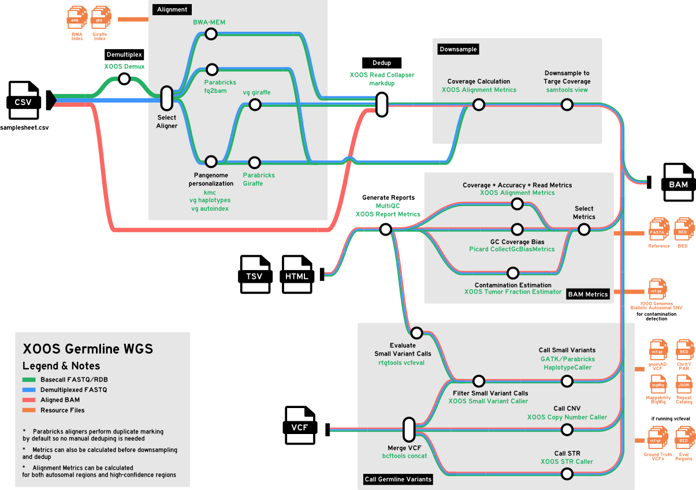
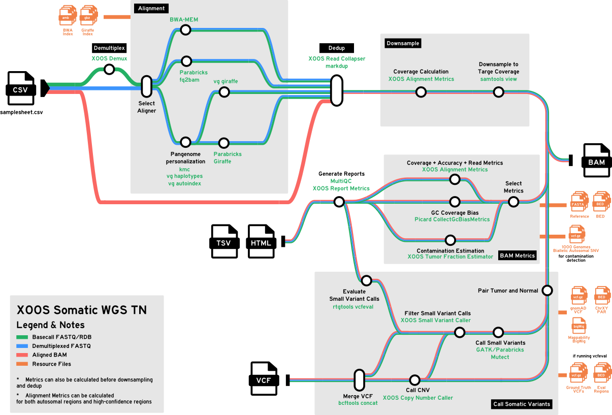
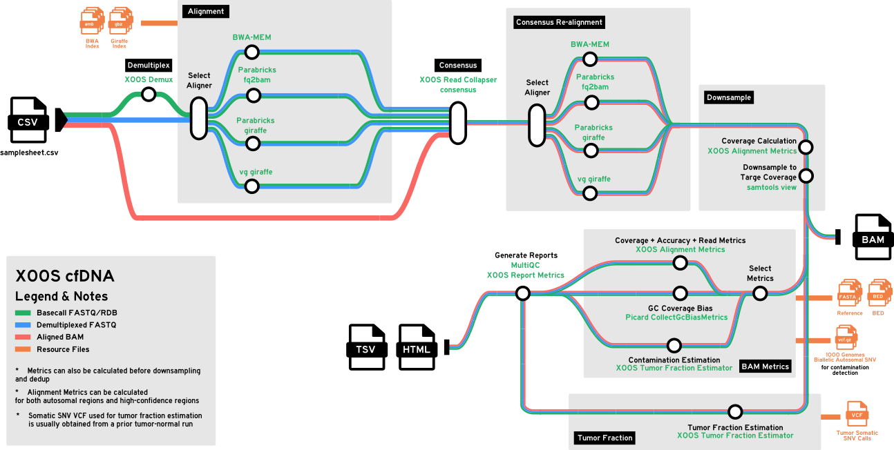

# Applications
<!-- markdownlint-disable MD024 -->

The XOOS pipeline supports three end-to-end applications. Each application is selected by a
Nextflow **analysis profile** (passed via `-profile`) together with an appropriately structured
samplesheet. This page describes each application and how to configure and run it.

| Application | Analysis profile | Variant calling mode |
|-------------|------------------|----------------------|
| SBX-D Germline WGS | `germline_wgs_duplex` | `germline` |
| SBX-D Somatic Tumor/Normal WGS | `somatic_wgs_tn_duplex` | `somatic_tn` |
| SBX-D cfDNA WGS | `cfdna_wgs_duplex` | `none` (reporter against an external VCF) |


The cfDNA application depends on the output of the Somatic Tumor/Normal application. Run a
matched Tumor/Normal analysis first, then feed its output VCF into the cfDNA analysis. See
[SBX-D cfDNA WGS](#sbx-d-cfdna-wgs) below.


For the full profile parameter matrix, see
[Analysis profiles (xoosnf)](README.md#analysis-profiles-xoosnf). For the complete samplesheet
column reference, see [Input samplesheet](README.md#input-run-sheet-format).

---

## SBX-D Germline WGS

Germline whole-genome small-variant and copy-number analysis for a single sample (no matched
normal). Uses pangenome-personalized alignment and germline variant calling.



### Configure

Use a simple germline samplesheet — one row per sample, no `group`/`TN` columns:

```csv
sample_name,sample_sid,target_coverage
SAMPLE_A,ACGTACGT,30
SAMPLE_B,TTGGCCAA,30
```

### Run

```bash
xoos run \
    --env ENV_NAME \
    --pipeline-script PATH_OR_URI_TO_PIPELINE_SCRIPT \
    --resources-base PATH_OR_URI_TO_RESOURCES_BASE \
    --analysis-dir PATH_OR_URI_TO_ANALYSIS_DIR \
    -- \
    --input samplesheet.csv \
    --outdir results/ \
    -profile docker,germline_wgs_duplex
```

---

## SBX-D Somatic Tumor/Normal WGS

Somatic small-variant analysis using a matched tumor and normal sample. Tumor and normal are
paired by the `group` column; the `TN` column designates each sample's role.



### Configure

Each tumor-normal pair shares a unique `group` value. `TN` must be `T` for the tumor and `N`
for the normal:

```csv
sample_name,sample_sid,group,TN,target_coverage
SAMPLE01_TUMOR,ACGTACGT,SAMPLE01,T,60
SAMPLE01_NORMAL,TTGGCCAA,SAMPLE01,N,30
```


`TN` and `group` must be provided together, and `group` must be unique per tumor-normal pair
across all runs. Tumor and normal samples may live in different runs (see the multi-run
samplesheet example in the [README](README.md#input-run-sheet-format)).


Optionally set `sample_type` (`ffpe` or `cell-line`) to select the somatic TN model and
thresholds. It defaults to `ffpe`.

### Run

```bash
xoos run \
    --env ENV_NAME \
    --pipeline-script PATH_OR_URI_TO_PIPELINE_SCRIPT \
    --resources-base PATH_OR_URI_TO_RESOURCES_BASE \
    --analysis-dir PATH_OR_URI_TO_ANALYSIS_DIR \
    -- \
    --input samplesheet.csv \
    --outdir results/ \
    -profile docker,somatic_wgs_tn_duplex
```

The somatic small-variant VCF produced here is the input to the cfDNA application below.

---

## SBX-D cfDNA WGS

Cell-free DNA analysis. The cfDNA profile does not call variants de novo; instead it reports
on a set of variants supplied per sample via `reporter_vcf`. This is typically used for
tumor-informed cfDNA monitoring, where the variants come from a prior tumor/normal analysis of
the same patient.



### Workflow dependency


**Run Somatic Tumor/Normal first.** The recommended workflow is:

1. Run [SBX-D Somatic Tumor/Normal WGS](#sbx-d-somatic-tumornormal-wgs) on the patient's matched
   tumor and normal samples.
2. Take the somatic small-variant VCF produced by that run.
3. Supply that VCF as the `reporter_vcf` for the patient's cfDNA sample(s) in the cfDNA
   samplesheet.

This produces a tumor-informed cfDNA report keyed to the somatic variants identified for that
patient.


### Configure

Add a `reporter_vcf` column pointing at the somatic VCF from step 1 (the file must exist):

```csv
sample_name,sample_sid,target_coverage,reporter_vcf
PATIENT01_CFDNA,ACGTACGT,60,/data/results/PATIENT01_somatic/PATIENT01.somatic.vcf.gz
```

### Run

```bash
xoos run \
    --env ENV_NAME \
    --pipeline-script PATH_OR_URI_TO_PIPELINE_SCRIPT \
    --resources-base PATH_OR_URI_TO_RESOURCES_BASE \
    --analysis-dir PATH_OR_URI_TO_ANALYSIS_DIR \
    -- \
    --input samplesheet.csv \
    --outdir results/ \
    -profile docker,cfdna_wgs_duplex
```

The cfDNA profile uses consensus deduplication (`dedup_strategy = consensus`) and the
`wgs-duplex-cfdna` read-collapser preset, which differ from the germline and somatic profiles.
