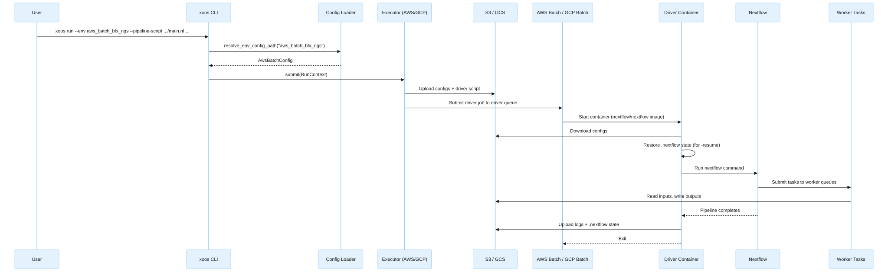

# XOOS Pipeline System Architecture

## Overview

The XOOS pipeline system consists of three repositories that work together to run bioinformatics analysis pipelines on cloud infrastructure:

| Repository | Role |
|---|---|
| **xoosnf** | An nf-core style Nextflow pipeline for end-to-end processing of SBX sequencing data (demux, alignment, variant calling, QC). |
| **xoos** (pipeline_launcher) | A Python CLI (`xoos`) that abstracts Nextflow pipeline submission across local, Slurm, AWS Batch, and GCP Batch environments. |
| **xoos-ops** | Terragrunt/Terraform infrastructure-as-code that provisions the AWS resources (VPC, Batch, S3, IAM) used by the pipeline. |

The user interacts only with pipeline_launcher. It reads an environment config, uploads pipeline configs to cloud storage, and submits a batch job that runs Nextflow, which in turn executes the xoosnf pipeline.



---

## pipeline_launcher and xoosnf

### Relationship

pipeline_launcher does not contain pipeline logic. It is a submission tool that wraps Nextflow invocation of any Nextflow pipeline, including xoosnf. The launcher:

1. Loads an **environment config** (YAML) that selects the executor type and cloud-specific settings.
2. Loads **Nextflow config files** that define process resources, queue routing, and retry strategies for that environment.
3. Renders a **driver script** (Jinja template) that handles Nextflow lifecycle inside a container.
4. Uploads configs + driver script to cloud storage.
5. Submits a batch job that runs the driver, which in turn runs Nextflow against the pipeline.

### Environment Configs

Environment configs are YAML files in `pipeline_launcher/src/pipeline_launcher/env/`. Each file describes one execution target:

```text
env/
├── aws_batch_bfx_ngs.yaml          # AWS Batch, prod standard analysis (spot)
├── aws_batch_bfx_ngs_on_demand.yaml # AWS Batch, prod standard analysis (on-demand)
├── gcp_batch_genomics_sbx.yaml      # GCP Batch, genomics sandbox (spot)
├── gcp_batch_genomics_sbx_on_demand.yaml
├── shpc_sc1.yaml                    # Slurm HPC
├── shpc_kau.yaml
├── shpc_ind.yaml
├── dl380a_gen12.yaml                # Local execution
└── ...
```

The `executor` field determines which executor class handles the submission:

| `executor` value | Python class | Backend |
|---|---|---|
| `local` | `LocalExecutor` | Runs Nextflow directly on the current machine |
| `slurm` | `SlurmExecutor` | Submits an sbatch driver script |
| `aws_batch` | `AwsBatchExecutor` | Submits a containerized driver to AWS Batch |
| `gcp_batch` | `GcpBatchExecutor` | Submits a containerized driver to GCP Batch |

### Nextflow Config Files

Each environment config references one or more Nextflow config files via the `config_files` array. These are stored in `pipeline_launcher/src/pipeline_launcher/nextflow_config/env/` and define:

- **Process resource labels** (`process_single`, `process_low`, `process_medium`, `process_high`, `process_gpu`, etc.) — CPU, memory, time, and disk allocations.
- **Queue routing** — a closure that maps CPU/memory requirements to specific batch queue names.
- **Retry and error strategies** — exponential backoff for spot interruptions, retry on OOM/signal exits.
- **Executor-specific settings** — AWS Batch CLI path, IAM roles, GCP project/region, spot configuration.

The `profiles` array in the env JSON activates these configs as Nextflow profiles (e.g., `-profile aws_batch_bfx_ngs`).

### Execution Flow



---

## pipeline_launcher and AWS Batch

### How the AWS Batch Executor Works

The `AwsBatchExecutor` (`executor/aws_batch.py`) performs these steps:

1. **Build the Nextflow command** — assembles `nextflow run <pipeline> -profile <profiles> -c <configs> --outdir <s3_path> ...` with all environment and user-supplied parameters.
2. **Stage local files** — if the user passes local file paths (e.g., samplesheets), they are uploaded to S3 and the command is rewritten to use S3 URIs.
3. **Upload configs** — all Nextflow config files referenced in `config_files` are uploaded to `s3://<bucket>/<analysis_name>/conf/`.
4. **Render and upload the driver script** — the `aws_batch_driver.jinja` template is rendered with the Nextflow command, S3 paths for logs and state, and uploaded to S3.
5. **Create a Batch job definition** — a one-time job definition with the driver container image, vCPUs, memory, and the driver IAM role.
6. **Submit the job** — submits to the `driver_queue` with the driver script as the container command.

### Driver Script Lifecycle

The driver script (`templates/aws_batch_driver.jinja`) runs inside the `nextflow/nextflow` container on the driver queue:

1. **Stage configs** — downloads all config files from S3 to `/pipeline/conf/`.
2. **Download pipeline source** — if `pipeline_source_dir` is set, downloads the pipeline from S3 (decouples pipeline source from the container image).
3. **Restore resume state** — syncs `.nextflow/` from S3 to enable `-resume` across runs.
4. **Run Nextflow** — executes the assembled command, tees output to `nextflow-run.log`.
5. **Signal handling** — traps SIGTERM/SIGINT and forwards INT to Nextflow for graceful shutdown.
6. **Cleanup (EXIT trap)** — syncs `.nextflow/` state back to S3, uploads `.nextflow.log` and `nextflow-run.log`.

### Key Config Fields (AwsBatchAttributes)

| Field | Description |
|---|---|
| `region` | AWS region (e.g., `us-west-2`) |
| `s3_bucket` | S3 bucket for configs, logs, state, and pipeline outputs |
| `driver_queue` | Batch job queue for the Nextflow driver job |
| `driver_image` | Container image for the driver (e.g., `nextflow/nextflow:26.04.0`) |
| `cli_path` | Path to AWS CLI inside worker containers (mounted from EBS) |
| `job_role_arn` | IAM role ARN assumed by the driver container |
| `driver_vcpus` | vCPUs for the driver job (default: 2) |
| `driver_memory_mib` | Memory for the driver job in MiB (default: 3072) |
| `expected_bucket_owner` | AWS account ID for S3 bucket ownership verification |

### Queue Routing

The Nextflow config defines a `queue` closure that routes each process task to the appropriate Batch queue based on CPU and memory requirements:

```groovy
queue = {
    def memGB = task.memory.toGiga()
    if (task.cpus <= 2  && memGB <= 4)  return 'prod-standard-analysis-c7a-large'
    if (task.cpus <= 32 && memGB <= 64) return 'prod-standard-analysis-c7a-8xlarge'
    return 'prod-standard-analysis-c7a-16xlarge'
}
```

GPU tasks are routed to dedicated GPU queues via `withLabel:process_gpu`:

```groovy
withLabel:process_gpu {
    queue = 'prod-standard-analysis-g6-16xlarge'
    accelerator = 1
    cpus = 64
    memory = 240.GB
}
```

The queue names follow the pattern `<name_prefix>-<compute_resource_key>` where `name_prefix` comes from the terraform module and `compute_resource_key` is the map key in the `compute_resources` variable.

---

## pipeline_launcher and GCP Batch

### How the GCP Batch Executor Works

The `GcpBatchExecutor` (`executor/gcp_batch.py`) follows the same pattern as AWS but uses GCP APIs:

1. **Build the Nextflow command** — same as AWS.
2. **Stage local files** — uploads to GCS instead of S3.
3. **Upload configs** — uploads to `gs://<bucket>/<analysis_name>/conf/`.
4. **Render and upload the driver script** — uses `gcp_batch_driver.jinja`, uploads to GCS.
5. **Submit a GCP Batch job** — creates a `batch_v1.Job` with a single task group containing one runnable (the driver script), specifying machine type, boot disk, service account, and networking.

### Key Differences from AWS

| Aspect | AWS Batch | GCP Batch |
|---|---|---|
| **Compute provisioning** | Pre-provisioned compute environments with fixed instance types | Serverless — VMs created on demand per job |
| **Queue model** | One job queue per compute environment, routing via Nextflow config | No pre-created queues; Nextflow's `google-batch` executor creates VMs directly |
| **Storage** | EBS volumes attached to EC2 instances | Local SSD / persistent disk per VM |
| **Spot handling** | Compute environment `type = SPOT`, Nextflow retries on `exitStatus == Integer.MAX_VALUE` | `spot = true` in Nextflow config, `autoRetryExitCodes` for Batch-level retries |
| **GPU** | Dedicated GPU instance types in separate queues | `accelerator` directive with GPU type, `installGpuDrivers = true` |
| **CLI for storage** | AWS CLI mounted from EBS snapshot | gcloud CLI bundled in the Nextflow image |
| **Infrastructure-as-code** | Terraform module provisions everything | Manual setup (enable APIs, create bucket, create service account) |

### Key Config Fields (GcpBatchAttributes)

| Field | Description |
|---|---|
| `region` | GCP region (e.g., `us-central1`) |
| `project_id` | GCP project ID |
| `gcs_bucket` | GCS bucket for configs, logs, state, and outputs |
| `driver_image` | Container image for the driver (e.g., `nextflow/nextflow:26.04.0`) |
| `execution_service_account` | Service account email for the Batch job |
| `cli_path` | Path to gcloud CLI inside the container |
| `driver_machine_type` | Machine type for the driver VM (e.g., `n2-standard-2`) |

---

## multi-queue-batch Terraform Module

The `multi-queue-batch` module (`xoos-ops/terraform/modules/multi-queue-batch/`) provisions a complete AWS Batch environment for running Nextflow pipelines. It creates all networking, compute, storage, and IAM resources from a single `compute_resources` map variable.

### What the Module Provisions



### Resource Details

#### Networking

- A dedicated VPC with a `/16` CIDR block.
- One public subnet per availability zone with auto-assigned public IPs.
- Internet gateway + route table for outbound access (container image pulls, S3 access).
- Security group allowing all egress, no ingress.

#### Compute (per `compute_resources` entry)

- A **launch template** with:
  - Root EBS volume (gp3, configurable size/IOPS/throughput, KMS-encrypted).
  - Secondary EBS volume mounted at `/mnt/aws-cli` from a pre-built snapshot containing the AWS CLI (avoids installing it at runtime).
  - Userdata script that configures ECS engine auth (Docker registry credentials from SSM) and mounts the CLI volume.
  - IMDSv2 required (metadata tokens).
- A **Batch compute environment** — either `SPOT` (with `SPOT_CAPACITY_OPTIMIZED` allocation) or `EC2` (with `BEST_FIT_PROGRESSIVE`).
- A **Batch job queue** mapped 1:1 to the compute environment.

#### IAM Roles

- **Batch Worker Role** — assumed by EC2 instances, has ECS container service permissions + SSM read for Docker auth + any `additional_permissions`.
- **Driver Role** — assumed by the Nextflow driver container, has full Batch access, S3/KMS access to the data bucket, `iam:PassRole` for the data-all-access and driver roles, CloudWatch Logs read, and any `additional_permissions`.
- **Data All-Access Role** — assumed by worker task containers, has full S3 + KMS access to the data bucket and any `additional_permissions`.
- **Spot Fleet Role** — created per SPOT compute environment for EC2 spot fleet tagging.

#### Storage

- An S3 bucket (auto-generated name from `name_prefix`) with:
  - Versioning enabled.
  - Server-side encryption with a dedicated KMS key.
  - Lifecycle rules: abort incomplete multipart uploads (30 days), transition to Intelligent-Tiering (10 days), expire noncurrent versions (configurable, default 30 days), clean up expired delete markers.
  - Public access blocked.

#### Notifications

- An SQS queue that receives Batch job state change events via CloudWatch Event Rules (one rule per job queue). This enables external monitoring of job completion/failure.

### The `compute_resources` Variable

This is the primary configuration surface. Each entry in the map creates a paired compute environment + job queue:

```hcl
compute_resources = {
  c7a-large = {
    type                = "SPOT"           # SPOT or EC2 (on-demand)
    allocation_strategy = "SPOT_CAPACITY_OPTIMIZED"  # or BEST_FIT_PROGRESSIVE
    bid_percentage      = 100              # Max spot price (% of on-demand)
    max_vcpus           = 8192             # Max concurrent vCPUs
    instance_type       = ["c7a.large"]    # EC2 instance type(s)
    volume_size         = null             # Root EBS size (falls back to var.volume_size)
    iops                = null             # EBS IOPS (falls back to 16000)
    throughput          = null             # EBS throughput (falls back to 1000)
  }
}
```

The resulting Batch queue name is `<name_prefix>-<key>`, e.g., `prod-standard-analysis-c7a-large`. This name must match the queue names used in the Nextflow config's `queue` closure.

### Userdata Template

The launch template userdata (`userdata.tpl`) runs on each EC2 instance at boot:

1. Installs the AWS CLI via yum (used on the host to retrieve SSM parameters in the next step).
2. Retrieves Docker registry credentials from SSM Parameter Store and writes them to `/etc/ecs/ecs.config` as `ECS_ENGINE_AUTH_DATA`.
3. Sets `ECS_CONTAINER_STOP_TIMEOUT=5m` to allow graceful container shutdown.
4. Mounts the secondary EBS volume (AWS CLI snapshot) at `/mnt/aws-cli`. This provides the AWS CLI inside containers — Nextflow tasks use the path `/mnt/aws-cli/miniconda/bin/aws` rather than the host-installed CLI.
5. Grows the root XFS filesystem to fill the EBS volume.
