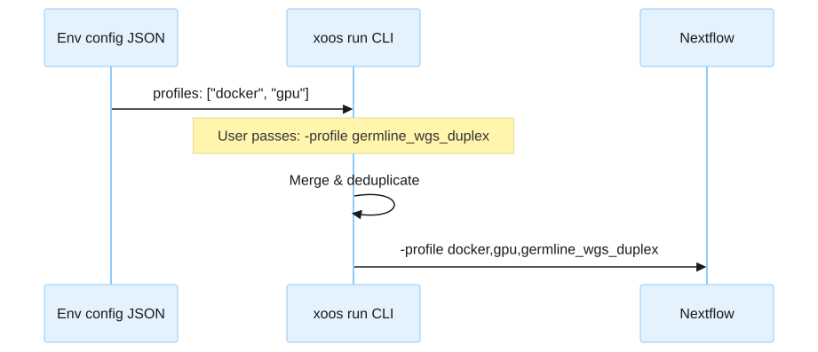

# Custom environment
<!-- markdownlint-disable MD024 -->

You can create your own environment config YAML for any infrastructure not covered by the bundled configs.

## Environment config schema

All environment configs share these fields:

| Field             | Type     | Description                                                                      |
|:------------------|:---------|:---------------------------------------------------------------------------------|
| `executor`        | string   | `local`, `slurm`, `aws_batch`, or `gcp_batch`. Defaults to `local`.             |
| `profiles`        | string[] | Nextflow `-profile` values to activate.                                          |
| `config_files`    | string[] | Additional Nextflow config files. Supports `@nextflow_config/` prefix.           |
| `pipeline_params` | object   | Key-value pairs forwarded as `--key value` to Nextflow.                          |

Executor-specific fields:




| Field                          | Type     | Description                                              |
|:-------------------------------|:---------|:---------------------------------------------------------|
| `attributes.cluster_cpu_queue` | string   | Default Slurm partition for CPU tasks.                   |
| `attributes.cluster_gpu_queue` | string   | Slurm partition for GPU tasks.                           |
| `attributes.cluster_qos`      | string   | Quality of service for job scheduling.                   |
| `attributes.cluster_account`  | string   | Slurm account for billing (optional).                    |
| `preamble`                     | string[] | Shell lines prepended to the driver script.              |
| `driver.scratch_base`         | string   | Base path for work directories.                          |
| `driver.singularity_cache`    | string   | Shared Singularity/Apptainer image cache directory.      |




| Field                              | Type    | Description                                          |
|:-----------------------------------|:--------|:-----------------------------------------------------|
| `aws_batch.region`                | string  | AWS region.                                           |
| `aws_batch.s3_bucket`            | string  | S3 bucket for work and staging.                       |
| `aws_batch.driver_queue`         | string  | Batch job queue for the driver.                       |
| `aws_batch.cli_path`             | string  | Path to AWS CLI in the driver container.              |
| `aws_batch.driver_image`         | string  | Docker image for the driver container.                |
| `aws_batch.driver_vcpus`         | integer | vCPUs for the driver job.                             |
| `aws_batch.driver_memory_mib`    | integer | Memory (MiB) for the driver job.                      |
| `aws_batch.job_role_arn`         | string  | IAM role ARN for Batch jobs.                          |
| `aws_batch.expected_bucket_owner`| string  | AWS account ID owning the S3 bucket.                  |




| Field                                  | Type   | Description                                    |
|:---------------------------------------|:-------|:-----------------------------------------------|
| `gcp_batch.region`                    | string | GCP region.                                     |
| `gcp_batch.project_id`               | string | GCP project ID.                                 |
| `gcp_batch.gcs_bucket`               | string | GCS bucket for work and staging.                |
| `gcp_batch.pipeline_image_uri`       | string | Container image for the driver job.             |
| `gcp_batch.execution_service_account`| string | Service account for Batch jobs.                 |
| `gcp_batch.cli_path`                 | string | Path to `gcloud` in the driver container.       |
| `gcp_batch.driver_machine_type`      | string | Machine type for the driver VM.                 |




No additional fields.
The local executor runs Nextflow directly on the current machine.




## Bundled config resolution

Config file paths prefixed with `@nextflow_config/` are resolved from the bundled `nextflow_config/` directory inside the pipeline_launcher package.
This allows environment configs to reference hardware profiles shipped with the launcher without requiring absolute paths.

For example, `@nextflow_config/env/my_cluster.config` resolves to the file at `pipeline_launcher/src/pipeline_launcher/nextflow_config/env/my_cluster.config`.

## Profile merging

Profiles from three sources are merged in order:

1. **Environment config** — profiles listed in the `profiles` field of the env config YAML.
2. **User passthrough** — profiles passed via `-profile` after the `--` separator.
3. **Deduplication** — duplicate profile names are removed, preserving the first occurrence.

The merged list is passed to Nextflow as a single `-profile` argument.



## Writing a custom Nextflow config profile

Create a Nextflow config file that defines a profile matching the name in your env config's `profiles` list.
The profile should set:

- `process.executor` — the Nextflow executor type (`local`, `slurm`, `awsbatch`, `google-batch`).
- Resource allocations — CPU, memory, and time per process label.
- Retry and error strategies.
- Queue or partition selection (for HPC and cloud executors).
- Container runtime settings if not using a built-in profile like `docker` or `singularity`.

Reference the profile from your env config via `config_files`:

```yaml
profiles:
- my_custom_profile
- docker
config_files:
- /path/to/my_custom.config
```
