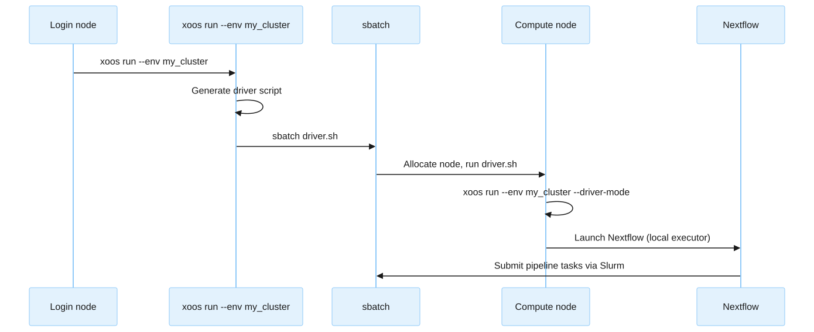

# Slurm HPC
<!-- markdownlint-disable MD024 -->

Run the XOOS pipeline on a Slurm-managed HPC cluster using the `slurm` executor.

## Prerequisites

- Access to a Slurm-managed HPC cluster.
- Singularity or Apptainer installed on compute nodes.
- Java 17+ and Nextflow available (via module system or direct install).
- Python 3.10+ with the pipeline_launcher installed on the login node.

## Infrastructure

No cloud resources are needed.
Ensure the following are available on the cluster:

1. **Slurm queues** — at least one CPU queue and optionally a GPU queue.
2. **Scratch storage** — a high-performance filesystem for Nextflow work directories.
3. **Singularity cache** — a shared directory for cached container images to avoid redundant downloads.
4. **Nextflow binary** — install Nextflow on a shared filesystem or load it via the module system.

## Environment config YAML

```yaml
executor: slurm
profiles:
- my_slurm_profile
attributes:
  cluster_cpu_queue: batch_cpu
  cluster_gpu_queue: batch_gpu
  cluster_qos: normal
  cluster_account: my_account
preamble:
- module load Java/17
- export PATH="/path/to/nextflow:$PATH"
config_files:
- my_slurm_nextflow.config
driver:
  scratch_base: /scratch/users/
  singularity_cache: /shared/software/xoos_cache
```

| Field              | Description                                                                          |
|:-------------------|:-------------------------------------------------------------------------------------|
| `attributes`       | Slurm scheduling parameters forwarded as `--cluster_*` Nextflow params.              |
| `cluster_cpu_queue` | Default Slurm partition for CPU tasks.                                              |
| `cluster_gpu_queue` | Slurm partition for GPU tasks.                                                      |
| `cluster_qos`      | Quality of service for job scheduling.                                               |
| `cluster_account`  | Slurm account for job billing (optional).                                            |
| `preamble`         | Shell lines prepended to the driver script (module loads, PATH setup).               |
| `driver`           | Driver environment settings.                                                         |
| `scratch_base`     | Base path for Nextflow work directories. The username is appended automatically.     |
| `singularity_cache`| Shared directory for Singularity/Apptainer image cache.                              |

## Nextflow config profile

The Slurm Nextflow config profile sets `process.executor = 'slurm'` and configures:

- Queue selection via `process.queue` (using `cluster_cpu_queue` and `cluster_gpu_queue` params).
- QOS-based `clusterOptions` for time-limited job classes.
- Retry strategies for transient failures.
- Resource allocations per process label.

## Driver mode

When submitting to Slurm, the launcher does not run Nextflow on the login node.
Instead, it generates a driver script and submits it via `sbatch`.
The driver script re-invokes `xoos run` with the `--driver-mode` flag.
The launcher detects this flag and forces the local executor, so Nextflow runs directly on the allocated compute node.



## Example run command

```bash
xoos run \
  --env my_slurm_cluster \
  --pipeline-script /shared/pipelines/xoos-nf-core/main.nf \
  --resources-base /shared/resources/xoos-resources-1.1 \
  --analysis-dir /scratch/users/$USER/my-analysis \
  --project my_project \
  -- \
  --input /data/run_sheet.csv \
  -profile germline_wgs_duplex
```


The `--project` flag is required for Slurm environments.
It sets the Slurm job comment for tracking and accounting.

