# Getting Started on AWS

This guide walks through deploying the multi-queue-batch terraform module and configuring pipeline_launcher for a new AWS environment.

## Prerequisites

- An AWS account with permissions to create: VPC, subnets, internet gateway, security groups, IAM roles/policies, Batch compute environments and job queues, S3 buckets, KMS keys, SQS queues, CloudWatch event rules, EC2 launch templates, and key pairs.
- [Terraform](https://www.terraform.io/) ≥ 1.x installed.
- [Terragrunt](https://terragrunt.gruntwork.io/) installed.
- Docker registry credentials stored in AWS SSM Parameter Store (the Batch workers pull XOOS container images from a private registry).
- An SSH public key stored in SSM Parameter Store (for optional SSH access to Batch worker instances).
- An EBS snapshot containing the AWS CLI. The default snapshot `snap-027786c4b386bc959` is available in the `674650533962` account. If deploying in a different account, you need to create your own snapshot or copy the existing one.

## Overview







### Deploy the multi-queue-batch Module

#### 1.1 Create the Terragrunt Directory Structure

Follow the existing hierarchy pattern:

```text
terraform/
├── root.hcl
├── <account-alias>/
│   ├── account.hcl
│   ├── <region>/
│   │   ├── region.hcl
│   │   └── <environment>/
│   │       ├── env.hcl
│   │       └── <deployment-name>/
│   │           └── terragrunt.hcl
```

Create the hierarchy files:

**`account.hcl`:**

```hcl
locals {
  account_name = "<your-account-alias>"
  account_id   = "<your-aws-account-id>"
}
```

**`region.hcl`:**

```hcl
locals {
  aws_region = "us-west-2"  # or your preferred region
}
```

**`env.hcl`:**

```hcl
locals {
  env = "prod"  # or "dev", "staging", etc.
}
```

#### 1.2 Write the Terragrunt Configuration

Create `terragrunt.hcl` in your deployment directory:

```hcl
include "root" {
  path = find_in_parent_folders("root.hcl")
}

terraform {
  source = "${get_parent_terragrunt_dir()}/modules//multi-queue-batch"
}

locals {
  env_vars = read_terragrunt_config(find_in_parent_folders("env.hcl"))
  env      = local.env_vars.locals.env
}

inputs = {
  name_prefix = "${local.env}-my-analysis"

  batch_worker_ssh_access_public_key_ssm_parameter = "/${local.env}/my-analysis/worker-ssh-access/public-key"
  ecs_engine_auth_ssm_parameter                    = "/${local.env}/my-analysis/worker/ECS_ENGINE_AUTH_DATA"

  volume_size        = 500
  availability_zones = ["us-west-2b"]

  compute_resources = {
    # Driver queue — on-demand, never interrupted
    driver = {
      type                = "EC2"
      allocation_strategy = "BEST_FIT_PROGRESSIVE"
      max_vcpus           = 256
      instance_type       = ["c7a.large"]
      volume_size         = 30
      iops                = 10000
    }

    # CPU SPOT — for most pipeline tasks
    c7a-large = {
      type                = "SPOT"
      allocation_strategy = "SPOT_CAPACITY_OPTIMIZED"
      bid_percentage      = 100
      max_vcpus           = 4096
      instance_type       = ["c7a.large"]
    }

    c7a-8xlarge = {
      type                = "SPOT"
      allocation_strategy = "SPOT_CAPACITY_OPTIMIZED"
      bid_percentage      = 100
      max_vcpus           = 4096
      instance_type       = ["c7a.8xlarge"]
    }

    # GPU SPOT — for GPU-accelerated tasks (alignment, variant calling)
    g6-16xlarge = {
      type                = "SPOT"
      allocation_strategy = "SPOT_CAPACITY_OPTIMIZED"
      bid_percentage      = 100
      max_vcpus           = 4096
      instance_type       = ["g6.16xlarge"]
      volume_size         = 2048
    }
  }
}
```

#### 1.3 Understand the `compute_resources` Fields

| Field | Type | Description |
|---|---|---|
| `type` | `"SPOT"` or `"EC2"` | SPOT uses spot instances (cheaper, can be interrupted). EC2 uses on-demand (reliable, more expensive). Always use EC2 for the driver queue. |
| `allocation_strategy` | string | `SPOT_CAPACITY_OPTIMIZED` for spot (picks instances with most available capacity). `BEST_FIT_PROGRESSIVE` for on-demand (picks cheapest instance that fits). |
| `bid_percentage` | number | Max spot price as percentage of on-demand price. Use `100` to pay up to on-demand price. Only applies when `type = "SPOT"`. |
| `max_vcpus` | number | Maximum concurrent vCPUs across all instances in this compute environment. Controls how many tasks can run in parallel. |
| `instance_type` | list(string) | EC2 instance type(s). Each compute environment typically uses a single instance type for predictable resource allocation. |
| `volume_size` | number (optional) | Root EBS volume size in GB. Falls back to the top-level `volume_size` variable (default 500 GB). GPU instances typically need 2 TB for large model files. |
| `iops` | number (optional) | EBS IOPS. Falls back to 16000. The driver queue uses 10000 since it has minimal I/O. |
| `throughput` | number (optional) | EBS throughput in MB/s. Falls back to 1000. |

Each entry creates:

- A Batch compute environment named `<name_prefix>-<key>`
- A Batch job queue named `<name_prefix>-<key>`

#### 1.4 Set Up SSM Parameters

Before running `terragrunt apply`, create the required SSM parameters:

```bash
# Docker registry credentials (for pulling XOOS container images)
aws ssm put-parameter \
  --name "/<env>/my-analysis/worker/ECS_ENGINE_AUTH_DATA" \
  --type SecureString \
  --value '{"https://registry.example.com":{"auth":"<base64-encoded-credentials>"}}'

# SSH public key (for optional worker instance access)
aws ssm put-parameter \
  --name "/<env>/my-analysis/worker-ssh-access/public-key" \
  --type String \
  --value "ssh-rsa AAAA..."
```

#### 1.5 Deploy

```bash
cd terraform/<account>/<region>/<env>/<deployment-name>
terragrunt init
terragrunt apply
```

#### 1.6 Verify

After deployment, verify the resources:

1. **Batch console** — check that compute environments and job queues are created and in `ENABLED` state.
2. **S3** — check that the data bucket exists (name will be `<name_prefix>-<random-suffix>`).
3. **IAM** — check that the driver, data-all-access, and batch-worker roles exist.

Note the following outputs — you'll need them for the pipeline_launcher env config:

```bash
terragrunt output
# batch_queue_arns   = { "driver" = "arn:...", "c7a-large" = "arn:...", ... }
# data_bucket_name   = "<name_prefix>-<random-suffix>"
# driver_role_arn    = "arn:aws:iam::<account>:role/<name_prefix>-driver"
```

#### 1.7 Grant Cross-Bucket Access (Optional)

If the pipeline needs to read from or write to other S3 buckets, add `additional_permissions`:

```hcl
inputs = {
  # ... other inputs ...

  additional_permissions = [
    {
      Version = "2012-10-17"
      Statement = [
        {
          Action   = ["s3:ListBucket"]
          Effect   = "Allow"
          Resource = ["arn:aws:s3:::my-input-data-bucket"]
        },
        {
          Action   = ["s3:GetObject"]
          Effect   = "Allow"
          Resource = ["arn:aws:s3:::my-input-data-bucket/*"]
        },
        {
          Action   = ["kms:Decrypt"]
          Effect   = "Allow"
          Resource = ["arn:aws:kms:us-west-2:<account>:key/<key-id>"]
        }
      ]
    }
  ]
}
```

These permissions are attached to all three roles (batch worker, driver, data-all-access).





### Write a Custom pipeline_launcher Environment

#### 2.1 Create the Env YAML

Create a new file in `pipeline_launcher/src/pipeline_launcher/env/`, e.g., `aws_batch_my_analysis.yaml`:

```yaml
executor: aws_batch
profiles:
- aws_batch_my_analysis
pipeline_params:
  enable_low_gpu_memory_mode: true
config_files:
- '@nextflow_config/env/aws_batch_my_analysis.config'
aws_batch:
  region: us-west-2
  s3_bucket: <data-bucket-name-from-terraform-output>
  driver_queue: <name_prefix>-driver
  driver_image: nextflow/nextflow:26.04.0
  cli_path: /mnt/aws-cli/miniconda/bin/aws
  job_role_arn: <driver-role-arn-from-terraform-output>
  expected_bucket_owner: <your-aws-account-id>
```

**Field reference:**

| Field | Description |
|---|---|
| `executor` | Must be `"aws_batch"`. |
| `profiles` | List of Nextflow profile names to activate. Must match the profile name in the Nextflow config file. |
| `pipeline_params` | Key-value pairs passed as `--key value` to Nextflow. These are pipeline-specific parameters. |
| `config_files` | Nextflow config files to upload and apply. The `@nextflow_config/` prefix resolves to the bundled config directory. |
| `aws_batch.region` | AWS region where Batch is deployed. |
| `aws_batch.s3_bucket` | The S3 data bucket created by the terraform module. Get this from `terragrunt output data_bucket_name`. |
| `aws_batch.driver_queue` | The Batch job queue for the driver. This is `<name_prefix>-driver`. |
| `aws_batch.driver_image` | Docker image for the Nextflow driver container. Use `nextflow/nextflow:<version>`. |
| `aws_batch.cli_path` | Path to the AWS CLI inside worker containers. The EBS snapshot mounts it at `/mnt/aws-cli/miniconda/bin/aws`. |
| `aws_batch.job_role_arn` | IAM role ARN for the driver container. Get this from `terragrunt output driver_role_arn`. |
| `aws_batch.expected_bucket_owner` | Your AWS account ID. Used for S3 bucket ownership verification. |

#### 2.2 Create the Nextflow Config

Create a matching config file in `pipeline_launcher/src/pipeline_launcher/nextflow_config/env/`, e.g., `aws_batch_my_analysis.config`:

```groovy
profiles {
    aws_batch_my_analysis {
        aws {
            batch {
                jobRole = '<driver-role-arn>'
                cliPath = '/mnt/aws-cli/miniconda/bin/aws'
                terminateUnschedulableJobs = true
                maxParallelTransfers = 16
                maxTransferAttempts = 3
                delayBetweenAttempts = '15 sec'
            }
            client {
                maxConnections = 100
            }
            region = 'us-west-2'
        }
        process {
            executor = 'awsbatch'
            maxRetries = 3

            // Error strategy with spot retry
            errorStrategy = {
                if (task.exitStatus in (135..140) + [255]) {
                    return 'retry'
                }
                if (task.exitStatus == Integer.MAX_VALUE) {
                    task.ext.spotRetry = true
                    sleep((Math.pow(2, task.attempt) * 10 * 1000) as long)
                    return 'retry'
                }
                return params.getOrDefault('error_strategy_fallback', 'ignore')
            }

            // Default resources
            cpus   = { Math.min(1 * task.attempt, 2) }
            memory = { Math.min(2 * task.attempt, 4).GB }
            time   = { 4.h * task.attempt }

            // Queue routing — MUST match terraform queue names
            queue = {
                def memGB = task.memory.toGiga()
                if (task.cpus <= 2  && memGB <= 4)  return '<name_prefix>-c7a-large'
                if (task.cpus <= 32 && memGB <= 64) return '<name_prefix>-c7a-8xlarge'
                return '<name_prefix>-c7a-8xlarge'  // adjust if you have a 16xlarge queue
            }

            // Process resource labels
            withLabel:process_single {
                cpus   = 1
                memory = { Math.min(1 * task.attempt, 3).GB }
                time   = { 4.h * task.attempt }
            }

            withLabel:process_low {
                cpus   = 2
                memory = { Math.min(3 * task.attempt, 3).GB }
                time   = { 4.h * task.attempt }
            }

            withLabel:process_medium {
                cpus   = { Math.min(16 * task.attempt, 32) }
                memory = { Math.min(48 * task.attempt, 60).GB }
                time   = { 8.h * task.attempt }
            }

            withLabel:process_high {
                cpus   = { Math.min(48 * task.attempt, 64) }
                memory = { Math.min(64 * task.attempt, 120).GB }
                time   = { 16.h * task.attempt }
            }

            withLabel:process_high_memory {
                cpus   = { Math.min(48 * task.attempt, 64) }
                memory = { Math.min(64 * task.attempt, 120).GB }
            }

            withLabel:process_gpu {
                queue = '<name_prefix>-g6-16xlarge'
                accelerator = 1
                cpus = 64
                memory = 240.GB
            }
        }
    }
}
```

#### 2.3 Queue Name Alignment

The queue names in the Nextflow config **must** match the Batch job queue names created by Terraform. The naming convention is:

```text
<name_prefix>-<compute_resource_key>
```

For example, if your terraform inputs are:

```hcl
name_prefix = "prod-my-analysis"
compute_resources = {
  c7a-large   = { ... }
  c7a-8xlarge = { ... }
  g6-16xlarge = { ... }
  driver      = { ... }
}
```

Then the queue names are:

- `prod-my-analysis-c7a-large`
- `prod-my-analysis-c7a-8xlarge`
- `prod-my-analysis-g6-16xlarge`
- `prod-my-analysis-driver`

And the Nextflow config's `queue` closure must return these exact names.

#### 2.4 Test the Environment

```bash
xoos run \
  --env aws_batch_my_analysis \
  --pipeline-script /path/to/xoos-nf-core/main.nf \
  --resources-base s3://<resources-bucket>/xoos-resources-1.1 \
  --analysis-dir s3://<data-bucket>/$USER/$(date +%Y%m%d)/test-run \
  -- \
  --input s3://<data-bucket>/data/run_sheet.csv \
  -profile germline_wgs_duplex
```

The launcher will:

1. Upload configs to `s3://<data-bucket>/<analysis-name>/conf/`
2. Submit a driver job to `<name_prefix>-driver`
3. Print the AWS Batch Console URL for monitoring





## Common Operations

### Resuming a Failed Run

To resume a failed run, re-run the same command with the same `--analysis-dir`.
The pipeline_launcher automatically passes `-resume` to Nextflow and restores `.nextflow` state from S3.
See [Resume and retries](advanced-topics.md#resume-and-retries) for details on how caching and resume work.

### Checking Job Status

- **AWS Batch Console** — view job status, logs, and compute environment utilization.
- **CloudWatch Logs** — Batch job logs are in `/aws/batch/job`.
- **S3 logs** — the driver uploads `nextflow-run.log` and `.nextflow.log` to `s3://<bucket>/<analysis-name>/`.

### Adjusting Queue Capacity

To change `max_vcpus` for a queue, update the `compute_resources` map in `terragrunt.hcl` and run `terragrunt apply`. The compute environment will be updated in place (Batch uses `create_before_destroy` lifecycle).

### Adding New Queue Types

To add a new instance type (e.g., for a memory-optimized workload):

1. Add an entry to `compute_resources` in `terragrunt.hcl`.
2. Run `terragrunt apply`.
3. Update the Nextflow config's `queue` closure to route appropriate tasks to the new queue.
4. Update the env YAML if needed (usually not required — the YAML only references the driver queue).
