# Getting Started on GCP

This guide covers setting up GCP resources for running XOOS pipelines via GCP Batch and configuring pipeline_launcher for a new GCP environment.

Unlike AWS, GCP Batch is serverless — there are no pre-provisioned compute environments or job queues. Nextflow's `google-batch` executor creates VMs on demand for each task. This makes the infrastructure setup significantly lighter than AWS.

## Prerequisites

- A GCP project with billing enabled.
- `gcloud` CLI installed and authenticated.
- Permissions to enable APIs, create service accounts, manage IAM, and create GCS buckets.

---





### Set Up GCP Resources

#### 1.1 Enable Required APIs

```bash
gcloud services enable \
  batch.googleapis.com \
  compute.googleapis.com \
  storage.googleapis.com \
  --project <PROJECT_ID>
```

| API | Purpose |
|---|---|
| `batch.googleapis.com` | GCP Batch — submits and manages compute jobs |
| `compute.googleapis.com` | Compute Engine — VMs created by Batch for each task |
| `storage.googleapis.com` | Cloud Storage — pipeline data, configs, logs |

#### 1.2 Create a GCS Bucket

Create a bucket for pipeline working directory, configs, logs, and outputs:

```bash
gcloud storage buckets create gs://<BUCKET_NAME> \
  --project <PROJECT_ID> \
  --location <REGION> \
  --uniform-bucket-level-access
```

For reference, an example setup uses:

- Bucket: `my-pipeline-runs`
- Region: `us-central1`
- Project: `my-genomics-project`

#### 1.3 Create a Service Account

The service account is used by both the Nextflow driver job and the worker task VMs:

```bash
# Create the service account
gcloud iam service-accounts create xoos-batch-executor \
  --display-name "XOOS Batch Executor" \
  --project <PROJECT_ID>
```

Grant the required roles:

```bash
SA_EMAIL="xoos-batch-executor@<PROJECT_ID>.iam.gserviceaccount.com"

# Batch job management
gcloud projects add-iam-policy-binding <PROJECT_ID> \
  --member "serviceAccount:${SA_EMAIL}" \
  --role "roles/batch.jobsEditor"

# Create and manage VMs
gcloud projects add-iam-policy-binding <PROJECT_ID> \
  --member "serviceAccount:${SA_EMAIL}" \
  --role "roles/compute.instanceAdmin.v1"

# Act as itself (required for Batch to use the SA on VMs)
gcloud iam service-accounts add-iam-policy-binding ${SA_EMAIL} \
  --member "serviceAccount:${SA_EMAIL}" \
  --role "roles/iam.serviceAccountUser" \
  --project <PROJECT_ID>

# Read/write pipeline data in GCS
gcloud storage buckets add-iam-policy-binding gs://<BUCKET_NAME> \
  --member "serviceAccount:${SA_EMAIL}" \
  --role "roles/storage.objectAdmin"
```

**Summary of required roles:**

| Role | Purpose |
|---|---|
| `roles/batch.jobsEditor` | Submit, monitor, and cancel Batch jobs |
| `roles/compute.instanceAdmin.v1` | Create/delete VMs for Batch tasks |
| `roles/iam.serviceAccountUser` | Allow Batch to attach the SA to task VMs |
| `roles/storage.objectAdmin` | Read/write pipeline data in GCS |

If the pipeline reads from additional GCS buckets, grant `roles/storage.objectViewer` on those buckets to the same service account.

#### 1.4 Configure Networking

GCP Batch creates VMs in the project's default VPC by default. The VMs need outbound internet access to:

- Pull container images from Docker registries.
- Access GCS (though this can also go through Private Google Access).

If using the default VPC, verify that:

- The default network exists: `gcloud compute networks list`
- Firewall rules allow egress (default VPC allows all egress by default).

If using a custom VPC, ensure:

- At least one subnet in the target region.
- A Cloud NAT or public IPs for outbound access.
- Firewall rules allowing all egress.

#### 1.5 Request GPU Quota (If Needed)

GPU tasks (e.g., alignment with Parabricks) require GPU quota in the target region:

```bash
# Check current quota
gcloud compute regions describe <REGION> \
  --project <PROJECT_ID> \
  --format="table(quotas.filter(metric:NVIDIA_L4_GPUS))"
```

Request quota increases through the [GCP Console → IAM & Admin → Quotas](https://console.cloud.google.com/iam-admin/quotas).

The existing sandbox uses NVIDIA L4 GPUs via `g2-standard-32` machine types. Common GPU options:

| Machine Type | GPUs | GPU Type | vCPUs | Memory |
|---|---|---|---|---|
| `g2-standard-32` | 1× L4 | NVIDIA L4 | 32 | 128 GB |
| `g2-standard-96` | 4× L4 | NVIDIA L4 | 96 | 384 GB |
| `a2-highgpu-1g` | 1× A100 | NVIDIA A100 | 12 | 85 GB |





### Write a Custom pipeline_launcher Environment

#### 2.1 Create the Env YAML

Create a new file in `pipeline_launcher/src/pipeline_launcher/env/`, e.g., `gcp_batch_my_project.yaml`:

```yaml
executor: gcp_batch
profiles:
- gcp_batch_my_project
pipeline_params:
  enable_low_gpu_memory_mode: true
config_files:
- '@nextflow_config/env/gcp_batch_my_project.config'
gcp_batch:
  region: us-central1
  project_id: <PROJECT_ID>
  gcs_bucket: <BUCKET_NAME>
  driver_image: nextflow/nextflow:26.04.0
  execution_service_account: <SA_EMAIL>
  cli_path: /usr/lib/google-cloud-sdk/bin/gcloud
  driver_machine_type: n2-standard-2
```

**Field reference:**

| Field | Description |
|---|---|
| `executor` | Must be `"gcp_batch"`. |
| `profiles` | Nextflow profile names to activate. Must match the profile in the config file. |
| `pipeline_params` | Key-value pairs passed as `--key value` to Nextflow. |
| `config_files` | Nextflow config files. `@nextflow_config/` resolves to the bundled config directory. |
| `gcp_batch.region` | GCP region for Batch jobs and VM creation. |
| `gcp_batch.project_id` | GCP project ID. |
| `gcp_batch.gcs_bucket` | GCS bucket for configs, logs, state, and outputs. |
| `gcp_batch.driver_image` | Docker image for the Nextflow driver container. |
| `gcp_batch.execution_service_account` | Service account email for Batch job VMs. |
| `gcp_batch.cli_path` | Path to gcloud CLI inside the driver container. The default path works with the `nextflow/nextflow` image. |
| `gcp_batch.driver_machine_type` | Machine type for the Nextflow driver VM. `n2-standard-2` (2 vCPUs, 8 GB) is sufficient for orchestration. |

For reference, a complete example environment (`gcp_batch_my_project.yaml`):

```yaml
executor: gcp_batch
profiles:
- gcp_batch_my_project
pipeline_params:
  enable_low_gpu_memory_mode: true
config_files:
- '@nextflow_config/env/gcp_batch_my_project.config'
gcp_batch:
  region: us-central1
  project_id: my-genomics-project
  gcs_bucket: my-pipeline-runs
  driver_image: nextflow/nextflow:26.04.0
  execution_service_account: xoos-batch-executor@my-genomics-project.iam.gserviceaccount.com
  cli_path: /usr/lib/google-cloud-sdk/bin/gcloud
  driver_machine_type: n2-standard-2
```

#### 2.2 Create the Nextflow Config

Create a matching config file in `pipeline_launcher/src/pipeline_launcher/nextflow_config/env/`, e.g., `gcp_batch_my_project.config`:

```groovy
profiles {
    gcp_batch_my_project {
        google {
            project = '<PROJECT_ID>'
            location = '<REGION>'
            batch {
                serviceAccountEmail = '<SA_EMAIL>'
                usePrivateAddress = false
                spot = true
                autoRetryExitCodes = [50001, 50002, 50003, 50004, 50006]
                maxSpotAttempts = 5
                installGpuDrivers = true
                bootDiskSize = 50.GB
            }
        }
        process {
            executor = 'google-batch'
            maxRetries = 3

            // Error strategy — same pattern as AWS
            errorStrategy = {
                if (task.exitStatus in (135..140) + [255]) {
                    return 'retry'
                }
                if (task.exitStatus == Integer.MAX_VALUE) {
                    task.ext.spotRetry = true
                    sleep((Math.pow(2, task.attempt) * 10 * 1000) as long)
                    return 'retry'
                }
                return params.getOrDefault('error_strategy_fallback', 'ignore')
            }

            // Default resources
            cpus   = { Math.min(1 * task.attempt, 2) }
            memory = { Math.min(2 * task.attempt, 4).GB }
            disk   = 375.GB

            // --- Process resource labels ---

            withLabel:process_single {
                cpus   = 1
                memory = { Math.min(1 * task.attempt, 3).GB }
            }

            withLabel:process_low {
                cpus   = 2
                memory = { Math.min(3 * task.attempt, 6).GB }
            }

            withLabel:process_medium {
                cpus   = 16
                memory = { Math.min(32 * task.attempt, 128).GB }
            }

            withLabel:process_high {
                cpus   = { Math.min(48 * task.attempt, 64) }
                memory = { Math.min(64 * task.attempt, 128).GB }
            }

            withLabel:process_high_memory {
                cpus   = { Math.min(48 * task.attempt, 64) }
                memory = { Math.min(64 * task.attempt, 128).GB }
            }

            withLabel:process_gpu {
                accelerator = [request: 1, type: 'nvidia-l4']
                machineType = 'g2-standard-32'
                cpus = 32
                memory = 128.GB
                disk = 1000.GB
                containerOptions = "--privileged"
            }

            // --- Process-specific overrides ---

            withName: XOOS_DEMUX {
                cpus   = 48
                memory = { Math.min(48 * task.attempt, 128).GB }
                disk   = 3000.GB
                errorStrategy = {
                    if (task.exitStatus in (135..140) + [255]) return 'retry'
                    if (task.exitStatus == Integer.MAX_VALUE) {
                        task.ext.spotRetry = true
                        sleep((Math.pow(2, task.attempt) * 10 * 1000) as long)
                        return 'retry'
                    }
                    return 'finish'
                }
            }

            withName: SAMTOOLS_VIEW {
                cpus   = { Math.min(8 * task.attempt, 32) }
                memory = { Math.min(8 * task.attempt, 60).GB }
            }
        }
    }
}
```

#### 2.3 Key GCP-Specific Config Settings

**Spot instances:**

```groovy
google.batch.spot = true
google.batch.autoRetryExitCodes = [50001, 50002, 50003, 50004, 50006]
google.batch.maxSpotAttempts = 5
```

GCP Batch handles spot preemption at the Batch API level using `autoRetryExitCodes`. These are GCP Batch-specific exit codes for preemption events. Nextflow also retries on `Integer.MAX_VALUE` (its generic spot interruption signal) with exponential backoff.

**GPU configuration:**

```groovy
withLabel:process_gpu {
    accelerator = [request: 1, type: 'nvidia-l4']
    machineType = 'g2-standard-32'
    containerOptions = "--privileged"
}
```

- `accelerator` specifies the GPU count and type.
- `machineType` must be compatible with the GPU type (L4 → `g2-standard-*`).
- `installGpuDrivers = true` in the `google.batch` block installs NVIDIA drivers automatically.
- `containerOptions = "--privileged"` is required for GPU access inside containers.

**Disk sizing:**

```groovy
disk = 375.GB  // default per task
```

Unlike AWS where EBS volumes are attached to the EC2 instance and shared across all containers, GCP Batch allocates disk per task VM. Set `disk` per process label based on the task's scratch space needs. Demux tasks typically need 3 TB.

**No queue routing needed:**

Unlike AWS, there is no `queue` closure in the GCP config. GCP Batch creates a VM with the exact resources requested by each task. Nextflow's `google-batch` executor translates `cpus`, `memory`, `disk`, and `accelerator` directives directly into VM specifications.

#### 2.4 Test the Environment

```bash
xoos run \
  --env gcp_batch_my_project \
  --pipeline-script /path/to/xoos-nf-core/main.nf \
  --resources-base gs://<BUCKET_NAME>/xoos-resources-1.1 \
  --analysis-dir gs://<BUCKET_NAME>/$USER/$(date +%Y%m%d)/test-run \
  -- \
  --input gs://<BUCKET_NAME>/data/run_sheet.csv \
  -profile germline_wgs_duplex
```

The launcher will:

1. Upload configs to `gs://<BUCKET_NAME>/<analysis-name>/conf/`
2. Submit a driver job to GCP Batch
3. Print the GCP Console URL for monitoring





## Key Differences from AWS



| Aspect | AWS Batch | GCP Batch |
|---|---|---|
| **Infrastructure setup** | Terraform module provisions VPC, compute environments, job queues, IAM roles, S3 bucket, launch templates | Enable 3 APIs, create a bucket, create a service account |
| **Compute model** | Pre-provisioned compute environments with fixed instance types; tasks routed to queues | Serverless — VMs created on demand with exact CPU/memory/GPU specs |
| **Queue routing** | Nextflow config has a `queue` closure mapping CPU/memory to queue names | No queues — Nextflow specifies resources directly |
| **Spot handling** | Compute environment `type = SPOT`; Nextflow retries on `Integer.MAX_VALUE` | `spot = true` in Nextflow config; Batch-level retries via `autoRetryExitCodes` |
| **Storage** | EBS volumes attached to EC2 instances (shared across containers on the same instance) | Per-task disk allocation via `disk` directive |
| **GPU** | Separate GPU queues with dedicated instance types | `accelerator` directive with GPU type; `installGpuDrivers = true` |
| **AWS CLI / gcloud** | Mounted from EBS snapshot at `/mnt/aws-cli` | Bundled in the `nextflow/nextflow` image at `/usr/lib/google-cloud-sdk/bin/gcloud` |
| **Cost control** | `max_vcpus` per compute environment limits concurrency | No built-in concurrency limit; use Nextflow's `executor.queueSize` parameter |
| **Monitoring** | SQS queue receives job state change events via CloudWatch | GCP Batch job logs in Cloud Logging |

### When to Choose GCP vs AWS

- **GCP** is simpler to set up and more flexible (no need to pre-define instance types). It works well for development, testing, and environments where the workload profile varies.
- **AWS** gives more control over instance types, EBS configuration, and cost (via `max_vcpus` limits and spot bid percentages). It is better suited for production environments with predictable workloads and strict cost controls.
- Both support spot/preemptible instances with automatic retry.
