# Supported environments
<!-- markdownlint-disable MD024 -->

The `--env` flag in the XOOS launcher selects an environment config YAML that determines the execution backend.

The pipeline runs on several environment types. Each page below covers the prerequisites, infrastructure requirements, environment config, and an example run command for that environment.

## Environment types

| Environment | Executor | Use case |
|-------------|----------|----------|
| [AWS Batch](environments/aws-batch.md) | `aws_batch` | Managed cloud batch on AWS. Includes the detailed AWS deployment guide. |
| [GCP Batch](environments/gcp-batch.md) | `gcp_batch` | Managed cloud batch on GCP. Includes the detailed GCP deployment guide. |
| [Slurm HPC](environments/slurm-hpc.md) | `slurm` | On-premises Slurm-managed HPC clusters. |
| [Standalone server](environments/standalone-server.md) | `local` | A single server with Docker/Singularity. |
| [Custom environment](environments/custom-environment.md) | any | Author your own env config for unlisted infrastructure; full schema reference. |

For the shared environment config schema and how profiles and bundled configs are resolved, see [Custom environment](environments/custom-environment.md).
