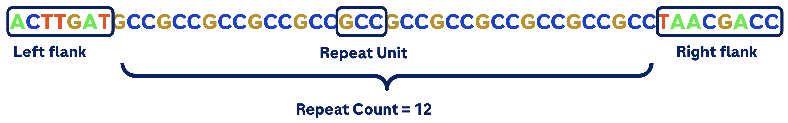

# STR Caller

A tool for genotyping and detecting repeat expansions in short tandem repeats (STR) from SBX sequencing data.

## Getting Started

### Introduction

The STR Caller module supports the finding of Repeat Expansions in Short Tandem Repeats (STR) in order to identify and analyze rare genetic variations associated with repeat expansions.
This caller specifically handles single ended reads and makes use of SBX-specific features like lossless encoding for high quality duplex reads to recover R1 and R2 reads for additional support.

An STR is a repeating structure of 2-6 base units.



The caller supports genotyping and detection of expansions in short tandem repeats (STR) by processing an aligned and sorted SBX BAM file and producing a VCF and JSON file that describe the alternate repeat structures.
Output is written directly to the specified output directory.

Tandem repeat regions such as STRs are polymorphic, meaning their repeat counts can vary between individuals.
This variability can influence gene function, gene expression, and genome stability.
Certain conditions, such as Huntington’s disease ([The Huntington’s Disease Collaborative Research Group, 1993](https://doi.org/10.1016/0092-8674%2893%2990585-E)), fragile X syndrome ([Fu et al., 1991](https://pubmed.ncbi.nlm.nih.gov/1760838/)), Friedreich's ataxia ([Campuzano et al., 1996](https://pubmed.ncbi.nlm.nih.gov/8596916/)), and myotonic dystrophy ([Brook et al., 1992](https://doi.org/10.1016/0092-8674%2892%2990154-5)), are directly linked to abnormal repeat expansions.
Accurate detection and characterization of these repeats enable researchers to study repeat variation, understand underlying mechanisms, and advance genetic research.
Repeat expansion callers streamline this process, making large-scale and high-throughput analysis feasible for research into repeat expansion biology.

#### Overall Workflow

The STR caller takes an SBX BAM from a single sample, reference FASTA and an [STR repeat catalog](#str-repeat-catalog-format) of known repeat regions.
The sample is analyzed for each repeat region in parallel and a single [VCF](#vcf-output-structure), [JSON](#json-output-structure), and an optional locally realigned BAM (for debugging) is produced.

At a high level, reads in the sample are aligned to a local realignment and the repeats with the maximum likelihood are calculated for each allele by considering the quality of alignment and how well the reads span the repeat or flank the repeat structure.



A more detailed analysis is provided in the [STR Workflow](#str-workflow) section.

### Recommended system requirements

| Component | Requirements                         |
|-----------|--------------------------------------|
| CPU       | Modern processor with at least 6 cores |
| Memory    | At least 16 GiB                     |

***

## Usage

### STR Calling

The STR Caller can genotype and detect repeat expansions as outlined in the [Introduction](#introduction).

#### Example command

To run the STR catalog use the following command:

```bash
str_caller \
--bam-input ${BAM} \
--output-dir ${OUTPUT} \
--reference ${REFERENCE} \
--str-catalog  ${STR_CATALOG} \
--threads 16
```

A more concrete example running the STR caller:

```bash
str_caller \
--bam-input tests/resources/str-caller/example/full_regions.bam \
--output-dir output \
--reference tests/resources/str-caller/example/reference.fa \
--str-catalog tests/resources/str-caller/example/str_example_catalog_entry.json \
--threads 16
```

For more details on the available command line options, see [Overview and CLI Options](#overview-and-cli-options).

#### Input

- Position sorted BAM file with an associated index file (`.bai`)
- Reference FASTA file with an associated index file (`.fai`)
- STR Catalog is a [custom JSON format](#str-repeat-catalog-format) defining the repeat regions to be analyzed

### STR Repeat Catalog Format

A repeat catalog file is a JSON array whose entries specify individual loci that the program will analyze.  The fields are defined as follows:

| Field              | Description                                                                                                                                                                                                                                                                                                           |
|:------------------|:----------------------------------------------------------------------------------------------------------------------------------------------------------------------------------------------------------------------------------------------------------------------------------------------------------------------|
| `LocusId`          | Unique identifier of the entire locus                                                                                                                                                                                                                                                                                 |
| `LocusStructure`   | Regular expression (e.g. `(ACTG)*`) defining the structure of the locus. When the locus contains multiple variants, ReferenceRegion and VariantType are arrays with associated information for each variant in the same order.                                                                                        |
| `ReferenceRegion`  | 0-based half open reference coordinates of the variant formatted as `chrom:start-end`.                                                                                                                                                                                                                                |
| `VariantType`      | Can be either `Repeat` or `RareRepeat`.                                                                                                                                                                                                                                                                               |
| `VariantId`        | Optional array of unique variant ids. If missing, variant ids are synthesized according to this rule: If there is only one variant in a locus then it gets the same id as the locus itself. If a locus contains multiple variants, each one of them gets an id of the form `<LocusId>_<ReferenceRegionOfTheVariant>`. |
| `OfftargetRegions` | Array of regions where reads from expanded repeats can misalign; only used for variants of type `RareRepeat`.                                                                                                                                                                                                         |

Here is an example of a catalog consisting of three loci containing repeats.

```json
[
{
    "LocusId": "AFF2",
    "LocusStructure": "(CCG)*",
    "ReferenceRegion": "chrX:148500631-148500691",
    "VariantType": "Repeat"
},
{
    "LocusId": "FMR1",
    "LocusStructure": "(CGG)*",
    "ReferenceRegion": "chrX:147912050-147912110",
    "VariantType": "RareRepeat",
    "OfftargetRegions": [
      "chr1:21176483-21176691",
      "chr14:92719177-92719417",
      "chr16:24729588-24729802",
      "chr16:25692225-25692429",
      "chr19:10871483-10871732",
      "chr2:86914258-86914906",
      "chr2:224585082-224585280",
      "chr3:74614352-74614558",
      "chr5:443131-443359",
      "chr6:45422666-45422877",
      "chr7:100694220-100694466",
      "chr7:105014070-105014277",
      "chr8:60678680-60678893",
      "chrX:19990837-19991058",
      "chrX:23334670-23334900",
      "chrX:67546431-67546649",
      "chrX:75746984-75747262",
      "chrX:150983311-150983536"
    ]
},
{
    "LocusId": "HTT",
    "LocusStructure": "(CAG)*CAACAG(CCG)*",
    "ReferenceRegion": ["chr4:3074876-3074933","chr4:3074939-3074966"],
    "VariantType": ["Repeat", "Repeat"]
},
{
  "LocusId": "ATXN7",
  "LocusStructure": "(GCA)*(GCC)+",
  "ReferenceRegion": [
    "chr3:63912684-63912714",
    "chr3:63912714-63912726"
  ],
  "VariantId": [
    "ATXN7",
    "ATXN7_GCC"
  ],
  "VariantType": [
    "Repeat",
    "Repeat"
  ]
},
  {
    "LocusId": "FXN",
    "LocusStructure": "(A)*(GAA)*",
    "ReferenceRegion": [
      "chr9:69037261-69037286",
      "chr9:69037286-69037304"
    ],
    "VariantType": [
      "Repeat",
      "RepeatFXN"
    ]
  }
]
```

The first entry in this catalog specifies a locus containing a single short tandem repeat. The identifier of this locus is AFF2 (field `LocusId`). The regular expression `(CCG)*` means that it is comprised of zero or more repetitions of the CCG repeat unit (field `LocusStructure`). The reference coordinates of this repeat are chrX:148500638-148500683 (field  `ReferenceRegion`). The `VariantType` field specifies that it is an ordinary STR, meaning the genome is expected to contain multiple long repeats (whose size is close to fragment length and longer) with this repeat unit.

The second entry is similar to the first. The only difference is that the variant type of the second repeat is set to `RareRepeat`. These are regions with off-target regions (i.e., repeats that are likely to have long expansions where the in-repeat reads, i.e., reads consisting purely of the repeat sequence, can align to other regions of the genome, which are listed as off-target regions). This information permits the program to use additional read-level evidence to potentially estimate the length of the repeat past the fragment length. The off-target regions field (field `OfftargetRegions`) specifies regions of the genome that can contain misaligned reads.

The third entry describes a repeat region containing multiple short tandem repeats in close proximity to each other. The regular expression `(CAG)*CAACAG(CCG)*` specifies that this region consists of two short tandem repeats with repeat units CAG and CCG separated by the sequence `CAACAG`. Fields `ReferenceRegion` and `VariantType` contain reference region and type of each constituent repeat. By default, the program assigns an identifier to each variant consisting of the locus id and reference region. So the two repeats receive ids HTT_4:3076603-3076660 and HTT_4:3076666-3076693 respectively.

The forth entry for `ATXN7` describes a locus with two repeats, a GCA repeat that can occur 0 or more times followed by a GCC repeat that can occur 1 or more times. The optional field `VariantId` assigns custom variant id to each variant.

The last entry for `FXN` also describes a locus with two repeats, but the variant type is specific to FXN (`RepeatFXN`). In repeat reads from this region have higher error rates, so HOM expansions that extend beyond the read length are identified by a low fraction of spanning reads.

#### Structure of a locus-specification record

When a locus contains a single variant, there is no difference between the variant and the locus containing it. So field names refer to the variant itself.

#### Using regular expressions to define locus structure

| Variant                                             | Regular expression |
|:----------------------------------------------------|:-------------------|
| Short tandem repeat that can occur 0 or more times  | `(CCG)*`           |
| Short tandem repeat that can occur 1 or more times  | `(CCG)+`           |

For example, a CAG repeat that can occur 1 or more times flanked by CTGT and then a CCG repeat that can occur 0 or more times is shown in the expression. `(CAG)+CTGT(CCG)*`.

#### A note on creating custom variant catalogs

Creating custom variant catalogs is relatively straightforward for "common" variants. Defining "rare" variants is much harder because some data analysis is required to prove that the variant is indeed rare. Users who are looking to define custom catalogs are encouraged to contact the developers for assistance.

#### Output

Output is written directly to the specified output directory.

| Name                  | Description                                                                                                                                                                                                                                                                                                                                           |
|:----------------------|:------------------------------------------------------------------------------------------------------------------------------------------------------------------------------------------------------------------------------------------------------------------------------------------------------------------------------------------------------|
| output.vcf            | str_caller generates a separate VCF record for each repeat with information about repeat's location and genotype. The records for non-ref repeats are demarcated by <STRn> symbolic alleles where n is the number of repeat units that the corresponding allele spans.  Non-standard formats are [described here](#vcf-output-structure). |
| output.json           | JSON file generated by str_caller contains information about sample parameters (SampleParameters field) and analysis results summarized by locus (LocusResults field). It is [defined here](#json-output-structure).                                                                                                                      |
| output.bam (optional) | BAM file containing realigned reads around the repeat regions analyzed.                                                                                                                                                                                                                                                                               |

### VCF Output Structure

The VCF file containing the results of the analysis.

#### VCF Example Interpretation

The following VCF entry describes the state of a repeat in a sample with name barcode sample_variant.

As an example, the following VCF record is broken down below:

```shell
chr3    63912714        ATXN7   A       <STR5>  .       PASS    END=63912726;REF=4;RL=12;RU=GCC;VARID=ATXN7_GCC;REPID=ATXN7    GT:SO:REPCN:REPCI:ADSP:ADFL:ADIR:LC     0/1:SPANNING/SPANNING:4/5:4-4/5-5:11/14:4/4:0/0:29
```

| chrom |    pos   |   id   | ref |   alt    | qual | filter |                                info                                 |             format              |                <sample_name>                |
|-------|----------|--------|-----|----------|------|--------|---------------------------------------------------------------------|-------------------------------|---------------------------------------------|
| chr3  | 63912714 | ATXN7  |  A  | &lt;STR5&gt; |  .   | PASS   | END=63912726;REF=4;RL=12;RU=GCC;VARID=ATXN7_GCC;REPID=ATXN7 | GT:SO:REPCN:REPCI:ADSP:ADFL:ADIR:LC | 0/1:SPANNING/SPANNING:4/5:4-4/5-5:11/14:4/4:0/0:29 |

This record contains one reference allele (A), which in this case is defined as the reference base prior to the start of the repeat region (i.e., the last base of the left flanking region).
There is also one allele with 5 repeat units of GCC denoted by the &lt;STR5&gt;.
The repeat unit is GCC (RU INFO field), so the sequence of the repeat allele is `GCCGCCGCCGCCGCC`.
The repeat spans 4 repeat units in the reference (REF INFO field).
The length of the short allele was estimated from spanning reads (SPANNING).
The confidence interval for the size of the expanded allele is (5,5).
There are 11 spanning and 4 flanking reads consistent with the repeat allele of size 5 (that 4 flanking reads overlap at most 5 repeat units) and there are 0 in-repeat reads consistent with the repeat allele of size 5.
For the reference repeat of 4 there are 11 spanning, 4 flanking and 0 in-repeat reads consistent with it.
The read depth of that locus is 29.

#### INFO Field Descriptions

| Field      | Description                                 | Example |
| ---------- |---------------------------------------------| -------- |
| END        | End position of the reference repeat region | 63912726    |
| REF        | Number of repeat units in the reference     | 4        |
| RL         | Read length used in the analysis            | 12       |
| RU         | Repeat unit sequence                        | GCC      |
| VARID      | Variant identifier                          | ATXN7_GCC  |
| REPID      | Locus identifier                            |  ATXN7    |

#### FORMAT Field Descriptions

| Field               | Description                                                              | Example        |
|:------------------ |:-------------------------------------------------------------------------|:---------------|
| GT                  | Genotype                                                                 | 0/1            |
| SO                 | Support origin of each allele (SPANNING, INREPEAT, FLANKING)             | SPANNING/SPANNING |
| REPCN              | Estimated repeat copy number for each allele                             | 4/5            |
| REPCI              | Confidence interval for the estimated repeat copy number for each allele | 4-4/5-5       |
| ADSP               | Number of supporting spanning reads for each allele                      | 11/14          |
| ADFL               | Number of supporting flanking reads for each allele                      | 4/4            |
| ADIR               | Number of supporting in-repeat reads for each allele                     | 0/0            |
| LC                 | Total number of reads used for genotyping                                | 29             |

### JSON Output Structure

JSON file generated by str_caller contains information about sample parameters(SampleParameters field) and
analysis results summarized by locus(LocusResults field). The locus results contain these fields:

- Variants Genotypes and other information describing each variant analyzed at the locus
- AlleleCount: The expected number of alleles
- Depth Estimated: read coverage
- LocusId: Locus identifier
- ReadLength: Mean read length

Example JSON record as below :

```json
{
  "LocusResults": {
    "STR": {
      "LocusId": "STR",
      "Variants": {
        "STR_chr1:2005-2008": {
          "AlleleCount": 2,
          "CountsOfFlankingReads": "(1, 1), (2, 2), (3, 2), (6, 1), (8, 2), (9, 1), (10, 2)",
          "CountsOfInrepeatReads": "()",
          "CountsOfSpanningReads": "(2, 22), (10, 21)",
          "Depth": 54,
          "Genotype": "2/10",
          "GenotypeConfidenceInterval": "2-2/10-10",
          "ReadLength": 149,
          "ReferenceRegion": "chr1:2005-2008",
          "RepeatUnit": "CAG",
          "VariantId": "STR_chr1:2005-2008",
          "VariantType": "repeat"
        }
      }
    }
  },
  "SampleParameters": {
    "SampleId": "sample_variants",
    "Sex": "female"
  }
}
```

#### Tips for analysis

- **Check Genotype Quality**: Review the genotype confidence intervals and supporting read counts (e.g., REPCN, REPCI, LC, ADIR, ADFL, ADSP fields) to assess the reliability of each call.
- **Compare to Reference**: Use the REF and ALT alleles to determine the number of repeat units relative to the reference genome.
- **Filter by Coverage**: Exclude loci with low read depth (LOW_DEPTH filter in vcf) to avoid unreliable calls.
- **Interpret Symbolic Alleles**: <STRn> alleles indicate the number of repeat units; compare these to published repeat-count thresholds for research purposes. For repeats expanding beyond read length, consider the confidence intervals provided.
- **Cross-reference with Catalog**: Map VariantId or LocusId to your STR catalog to interpret biological relevance.
- **Visualize**: Use genome browsers to inspect read alignments at loci of interest for confirmation.
- **Batch Analysis**: Aggregate results across samples to identify outliers or population-level patterns.

#### Performance and cost notes

Using the following command:

```bash
str_caller \
--num-threads 16 \
--bam-input=tests/resources/str-caller/example/full_regions.bam \
--str-catalog=tests/resources/str-caller/example/str_example_catalog_entry.json \
--reference tests/resources/str-caller/example/reference.fa \
--sex female
```

Running with a 30X BAM (~700M reads) with 40 regions in the catalog, the following performance was observed, estimating 200 GB
storage and an AWS on demand instance of type m5.4xlarge (16 vCPU, 64 GiB memory)
at $0.768 per hour down to m5.large (2 vCPU, 8 GiB memory) at $0.096 per hour:

| Num Threads | Time (s) | Cost $(USD) | Instance Type |
|-------------|----------|-------------|---------------|
| 1           | 39       | 0.06        | m5.large      |
| 2           | 20       | 0.03        | m5.large      |
| 4           | 11       | 0.04        | m5.xlarge     |
| 8           | 6        | 0.04        | m5.2xlarge    |
| 16          | 4        | 0.05        | m5.4xlarge    |

***

## Overview and CLI options

### General command syntax

```shell
str_caller [OPTIONS] <ARGUMENTS>
```

### Design summary

Short Tandem Repeats (STRs) are short sequences of DNA (2-6 base pairs) repeated in tandem. A short tandem repeat (STR) caller is used to genotype and detect expansions in STR regions in genomic data.
The use case for an STR caller includes:

- **Characterizing repeat expansions**: Repeat expansions in loci such as HTT and FMR1 are studied extensively in genetic research. STR callers enable systematic characterization of these expansions.
- **Population genetics and research**: STR variation helps study genetic diversity, inheritance patterns, and evolutionary relationships.

An STR caller automates the detection and characterization of these repeats from sequencing data, enabling high-throughput and reliable analysis for research applications.

### STR Workflow



The general flow of the diagram [STR Workflow](#str-workflow) is broken up into four layers: Input Layer, Recruitment Layer, Analysis Layer, and Output Layer based on inputs from the [Overall Workflow](#overall-workflow) section.

In the input layer, pools of read recruiters and references are created for each thread to allow for parallel processing of each STR catalog entry.
The sex and sample name are inferred from the BAM file if not provided.

In the analysis layer for each entry in the STR catalog, an Analysis Task is enqueued to process the repeat region defined by the catalog entry.



The Analysis Task consists of the following steps:

#### 1. Create Local Alignment

The alignment blueprint defines a repeat structure with sequence and type and its flanking regions in a linear vector.
Each genomic region within the alignment blueprint is converted to a node within the alignment data structure.
Repeats are represented as cycles in the alignment structure with the node having a self-loop edge.
Edges are connected from each feature to each downstream skippable feature as well as to the next feature in the sequence.



*Example: HTT (Huntington's Disease) CAG Repeat - chr4:3074876-3074933: Local alignment construction for the HTT CAG repeat. The alignment blueprint (top row) contains the linear sequence structure extracted from the catalog: left flanking sequence ending in ...GCTGCTGCTGCT, the (CAG)* repeat unit, and right flanking sequence starting with CAACAGCCGCCA.... Each blueprint element is converted to a node in the local realignment data structure (bottom row). The repeat node (Node 2) has a self-loop allowing it to be traversed multiple times. A skip edge connects Node 1 directly to Node 3, enabling alignment of reads that lack the repeat.*

#### 2. Recruit reads from the BAM file overlapping with the repeat region plus padding using the read recruiters

When recruiting reads, if off-target regions are specified in the repeat catalog entry, reads are recruited from those regions as well as unmapped reads if their resemblance to the repeat unit (weighted purity score) is sufficiently high.

#### 3. Align the recruited reads to generate an optimal local realignment

Each node represents the sequence and each alignment details the match for that node.
This allows for a repeat unit node to be visited multiple times consecutively with different metrics for each alignment.
The tool intersects each alignment path with the next to determine the best alignment for the read or returns the first one if no common path exists.



**Key Concepts:**

- **LF** = Left Flank node, **R** = Repeat node, **RF** = Right Flank node
- Repeat nodes can be visited multiple times (e.g., R → R → R for 3 repeat units)
- Each path represents a different hypothesis about the repeat count
- The optimal alignment is chosen by scoring and intersecting paths

#### 4. Analyze the repeat site using the aligned reads and local realignment to determine the optimal genotype

Reads are classified as spanning, flanking, or in-repeat and an alignment score is recorded for each plausible motif repeat count.
The tool calculates the maximum likelihood genotype and confidence interval that explains the repeat counts observed in the set of reads aligned to the repeat local realignment.

### CLI options

Required parameters are highlighted in **bold**.

#### Input options

| Parameter       | Description                                                                                                                            | Value(s)                              |
|:----------------|:---------------------------------------------------------------------------------------------------------------------------------------|:--------------------------------------|
| **--bam-input** | Path to the BAM file and associated index for the sample to be analyzed. The BAM file must be coordinate-sorted and indexed.             | Path to a sorted and indexed BAM file and associated `*.bai` file. |
| **--str-catalog**              | A [short tandem repeat (STR) catalog file](#str-repeat-catalog-format) is a JSON array whose entries specify individual loci that the program will analyze. | Path to STR catalog.                                          |
| **--reference**                | Path to the reference FASTA file used to compare the reads against. The FASTA file must be indexed with a `.fai` file.                 | Path to an indexed reference FASTA file                       |

#### Sample metadata options

| Parameter                      | Description                                                                                                                                                                                                                                                           | Value(s)                                                      |
|:-------------------------------|:----------------------------------------------------------------------------------------------------------------------------------------------------------------------------------------------------------------------------------------------------------------------|:--------------------------------------------------------------|
| --sample-name   | Name of the BAM sample.  If not provided it will be inferred from the bam file or marked as unknown.                                                                                              | String sample name description        |
| --sex           | Sex of the BAM sample.  Used for certain genotype priors. Accepted values are `male`, `female`, or `unknown`. If not provided will be inferred, but will default to 'unknown' if inference fails. | `male`, `female`, or `unknown`        |
| --exclude-sex-output | If set, the sex output is excluded from all output files.                                                                                                      | Flag (no value) [default: `false`]                                                 |

#### Performance options

| Parameter                      | Description                                                                                                                                                                                                                                                           | Value(s)                                      |
|--------------------------------|-----------------------------------------------------------------------------------------------------------------------------------------------------------------------------------------------------------------------------------------------------------------------|-----------------------------------------------|
| --threads       | Number of threads to use for parallel processing.  0 for all available threads.                                                                                                                   | Integer greater or equal to 0. [default: `1`] |

#### Lossless encoding options

| Parameter                      | Description                                                                                                                                                                                                                                                           | Value(s)                                                      |
|--------------------------------|-----------------------------------------------------------------------------------------------------------------------------------------------------------------------------------------------------------------------------------------------------------------------|---------------------------------------------------------------|
| --min-base-type                | Minimum base type of duplex reads supporting a base for it to be considered in the analysis (only applies to duplex reads with YC tags).                                                                                                                              | `concordant`, `simplex`, `discordant` [default: `concordant`] |
| --include-discordant-bases     | If set, include discordant bases in the consensus read (Note: by default discordant bases are converted to N in the consensus read; this flag only applies to consensus reads and does not affect decoded R1/R2 reads).                                               | Flag (no value; i.e., false)                                  |
| --skip-r1-r2-decoding          | If set, skip generating additional R1 and R2 reads from the YC tag. This can decrease memory usage but can also reduce accuracy in certain scenarios.                                                                        | Flag (no value; i.e., false)                                  |

#### Algorithm options

| Parameter                           | Description                                                                                                                                                                                                                                                      | Value(s)                                |
|-------------------------------------|------------------------------------------------------------------------------------------------------------------------------------------------------------------------------------------------------------------------------------------------------------------|-----------------------------------------|
| --weighted-purity-score-cutoff      | Weighted purity score cutoff for off-target read recruitment                                                                                                                                                                                                     | Float between 0 and 1 [default: `0.9`]  |
| --sp-fraction-hom-cutoff            | For RepeatFXN variant type, this cut-off is used to identify HOM expansions                                                                                                                                                 | Float between 0 and 1 [default: `0.2`]  |
| --sp-fraction-low-confidence-cutoff | For RepeatFXN variant type, this cut-off is used to identify low confidence calls                                                                                                                                          | Float between 0 and 1 [default: `0.35`] |
| --region-padding                    | Padding for pulling additional bases on either side of the reference region as well as adjusting the flanking region when building the local realignment.  NOTE: using the non-default padding is not recommended as it can affect STR calling accuracy at certain sites. | Non-negative integer [default: `800`]   |
| --giraffe-input-bam                 | If set, indicates that the input BAM file was generated by the Giraffe aligner or is in Giraffe-compatible format. This can affect how reads are interpreted and processed during analysis.                                                                      | Flag (no value; i.e., false)            |
| --legacy-duplex-bam                 | If set, duplex reads in the BAM file are encoded based on raw read quality scores for legacy duplex and the YC tag is ignored and thus R1 and R2 sequences are also not generated.                                                                               | Flag (no value; i.e., false)            |

#### Output options

| Parameter                | Description                                                                                                                                                              | Value(s)                                                                            |
|--------------------------|--------------------------------------------------------------------------------------------------------------------------------------------------------------------------|-------------------------------------------------------------------------------------|
| --output-dir             | Path to the output directory where the metrics will be written to.                                                                                                       | Path to a directory. [default: `.`]                                                 |
| --output-vcf             | Sets a custom VCF file name summarizing analysis results (e.g., <output_dir>/output.vcf).                                                                                | Filename under output directory. [default: `output.vcf.gz` and `output.vcf.gz.tbi`] |
| --metrics                | Custom filename for the metrics TSV file (default: <output_dir>/metrics.tsv).                                                                                            | Filename under output directory. [default: `metrics.tsv`]                           |
| --exclude-sex-output     | If set, the sex output is excluded from all output files.                                                                                                                | Flag (no value) [default: `false`]                                                  |
| --write-to-bam-unmapped  | If set, reads in output bam will be unmapped.                                                                                                                            | Flag (no value) [default: `false`]                                                  |
| --output-bam             | If set, a realigned BAM file around the repeat regions analyzed will be written to the output directory (e.g., <output_dir>/output.bam).                                 | Filename under output directory. [default: `none`]        |
| --output-json            | If set, a JSON file summarizing analysis results will be written to the output directory (e.g., <output_dir>/output.json).                                               | Filename under output directory. [default: `output.json`] |

***

## Troubleshooting

Troubleshooting tips:
In addition to the `VCF` file, the `JSON` file can be used to get additional details of repeat counts detected in
the recruited reads and the distribution of spanning/flanking/irr reads.
By setting `--output-bam`, the recruited reads and realignments can be obtained for further troubleshooting.
The default output `BAM` file (if the `--write-to-bam-unmapped` flag is not set) will have the original reference coordinates
of the recruited reads.
Setting the --skip-r1-r2-decoding flag can lead to LowDepth and LowConfidence calls as the number of reads for a given site will be reduced.

Table of known bugs or other information to share

| Issue                 | Description of Issue                                                                                                                                              |
|-----------------------|-------------------------------------------------------------------------------------------------------------------------------------------------------------------|
| reference regions     | Reference coordinates for certain repeat sites in the catalog may be slightly different from other catalogs, which can cause small differences in the repeat count|
| `--giraffe-input-bam` | Make sure this parameter is correctly set. Off-target read recruitment is different for Giraffe BAMs                                                             |

## Appendix

### Concepts and terminology

| Term                                 | Definition                                                                                                                                                                                                  |
|--------------------------------------|-------------------------------------------------------------------------------------------------------------------------------------------------------------------------------------------------------------|
| Short Tandem Repeat (STR)            | A short sequence of DNA bases that is repeated in tandem at a specific location in the genome. STRs are typically 2-6 base pairs unit lengths and can vary in the number of repeat units among individuals. |
| Spanning Reads | Reads that overlap both edges of a repeat region, providing the strongest support for a repeat. |
| Flanking Reads | Reads that overlap a single edge of the repeat region.                                                                                                                                                      |
| In-Repeat Reads | Reads that only provide the repeat region itself without any flanking region.  This is the weakest support for a repeat structure. |
| Local Realignment Blueprint          | A representation of the structure of a repeat region, including the arrangement of repeat units and flanking sequences. Local realignment blueprints are used to construct local realignments for aligning reads in STR analysis. |
| VariantType                      | The classification of a variant as either a common repeat (Repeat) or a rare repeat (RareRepeat). This classification affects how reads are recruited and analyzed for the variant.                        |
| OffTarget Regions                   | Genomic regions where reads from expanded repeats can misalign. These regions are used to recruit additional reads for analysis of rare repeats.                                                            |
| Weighted Purity Score               | A metric used to evaluate the similarity of a read to a repeat unit. It is calculated based on the proportion of bases in the read that match the repeat unit, weighted by base-call quality scores.               |
| Genotype Confidence Interval        | A range of repeat sizes that are considered plausible for a given genotype, based on the likelihood of the observed read data. This interval provides a measure of uncertainty in the genotype estimate.       |
