# Tumor Fraction Estimator

## Getting started

### Introduction

The Tumor Fraction Estimator (TFE) quantifies the fraction of tumor-derived DNA in a sequencing sample.
It operates on aligned reads and a set of known variant sites, counting reference and alternate allele observations at each site, applying read-level and variant-level filters, and deriving a tumor fraction estimate from the aggregate variant allele frequencies.

TFE provides two subcommands:

- `tumor-fraction`: Estimates tumor fraction from somatic variant sites in cell-free DNA (cfDNA) sequencing data.
- `contamination`: Estimates cross-sample contamination using population SNP sites.
  A bundled population SNP VCF (1000 Genomes, GRCh38, biallelic SNVs with AF 0.45 to 0.55) is used by default.

Both subcommands share the same workflow.
The key differences are the input variant set, default filter thresholds, and the output formats.

#### High-level diagram



### Recommended system requirements

| Resource | Requirements                            |
|----------|-----------------------------------------|
| CPU      | Modern processor with at least 8 cores. |
| Memory   | At least 16 GiB.                        |

***

## Usage

### Tumor fraction usage

The `tumor-fraction` subcommand estimates tumor fraction from a BAM file and a somatic variant VCF.

This subcommand uses `--min-baseq 29` and `--min-mapq 10` by default.

#### Tumor fraction example command

```bash
tumor_fraction_estimator tumor-fraction \
  --bam /path/to/input.bam \
  --vcf /path/to/somatic_variants.vcf \
  --reference /path/to/reference.fa \
  --included-regions-bed /resources/GRCh38_notinalldifficultregions.noY.bed \
  --output-dir /path/to/output \
  --enable-noise-estimation \
  --threads 8
```

For more details on the available command-line options, see [Overview and CLI options](#overview-and-cli-options).

#### Tumor fraction input

- Coordinate-sorted and indexed BAM file (`.bam` with `.bai` index).
- Somatic variant file in VCF format (`.vcf` or `.vcf.gz`).
  - Expected to contain PASS-filtered SNVs.
  - If a two-sample VCF is provided, the first sample is treated as germline and the second as somatic.
  - The `AD` and `AF` format fields are used for germline and somatic VAF filtering when present.
- Reference genome FASTA file with an associated index (`.fai`).
- Included-regions BED file (`--included-regions-bed`).
  - A bundled BED file is provided at *resources/GRCh38_notinalldifficultregions.noY.bed* inside the container image.
  - This file excludes difficult-to-map regions and the Y chromosome.
- (Optional) Systematic noise file in tab-delimited format (`--systematic-noise-tsv`).
  - Columns: `chr`, `pos`, `ref`, `alt`.
  - The `pos` column must use 1-based VCF coordinates.

The systematic noise file is a pre-computed list of genomic positions with known recurrent technical artifacts.
Variants matching an entry in this file are excluded from the tumor fraction calculation.

To measure the baseline sequencing error rate at runtime, use the `--enable-noise-estimation` flag.
When enabled, TFE generates control positions ("noise probe sites") near each somatic variant and reports a separate noise fraction alongside the tumor fraction.
See [Design summary](#design-summary) for details.

#### Tumor fraction output

Output files are written to the directory specified by `--output-dir` (default: current directory).
If the directory does not exist, it is created.
TFE exits with an error if any output file already exists.

| Default name                  | Description                                                                     |
|-------------------------------|---------------------------------------------------------------------------------|
| *tumor_fraction.results.tsv*  | Summary metrics including tumor fraction, mean VAF, and variant filter counts.  |
| *tumor_fraction.counts.tsv*   | Per-variant allele counts, filter status, and sequence context.                 |

Additional output (only when `--save-read-features` is set):

| Default name        | Description                |
|---------------------|----------------------------|
| *read_features.tsv* | Per-read feature table.    |

Both TSV files include a metadata header with the command-line invocation.

##### tumor_fraction.results.tsv

This file contains one row per metric in a two-column layout (`metric_name`, `value`).

| Metric name                    | Definition                                                                                                                                                                                                                                                         |
|--------------------------------|--------------------------------------------------------------------------------------------------------------------------------------------------------------------------------------------------------------------------------------------------------------------|
| tumor_fraction                 | Estimated tumor fraction: `2 * mean_vaf`.                                                                                                                                                                                                                          |
| mean_vaf                       | Mean variant allele frequency across all passing somatic variant sites.                                                                                                                                                                                            |
| error_rate                     | Estimated sequencing error rate from the model.                                                                                                                                                                                                                    |
| total_alt                      | Total alternate allele read count across passing sites.                                                                                                                                                                                                            |
| total_ref                      | Total reference allele read count across passing sites.                                                                                                                                                                                                            |
| total_depth                    | Total depth across passing sites.                                                                                                                                                                                                                                  |
| total_other_alts               | Total count of non-reference, non-alternate alleles across passing sites.                                                                                                                                                                                          |
| total_adjusted_alt             | Alternate count adjusted for other-alt noise: `total_alt - total_other_alts / 2`.                                                                                                                                                                                  |
| mean_vaf_other_alts            | Mean VAF of other (non-target) alternate alleles.                                                                                                                                                                                                                  |
| total_variants                 | Total number of somatic variant records parsed from the VCF.                                                                                                                                                                                                       |
| variants_detected              | Number of somatic variants with at least one alternate read.                                                                                                                                                                                                       |
| filtered_variants_*            | Count of variants removed by each [variant-level filter](#variant-level-filters) and certain [pileup filters](#pileup-filters) (`LowCoverage`, `HighCoverage`, `ObservedVAF`, `OtherObservedVAF`, `AltCoverage`). One row per filter type.                         |
| passing_variants               | Number of variants that passed all variant-level filters.                                                                                                                                                                                                          |
| passing_variants_detected      | Number of passing variants with at least one alternate read.                                                                                                                                                                                                       |
| passing_variants_with_coverage | Number of passing variants with non-zero depth.                                                                                                                                                                                                                    |
| filtered_reads_*               | Count of reads removed by each [read-level filter](#read-level-filters), [base-level filter](#base-level-filters), and [pileup filters](#pileup-filters) excluding pileup filters that are represented by a `filtered_variants_*` column. One row per filter type. |

When `--enable-noise-estimation` is set, additional noise metrics are appended:

| Metric name                        | Definition                                                                                  |
|------------------------------------|---------------------------------------------------------------------------------------------|
| noise_fraction                     | Estimated noise fraction: `2 * noise_mean_vaf`.                                             |
| noise_mean_vaf                     | Mean VAF at noise probe sites.                                                              |
| noise_total_alt                    | Total alternate count at noise probe sites.                                                 |
| noise_total_ref                    | Total reference count at noise probe sites.                                                 |
| noise_total_depth                  | Total depth at noise probe sites.                                                           |
| noise_total_other_alts             | Total other-alt count at noise probe sites.                                                 |
| noise_total_adjusted_alt           | Adjusted alternate count at noise probe sites.                                              |
| noise_mean_vaf_other_alts          | Mean other-alt VAF at noise probe sites.                                                    |
| noise_probe_sites_total            | Total number of noise probe sites generated.                                                |
| noise_probe_sites_detected         | Number of noise probe sites with at least one alternate read.                               |
| passing_noise_probe_sites          | Number of noise probe sites that passed all filters.                                        |
| passing_noise_probe_sites_detected | Number of passing noise probe sites with at least one alternate read.                       |
| passing_noise_probe_sites_with_coverage | Number of passing noise probe sites with non-zero depth.                               |

##### tumor_fraction.counts.tsv

This file contains one row per variant record (somatic and noise probe) with the following columns:

| Column           | Definition                                                                                                                                                                                                                                      |
|------------------|-------------------------------------------------------------------------------------------------------------------------------------------------------------------------------------------------------------------------------------------------|
| chrom            | Chromosome.                                                                                                                                                                                                                                     |
| pos              | 1-based genomic position.                                                                                                                                                                                                                       |
| ref              | Reference allele.                                                                                                                                                                                                                               |
| alt              | Alternate allele.                                                                                                                                                                                                                               |
| var_type         | `Somatic` or `NoiseProbe`.                                                                                                                                                                                                                      |
| ref_count        | Number of reads supporting the reference allele.                                                                                                                                                                                                |
| alt_count        | Number of reads supporting the alternate allele.                                                                                                                                                                                                |
| dp               | Total depth at this position.                                                                                                                                                                                                                   |
| other_alts_count | Number of reads supporting alleles other than ref or alt.                                                                                                                                                                                       |
| seq_context      | Sequence context annotation (for example, `HighConf`, `IncludedRegions`).                                                                                                                                                                       |
| sequence         | 7 bp sequence context around the variant (somatic and noise probe records).                                                                                                                                                                     |
| filter           | [Variant-level filter](#variant-level-filters) status and certain [pileup filters](#pileup-filters) (`LowCoverage`, `HighCoverage`, `ObservedVAF`, `OtherObservedVAF`, `AltCoverage`).                                                                             |
| alt_*            | Per-filter type alt allele counts for each type of [read-level filter](#read-level-filters), [base-level filter](#base-level-filters), and [pileup filter](#pileup-filters) excluding pileup filter types that are included in the `filter` column. |

### Contamination usage

The `contamination` subcommand estimates cross-sample contamination.
It uses the same analytical engine as `tumor-fraction` but with stricter default filters and a bundled population SNP VCF.

This subcommand uses `--min-baseq 39` and `--min-mapq 60` by default.

#### Contamination example command

Using the bundled population SNP VCF (default):

```bash
tumor_fraction_estimator contamination \
  --bam /path/to/input.bam \
  --reference /path/to/reference.fa \
  --included-regions-bed /resources/GRCh38_notinalldifficultregions.noY.bed \
  --output-dir /path/to/output \
  --enable-noise-estimation \
  --threads 8
```

Using a custom population SNP VCF:

```bash
tumor_fraction_estimator contamination \
  --bam /path/to/input.bam \
  --vcf /path/to/custom_population_snps.vcf.gz \
  --reference /path/to/reference.fa \
  --included-regions-bed /resources/GRCh38_notinalldifficultregions.noY.bed \
  --output-dir /path/to/output \
  --enable-noise-estimation \
  --threads 8
```

The bundled VCF is located at *resources/ALL.autosomal.shapeit2_integrated_biallelic_snv_v2a_27022019.GRCh38.phased.AF_0.45_0.55.vcf.gz* inside the container image.
It contains biallelic autosomal SNVs from the 1000 Genomes Project (GRCh38) filtered to population allele frequencies between 0.45 and 0.55.

For more details on the available command-line options, see [Overview and CLI options](#overview-and-cli-options).

#### Contamination input

- Coordinate-sorted and indexed BAM file (`.bam` with `.bai` index).
- (Optional) Population SNP VCF file (`.vcf` or `.vcf.gz`).
  - If not provided, the bundled 1000 Genomes VCF is used.
- Reference genome FASTA file with an associated index (`.fai`).
- Included-regions BED file (`--included-regions-bed`).
  - A bundled BED file is provided at *resources/GRCh38_notinalldifficultregions.noY.bed* inside the container image.
- (Optional) Systematic noise TSV, same as for `tumor-fraction`.

#### Contamination output

Output files are written to the directory specified by `--output-dir` (default: current directory).
If the directory does not exist, it is created.
TFE exits with an error if any output file already exists.

| Default name                   | Description                                                                          |
|--------------------------------|--------------------------------------------------------------------------------------|
| *contamination.results.tsv*    | Summary metrics with `contamination_fraction` instead of `tumor_fraction`.           |
| *contamination.counts.tsv*     | Per-variant allele counts, filter status, and sequence context.                      |

Additional output (only when `--save-read-features` is set):

| Default name        | Description                |
|---------------------|----------------------------|
| *read_features.tsv* | Per-read feature table.    |

The file formats are identical to the tumor fraction output.
The only difference is that the primary metric is labeled `contamination_fraction` in the results file.

***

## Overview and CLI options

### General command syntax

```shell
tumor_fraction_estimator <subcommand> [OPTIONS]
```

Subcommands: `tumor-fraction`, `contamination`.

Options must be placed after the subcommand.

### Design summary

1. **VCF parsing**: PASS-filtered SNV records are extracted from the input VCF.
   Germline allelic depth (`AD`) and somatic VAF (`AF`) filters are applied when the format fields are present.
2. **Region filtering**: Variants are filtered against the included-regions BED and systematic noise file (if provided).
3. **Noise probe generation** (when `--enable-noise-estimation` is set): For each passing somatic variant, nearby reference-matching positions are sampled as noise probe sites.
   Up to 200 000 noise probe sites are generated, distributed proportionally across passing variants.
   Probes are placed at least 200 bp away from the query variant and must share the same reference allele and trinucleotide context.
4. **Parallel pileup**: The BAM file is queried at each variant and noise probe position using one worker per thread.
   Each worker creates pileup objects for the genomic positions overlapping the variant, stores depth and alignment pointers, and applies read-level filters to each overlapping alignment.
5. **Allele counting**: For each variant site, reference, alternate, and other-alt allele counts are accumulated from reads that pass all read-level filters.
6. **Estimation**: Tumor fraction (or contamination fraction) is computed as `2 * mean_vaf` across all passing variant sites.
   When noise estimation is enabled, the noise rate is computed independently from the noise probe sites.
7. **Output**: Results and per-variant counts are written to TSV files with metadata headers.

### Design diagram



### Variant-level filters

The following filters are applied to each query VCF record before pileup.
A variant that fails any filter is excluded from the tumor fraction calculation but is still reported in the counts file with its filter status.

| Filter status              | Condition                                                                                |
|----------------------------|------------------------------------------------------------------------------------------|
| Pass                       | Variant passed all filters.                                                              |
| NonSNP                     | Variant is not a single-nucleotide polymorphism.                                         |
| GermlineAD                 | Germline allelic depth exceeds `--max-germline-allele-depth`.                            |
| LowSomaticVAF              | Somatic VAF is below `--min-somatic-vaf`.                                                |
| ExcludedRegion             | Variant falls outside the included regions.                                              |
| SystematicNoise            | Variant matches an entry in the systematic noise file.                                   |
| NoiseProbeOverlappingSomatic | Noise probe site overlaps with a somatic variant (noise probes only).                  |

### Read-level filters

The following filters are applied to each alignment overlapping a variant site during pileup.
Reads that fail any filter are excluded from allele counting but their filter category is tracked in the counts file.

| Filter status | Condition                                                                                          |
|---------------|----------------------------------------------------------------------------------------------------|
| MeanBaseQual  | Mean base quality of the read is below `--min-mean-baseq`.                                         |
| MAPQ          | Mapping quality is below `--min-mapq`.                                                             |
| Mismatch      | Number of mismatches in the read exceeds `--max-mismatch` (or `--max-high-base-quality-mismatch`). |
| Softclip      | Softclip length exceeds `--max-softclip-length`.                                                   |

### Base-level filters

These filters evaluate the read at a specific query position.
A read can pass read-level filters but still be excluded at a particular site based on local sequence context.

| Filter status   | Condition                                                                                       |
|-----------------|-------------------------------------------------------------------------------------------------|
| BaseQual        | Base quality at the query position is below `--min-baseq`.                                      |
| Homopolymer     | Query position is within `--homopolymer-search-radius` bases of a low-quality homopolymer base. |
| ReadEnd         | Query position falls within `--ignore-start` or `--ignore-end` bases of the read.               |
| Indel           | Query position is within `--min-distance-to-indel` of an indel, or the base is a deletion.      |

### Pileup filters

The following filters are applied after pileup and allele counting at each site. A site that fails any filter is excluded from the tumor fraction calculation but is still reported in the counts file with its filter status.

| Filter status    | Condition                                                                                    |
|------------------|----------------------------------------------------------------------------------------------|
| LowCoverage      | Depth at the variant site is below `--min-coverage`.                                         |
| HighCoverage     | Depth at the variant site exceeds `--max-coverage`.                                          |
| ObservedVAF      | Observed VAF exceeds `--max-observed-vaf`.                                                   |
| OtherObservedVAF | Observed VAF of other alternate alleles exceeds the observed VAF threshold.                  |
| AltCoverage      | Alternate read count exceeds `--max-alt-coverage`.                                           |
| LowQualityAlt    | Fraction of low base-quality alt reads at the site exceeds `--max-low-quality-alt-fraction`. |
| PercAltFiltered  | Percentage of alternate reads filtered exceeds 30%.                                          |

### CLI options

Required parameters are highlighted in **bold**.

#### Input options

| Parameter                | Description                                                                                | Value(s)                                                  |
|--------------------------|--------------------------------------------------------------------------------------------|-----------------------------------------------------------|
| **--bam**                | Path to the BAM file. Must be coordinate-sorted and indexed.                               | File path (must have `.bam` extension)                    |
| **--vcf**                | Path to somatic variant file in VCF format. Required for `tumor-fraction`; optional for `contamination` (defaults to bundled population SNP VCF). | File path (`.vcf` or `.vcf.gz`)          |
| **--reference**          | Path to reference genome FASTA file with an associated `.fai` index.                       | File path                                                 |
| --systematic-noise-tsv   | Path to systematic noise variants in tab-delimited format (chr, pos, ref, alt). The `pos` column must use 1-based VCF coordinates. | File path (`.tsv`)                       |

#### Output options

| Parameter    | Description       | Value(s)                       |
|--------------|-------------------|--------------------------------|
| --output-dir | Output directory. | Directory path [default: `.`]  |

#### Region options

| Parameter              | Description                                                                                | Value(s)                          |
|------------------------|--------------------------------------------------------------------------------------------|-----------------------------------|
| **--included-regions-bed** | Path to regions to include in analysis. A bundled BED is provided at *resources/GRCh38_notinalldifficultregions.noY.bed*. | File path (`.bed`) |

#### Query VCF filter options

These filters are applied to the input VCF records before pileup and are only available for `tumor-fraction`.
A variant that fails any of these filters is excluded from the tumor fraction calculation.
The VCF is expected to contain two samples ordered as germline (first) then tumor (second). The `AD` field is read from the germline sample, and the `AF` field is read from the tumor sample.
These filters are skipped when the expected fields are not present (`FORMAT/AD` in normal sample and `FORMAT/AF` in tumor sample).

| Parameter                   | Description                                                                              | Value(s)             |
|-----------------------------|------------------------------------------------------------------------------------------|----------------------|
| --max-germline-allele-depth | Maximum alt allele depth in the matched germline sample (VCF AD field). Sites exceeding this threshold are classified as germline. | Integer [default: 0]   |
| --min-somatic-vaf           | Minimum allele frequency from the input VCF (FORMAT/AF) for a site to be considered somatic. | Float [default: 0.03]  |

#### Read-level filter options

These filters evaluate whole-read properties.
A read that fails any of these filters is excluded from allele counting at all variant sites it overlaps.

| Parameter                        | Description                                                                    | Value(s)                                                           |
|----------------------------------|--------------------------------------------------------------------------------|--------------------------------------------------------------------|
| --min-mapq                       | Minimum mapping quality for a read to be considered.                           | Integer [default: 10 for `tumor-fraction`, 60 for `contamination`] |
| --min-mean-baseq                 | Minimum mean base quality for a read to be considered.                         | Float [default: 15.0]                                              |
| --min-frag-length                | Minimum fragment length to consider a read.                                    | Integer [default: 40]                                              |
| --max-frag-length                | Maximum fragment length to consider a read.                                    | Integer [default: 240]                                             |
| --max-mismatch                   | Maximum number of mismatches (NM tag) for a read to be considered.             | Integer [default: 5]                                               |
| --max-high-base-quality-mismatch | Maximum number of high base-quality mismatches for a read to be considered.    | Integer [default: 0]                                               |
| --max-softclip-length            | Maximum softclip length allowed in a read.                                     | Integer [default: 0]                                               |

#### Base-level filter options

These filters evaluate the read at a specific query position.
A read can pass read-level filters but still be excluded at a particular site based on local sequence context.

| Parameter                   | Description                                                                                                                                                                          | Value(s)                                                           |
|-----------------------------|--------------------------------------------------------------------------------------------------------------------------------------------------------------------------------------|--------------------------------------------------------------------|
| --min-baseq                 | Minimum base quality at the query position for a read to support the site.                                                                                                           | Integer [default: 29 for `tumor-fraction`, 39 for `contamination`] |
| --ignore-start              | Number of bases to ignore at the start of a read. Observations within this range are excluded.                                                                                       | Integer [default: 5]                                               |
| --ignore-end                | Number of bases to ignore at the end of a read. Observations within this range are excluded.                                                                                         | Integer [default: 5]                                               |
| --min-distance-to-indel     | Minimum distance between the query position and an indel in the read alignment. Reads with a closer indel are excluded. Observations within softclipped regions are always excluded. | Integer [default: 0]                                               |
| --homopolymer-search-radius | Number of bases to search around the query position for homopolymer-induced errors.                                                                                                  | Integer [default: 5]                                               |

#### Pileup filter options

These filters evaluate aggregate counts at a site after all reads have been processed.
A site that fails any of these filters is excluded from the tumor fraction calculation but is still reported in the counts file.

| Parameter                   | Description                                                                              | Value(s)             |
|-----------------------------|------------------------------------------------------------------------------------------|----------------------|
| --min-coverage              | Minimum read depth at a site.                                                            | Integer [default: 10]  |
| --max-coverage              | Maximum read depth at a site.                                                            | Integer [default: 300] |
| --max-alt-coverage          | Maximum alt read depth at a site.                                                        | Integer [default: 1]   |
| --max-low-quality-alt-fraction | Maximum fraction of low base-quality alt reads at a site.                             | Float [default: 0.6, range: 0.0–1.0] |
| --max-observed-vaf          | Maximum observed allele frequency at a site. Sites exceeding this threshold are excluded. | Float [default: 0.1]  |

#### Noise estimation options

These options control the generation and analysis of noise probe sites used to estimate the baseline sequencing error rate.

| Parameter               | Description                                            | Value(s)              |
|-------------------------|--------------------------------------------------------|-----------------------|
| --noise-to-tumor-ratio  | Noise-to-tumor ratio for noise estimation.             | Integer [default: 1]  |
| --max-noise-reads       | Maximum noise reads to consider for noise estimation.  | Integer [default: 0]  |
| --enable-noise-estimation | Enable baseline noise estimation in the sample.      | No value (flag)       |

#### Performance options

| Parameter  | Description                                                    | Value(s)                        |
|------------|----------------------------------------------------------------|---------------------------------|
| --threads  | Number of threads. Set to 0 to use all available hardware threads. | Non-negative integer [default: 1] |

#### Developer options

| Parameter            | Description                                          | Value(s)        |
|----------------------|------------------------------------------------------|-----------------|
| --save-read-features | Write per-read feature TSV to the output directory.  | No value (flag) |

#### Help options

| Parameter    | Description  | Value(s) |
|--------------|--------------|----------|
| -h, --help   | Print usage. |          |

***

## Troubleshooting

| Issue                                    | Description                                                                                                  |
|------------------------------------------|--------------------------------------------------------------------------------------------------------------|
| No reads overlapping the target variants | All variant sites were filtered or the BAM has no coverage in the VCF regions. Verify the BAM and VCF match the same reference genome and coordinate system. |
| No reads overlapping the noise probe sites | Noise probe generation succeeded but the BAM has no coverage at the probe positions. This can occur with very sparse BAM files or restrictive region filters. |
| Bundled VCF not found (contamination)    | The default population SNP VCF path assumes the container image layout. When running outside Docker, provide `--vcf` explicitly. |

***

## Appendix

### Concepts and terminology

| Term                  | Definition                                                                                                    |
|-----------------------|---------------------------------------------------------------------------------------------------------------|
| Tumor fraction        | The proportion of circulating tumor DNA (ctDNA) in a cfDNA sample, estimated as `2 * mean_vaf`.              |
| Contamination fraction | The proportion of cross-sample contamination, estimated identically to tumor fraction but from population SNP sites. |
| Noise probe site      | A reference-matching genomic position near a somatic variant, used to estimate the baseline sequencing noise rate. Probes share the same reference allele and trinucleotide context as the query variant. |
| Variant allele frequency (VAF) | The fraction of reads supporting the alternate allele at a given variant site: `alt_count / depth`.   |
| Systematic noise      | Recurrent technical artifacts at specific genomic positions, provided as a TSV file and excluded from analysis. |
| Pileup                | The set of aligned reads overlapping a specific genomic position, used to count allele observations.          |
